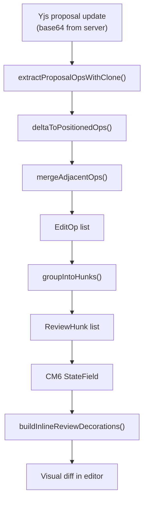
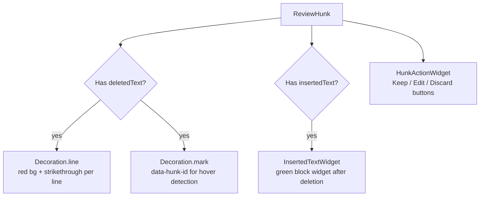
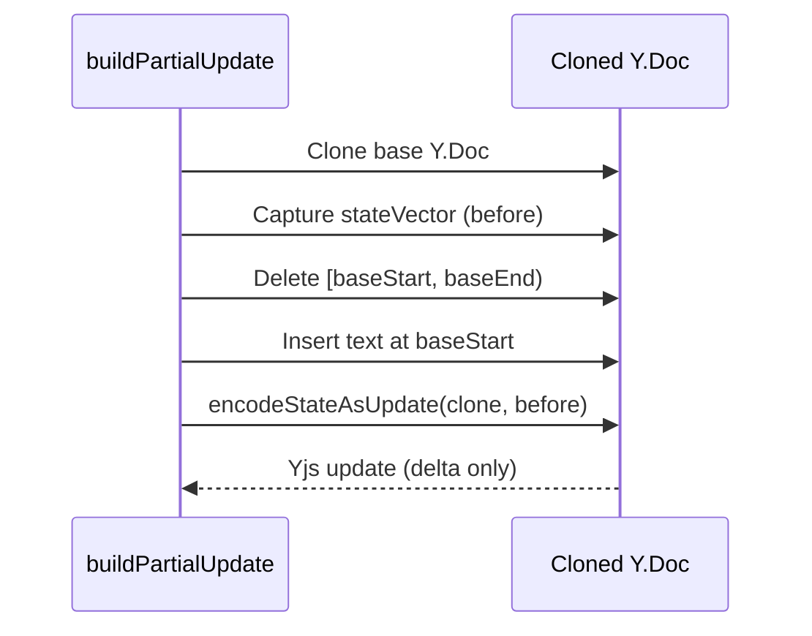
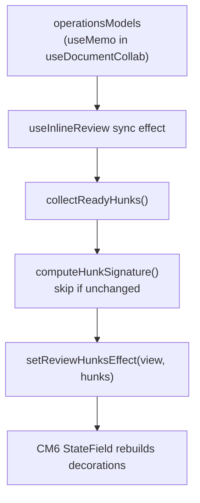

# Inline Review: Yjs Update to Visual Diff

How the frontend turns a binary Yjs proposal update into reviewable diff hunks in the CodeMirror editor.

## Pipeline Overview

---

## Stage 1: Changeset Extraction

The system does NOT use CodeMirror `ChangeSet` types. It defines its own operation model based on Yjs deltas.

**File**: `core/cm6-collab/review/changeset-extractor.ts`

### extractProposalOpsWithClone (line 46)

1. **Clone** the Y.Doc and capture base text
2. **Attach** a `ytext.observe()` handler before applying the update
3. **Apply** `Y.applyUpdate(cloned, yjsUpdate)` -- triggers the observer synchronously
4. **Convert** the Yjs delta (retain/delete/insert operations) into positioned operations

### deltaToPositionedOps (line 89)

Walks the Yjs delta linearly, tracking `basePos`:
- `retain N` -- advance `basePos` by N (unchanged text)
- `delete N` -- record deletion at `basePos`, recover deleted text from base string
- `insert S` -- record insertion at `basePos` without advancing

### mergeAdjacentOps (line 126)

Adjacent delete+insert at the same position become a single `ReplaceOp`:

| Before | After |
|--------|-------|
| `DeleteOp(pos=10, len=5)` + `InsertOp(pos=10)` | `ReplaceOp(baseStart=10, baseEnd=15, deleted, inserted)` |

### Operation Types

Defined in `core/cm6-collab/review/types.ts`:

| Type | Fields | Meaning |
|------|--------|---------|
| `InsertOp` | `basePos, insertedText` | New text added |
| `DeleteOp` | `baseStart, baseEnd, deletedText` | Text removed |
| `ReplaceOp` | `baseStart, baseEnd, deletedText, insertedText` | Text substituted |

All positions are offsets into the base text (document state before the proposal).

---

## Stage 2: Hunk Grouping

**File**: `core/cm6-collab/review/hunk-grouper.ts`

### groupIntoHunks (line 15)

1. Convert each `EditOp` 1:1 into a preliminary `ReviewHunk` via `opToHunk`
2. Sort by `baseStart`
3. Merge nearby hunks via `mergeNearby`
4. Assign deterministic IDs: `${proposalId}-chunk-${index}`

### Merge Rule (shouldMerge, line 147)

Two hunks merge when the gap text between them has `split("\n").length <= 2`:

| Gap | Lines | Merge? |
|-----|-------|--------|
| `""` (empty) | 1 | Yes |
| `"foo"` (same line) | 1 | Yes |
| `"foo\nbar"` (one newline) | 2 | Yes |
| `"\n\n"` (blank line separator) | 3 | No -- paragraph boundary |
| Three+ lines | 3+ | No |

When merging, `deletedText` becomes the full base span; `insertedText` concatenates with the gap text between.

### ReviewHunk

| Field | Purpose |
|-------|---------|
| `id` | Deterministic: `${proposalId}-chunk-${index}` |
| `baseStart`, `baseEnd` | Offsets in base text |
| `deletedText` | Original text (undefined for pure inserts) |
| `insertedText` | Proposed text (undefined for pure deletes) |
| `status` | Always starts as `"pending"` |

---

## Stage 3: CM6 State + Decorations

### State Management

**File**: `core/cm6-collab/review/state.ts`

`InlineReviewState` (CM6 `StateField`):
- `hunks: ReviewHunk[]`
- `resolutions: Map<string, "accepted" | "rejected">`
- `activeHunkIndex: number`

Four effects: `setReviewHunks`, `resolveHunk`, `setActiveHunk`, `clearReview`.

On `setReviewHunks`, existing resolutions are carried over for hunks that still exist -- prevents the re-sync race where accepting a hunk triggers re-derivation that would wipe just-recorded resolutions.

### Decoration Rendering

**File**: `core/cm6-collab/review/inline-review.ts`

For each **pending** (unresolved) hunk:

Resolved hunks are skipped entirely -- they disappear immediately from decorations.

Block-level widgets (InsertedTextWidget, HunkActionWidget) are in a `StateField`, not a `ViewPlugin`, because CM6 forbids block decorations from ViewPlugins.

### Hover Manager

**File**: `core/cm6-collab/review/hover-manager.ts`

A `ViewPlugin` using event delegation on `contentDOM`. Shows/hides the floating toolbar on hover with a 150ms hide delay to prevent flicker.

---

## Stage 4: Partial Apply (Accept a Hunk)

**File**: `core/cm6-collab/review/partial-apply.ts`

### buildPartialUpdate (line 26)

The returned update contains only the hunk's edit, not the full document state.

### Why Reject After Accept

When the writer accepts individual hunks:
1. Partial updates are applied directly to the live Y.Doc
2. Yjs CRDT sync propagates changes to server automatically
3. Sending `proposal:accept` would re-apply the **full** proposal update, duplicating text

Therefore, auto-finalization **always sends `proposal:reject`** to close the proposal, regardless of how many hunks were accepted. The accepted edits are already in the Y.Doc.

See `features/documents/hooks/useInlineReview.ts:263-266` (Bug 3 comment), `:440-442`.

---

## Orchestrator: useInlineReview

**File**: `features/documents/hooks/useInlineReview.ts`

### Data Flow

### Performance Guards

| Guard | Where | What it prevents |
|-------|-------|------------------|
| `reviewRevision` gating | `useDocumentCollab.ts:194-199` | Skips recompute on keystrokes when no proposals exist |
| `hunkSignature` check | `useInlineReview.ts` sync effect | Skips CM6 dispatch when hunks haven't changed |
| `isResolvingRef` flag | `useInlineReview.ts:181` | Suppresses sync during hunk resolution (prevents phantom diffs) |
| `proposals.size === 0` early return | `operationsModels` useMemo | Skips clone+apply entirely when no proposals |

### Key Handlers

| Handler | What it does |
|---------|-------------|
| `handleAcceptHunk` | `applyHunkUpdate` -> `resolveHunkEffect` -> `maybeAutoFinalize` |
| `handleRejectHunk` | `resolveHunkEffect` -> `maybeAutoFinalize` (no doc mutation) |
| `handleAcceptAll` | Apply all pending hunks, resolve all, send reject for each proposal |
| `handleRejectAll` | Send reject for each proposal, clear review (no doc mutations) |

### Auto-Finalization (maybeAutoFinalize, line 228)

When all hunks in all proposals have resolutions:
1. Group resolutions by proposalId
2. Send `proposal:reject` for every proposal (accepted hunks already in Y.Doc)
3. Clear review state

---

## Related

- [ai-edit-flow](ai-edit-flow.md) -- End-to-end flow including the review path
- [sync-system](../frontend/architecture/sync-system.md) -- Frontend transport (proposal events, Yjs sync)
- [b-collab-arbitration](../../features/b-collab-arbitration/) -- Backend guardrails that determine if proposals need review
