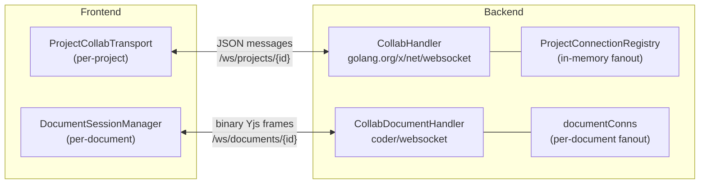
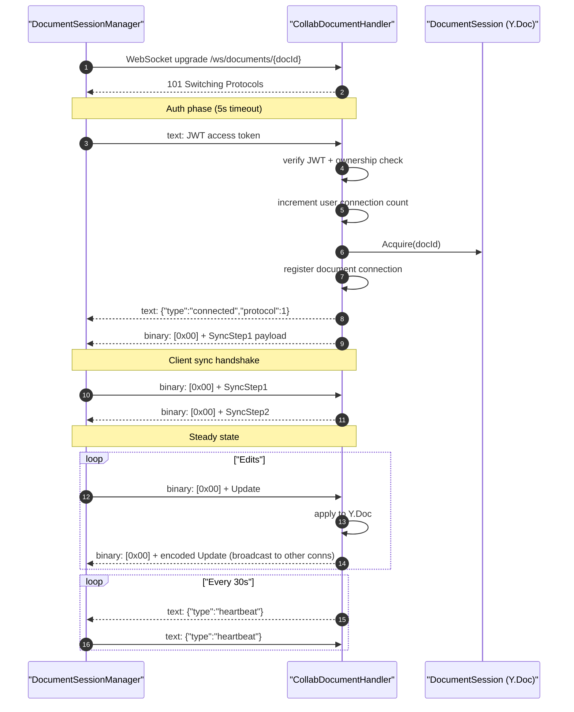
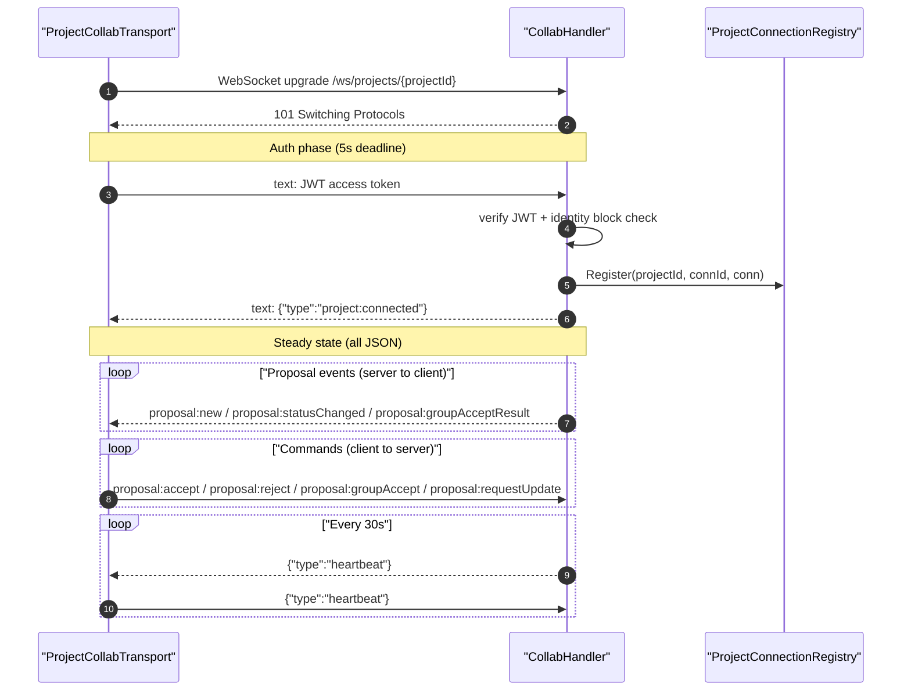
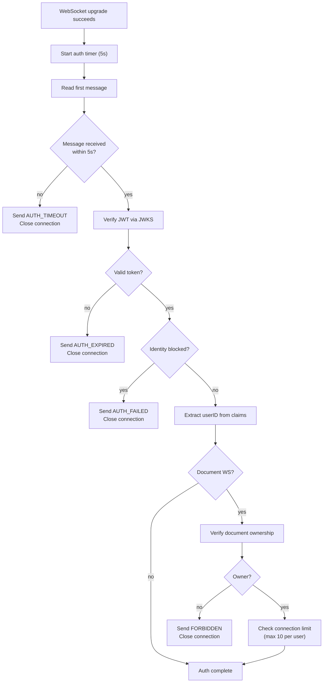

# WebSocket Transport

Two separate WebSocket connections carry collaboration traffic between frontend and backend. The document WS handles binary Yjs CRDT sync. The project WS handles JSON proposal lifecycle events. They use different libraries, protocols, and framing because they solve fundamentally different problems.

## Overview



### Why Two Connections

| Concern | Document WS | Project WS |
|---------|------------|------------|
| Scope | One per open document | One per project (shared across documents) |
| Protocol | Binary (Yjs sync + awareness) | JSON (proposal events + commands) |
| Library | `coder/websocket` (nhooyr) | `golang.org/x/net/websocket` |
| Frame type | `MessageBinary` with 1-byte prefix | `MessageText` (JSON objects) |
| Lifecycle | Tied to editor tab | Tied to workspace session |
| Fanout | Per-document connection set | Per-project connection registry |

The document WS must carry binary Yjs sync frames efficiently -- the `coder/websocket` library provides `MessageBinary` support, per-message compression control, and concurrency-safe writes. The project WS only needs JSON text frames, so the simpler `golang.org/x/net/websocket` codec-based API is sufficient.

---

## Document WebSocket (Binary Yjs Sync)

### Endpoint and Upgrade

`GET /ws/documents/{documentId}` -- See `collab_document_handler.go:80-120`.

The handler validates the UUID, builds origin patterns from `CORS_ORIGINS`, and upgrades via `websocket.Accept()`. Compression is disabled (Yjs payloads compress poorly after CRDT encoding).

### Connection Lifecycle



### Binary Framing

Every binary frame has a 1-byte prefix:

| Prefix | Meaning | Payload |
|--------|---------|---------|
| `0x00` | Sync | Yjs sync protocol (SyncStep1, SyncStep2, or Update) |
| `0x01` | Awareness | Yjs awareness update (cursor position, user presence) |

See `collab_document_handler.go:51-53` for prefix constants and `runtime.ts:22-24` for the frontend counterparts.

### Sync Handshake

After the `connected` JSON message, the server sends its SyncStep1 (state vector). The flow then follows the standard Yjs sync protocol:

1. Server sends SyncStep1 (its state vector) to client
2. Client receives server SyncStep1, sends its own SyncStep1 and a SyncStep2 (diff the server needs)
3. Server receives client SyncStep1, sends SyncStep2 (diff the client needs)
4. Both sides are now in sync; subsequent messages are Updates

The runtime tracks SyncStep2 receipt to fire `onInitialSyncComplete` exactly once. See `runtime.ts:182-185`.

### Limits

| Limit | Value | Purpose |
|-------|-------|---------|
| Read limit (library-level) | 2 MB | Safety net on `conn.SetReadLimit()` |
| App-level max frame | 256 KB | Rejects frames exceeding this with `FRAME_TOO_LARGE` |
| Max connections per user | 10 | Across all documents |
| Idle timeout | 5 min | Closes connection if no sync or awareness frames |
| Rate limit | 30 msg/s | Per-connection via `golang.org/x/time/rate.Limiter` |

See `collab_document_handler.go:41-53` for all constants.

### Broadcast (Fanout)

The handler maintains an in-memory `documentConns` map (`documentID -> set of *websocket.Conn`). When a client sends an Update, the handler applies it to the shared `DocumentSession` and broadcasts the encoded update to all other connections for that document, excluding the sender. See `collab_document_handler.go:553-581`.

The `BroadcastToDocument()` method is also called externally by `ProposalBroadcasterImpl` when a proposal is accepted server-side (AI auto-accept), fanning the resulting Yjs update to all connected document editors. See `collab_proposal_broadcaster.go:65-78`.

---

## Project WebSocket (JSON Proposals)

### Endpoint and Upgrade

`GET /ws/projects/{projectId}` -- See `collab_project.go:42-62`.

Uses `golang.org/x/net/websocket.Server` with a permissive handshake (origin check skipped -- auth is via JWT in the first message, not cookies).

### Connection Lifecycle



### Message Types

**Server-to-client events:**

| Type | Purpose |
|------|---------|
| `project:connected` | Auth succeeded, safe to send commands |
| `heartbeat` | Keep-alive ping |
| `proposal:snapshot` | Batch of pending proposals for a document (sent on document subscribe) |
| `proposal:new` | New proposal created (includes yjsUpdate as base64) |
| `proposal:statusChanged` | Proposal accepted/rejected |
| `proposal:groupAcceptResult` | Batch accept outcome per proposal |
| `proposal:updateData` | Unicast response with yjsUpdate for a specific proposal |
| `doc:error` | Document-scoped error (does NOT close the connection) |
| `error` | Connection-level error (may close the connection) |

**Client-to-server commands:**

| Type | Required Fields | Purpose |
|------|----------------|---------|
| `heartbeat` | -- | Keep-alive ack |
| `proposal:accept` | `documentId`, `proposalId`, `idempotencyKey` | Accept a proposal |
| `proposal:reject` | `documentId`, `proposalId` | Reject a proposal |
| `proposal:groupAccept` | `documentId`, `groupId`, `idempotencyKey` | Accept all proposals in a group |
| `proposal:requestUpdate` | `documentId`, `proposalId` | Fetch yjsUpdate for a snapshot-loaded proposal |

See `collab_proposal.go:23-34` for all `wsType` constants.

### Document Access Caching

Proposal commands include a `documentId`. The handler verifies document ownership and project membership on first use, then caches the result per connection. See `collab_project.go:113` and `:184-189`.

### Limits

| Limit | Value | Purpose |
|-------|-------|---------|
| Max payload | 64 KB | `conn.MaxPayloadBytes` |
| Auth timeout | 5 s | Deadline on first message read |
| Rate limit | 30 msg/s (1s window, 1s mute) | Per-connection sliding window tracker |
| Heartbeat interval | 30 s | Server sends ping |
| Heartbeat timeout | 5 s | Closes connection if ack not received |

See `collab.go:34-45` for constants.

### Broadcast (Fanout)

`InMemoryProjectConnectionRegistry` maps `connectionID -> {projectID, conn}`. `BroadcastToProject()` iterates all connections for a project and sends the JSON payload. See `project_connection_registry.go:81-111`.

---

## Authentication

Both WebSocket types use the same pattern: **JWT as first message after upgrade**.



**Why not use HTTP headers for auth?** WebSocket upgrade requests from browsers cannot set custom `Authorization` headers. The standard workaround is to send the token as the first message after the connection opens.

### Token Refresh

- **Frontend**: Both `DocumentSessionManager` and `createProjectCollabTransport` call `supabase.auth.getSession()` first; if expired, call `supabase.auth.refreshSession()`. See `DocumentSessionManager.ts:353-364` and `useProjectCollab.ts:441-452`.
- **Backend (document WS only)**: The heartbeat loop checks `jwtExpiry` on each tick and sends `AUTH_EXPIRED` when the token has lapsed. See `collab_document_handler.go:422-426`.
- **Frontend response**: On `AUTH_FAILED` or `AUTH_EXPIRED`, the client triggers a Supabase session refresh and lets the reconnect logic re-establish the connection. See `DocumentSessionManager.ts:293-295` and `useProjectCollab.ts:205-209`.

---

## Rate Limiting

### Document WS

Uses `golang.org/x/time/rate.Limiter` (token bucket) at 30 tokens/second. When exceeded, the server sends a `RATE_LIMITED` JSON error but does NOT close the connection -- the frame is dropped and the client can continue after the bucket refills. See `collab_document_handler.go:277-306`.

### Project WS

Uses a custom `collabInboundRateTracker` (sliding window). Allows 30 messages per 1-second window. When exceeded, the connection is muted for 1 second -- all messages during the mute period are silently dropped. A `RATE_LIMITED` error is sent once when the limit first trips. See `collab.go:57-80` and `collab_message_loop.go:48-68`.

---

## Reconnection

Both frontend clients use the same reconnection formula with exponential backoff and jitter:

```
delay = min(5000ms, 250ms * 2^attempt) + 15% jitter
minimum delay: 100ms
```

### Document WS Reconnection

`DocumentSessionManager.scheduleReconnect()` creates a new `WebSocket` and calls `runtime.reset()` to clear the sync handshake state, then re-attaches all socket event handlers. The existing `Y.Doc` and awareness state are preserved -- only the transport is re-established. See `DocumentSessionManager.ts:305-331`.

Reconnection is suppressed if the session has been explicitly released (refCount reaches 0) or the manager is destroyed.

### Project WS Reconnection

`createProjectCollabTransport` schedules reconnect on any `onclose` event unless `isStopped` is true. The new connection goes through the full auth + `project:connected` handshake before commands can be sent. See `useProjectCollab.ts:138-154`.

---

## Why Two Libraries

| Library | Used By | Why |
|---------|---------|-----|
| `coder/websocket` (nhooyr) | Document WS handler | Supports `MessageBinary` and `MessageText` frame types natively. Concurrent-write-safe. Provides `SetReadLimit()`, origin pattern matching, and compression control. Required for the binary Yjs sync protocol. |
| `golang.org/x/net/websocket` | Project WS handler | Codec-based API (`websocket.Message.Receive`, `websocket.JSON.Send`) is simpler for JSON-only traffic. `MaxPayloadBytes` built-in. Sufficient when only text frames are needed. |

The document WS needs strict binary/text frame discrimination because the same connection carries both (binary sync frames and text JSON heartbeat/error messages). The `coder/websocket` library returns `websocket.MessageBinary` vs `websocket.MessageText` from `conn.Read()`, making the dispatch straightforward. See `collab_document_handler.go:311-401`.

The project WS only carries text frames (JSON), so the `golang.org/x/net/websocket` codec approach (`websocket.Message.Receive` into `[]byte`, then check first byte for `{`) is adequate. See `collab_message_loop.go:50-86`.

---

## Related

- [yjs-state-lifecycle.md](yjs-state-lifecycle.md) -- Backend Yjs session management (Acquire/Release, persistence)
- [ai-edit-flow.md](ai-edit-flow.md) -- How AI edits flow through the proposal system
- [inline-review.md](inline-review.md) -- Frontend inline diff derivation from proposal yjsUpdates
- [sync-system.md](../frontend/architecture/sync-system.md) -- Frontend transport layer overview (HTTP drains, WS, offline)
