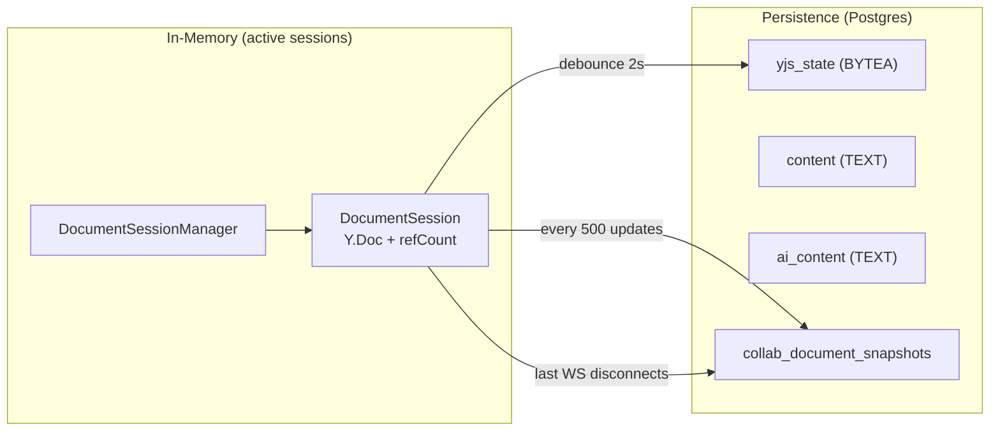
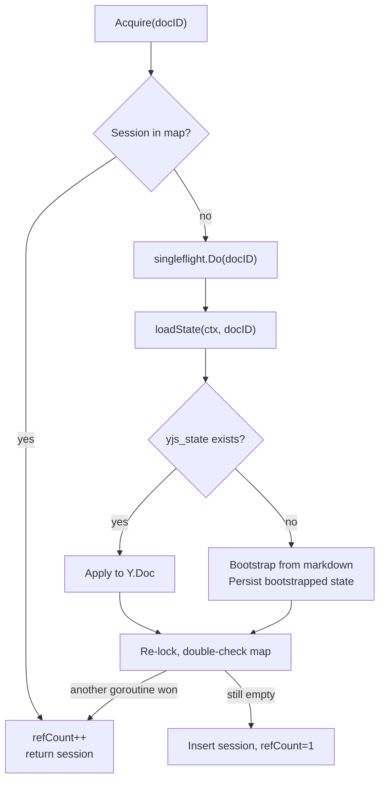
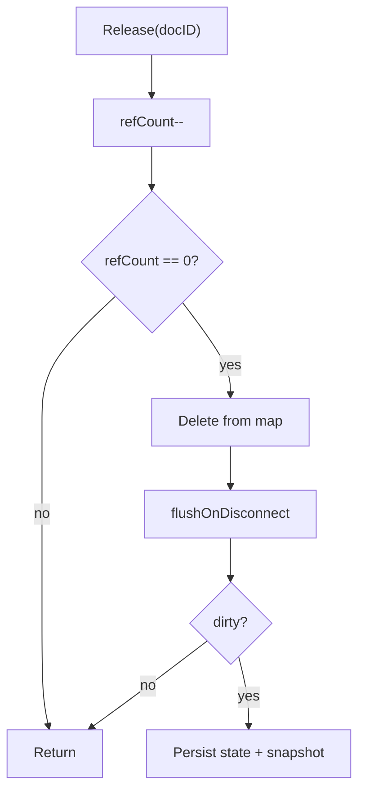
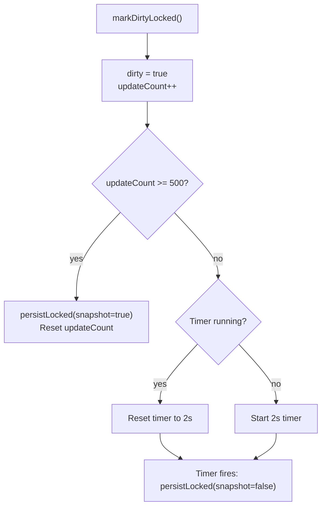
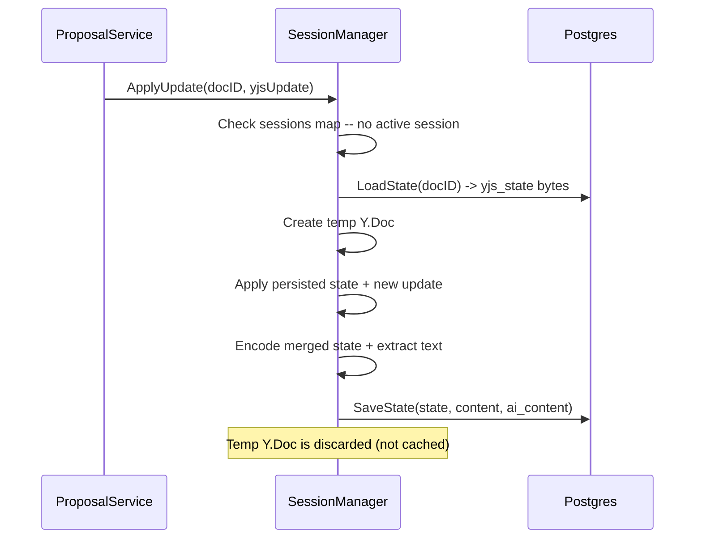

# Yjs State Lifecycle

How the backend manages Yjs document state: in-memory sessions, persistence, offline apply, and snapshots.

## Overview

---

## Session Lifecycle

### Acquire (ref-count + singleflight)

Key design decisions:

- **Singleflight** deduplicates concurrent first-loads. 5 WS connections racing on the same doc trigger one DB read, not five.
- **Detached context** (`context.Background()` + 30s timeout) keeps the shared load alive even if the triggering request is canceled.
- **Post-load double-check** handles the race where another goroutine's singleflight result was already inserted.

See `service/collab/session_manager.go:80-128`.

### Release

The map deletion happens **before** the flush. New `Acquire` calls during the flush create a fresh session via singleflight rather than getting a session being torn down.

See `service/collab/session_manager.go:131-161`.

---

## Persistence Model

### Three Triggers

| Trigger | When | Snapshot? | Context |
|---------|------|-----------|---------|
| Debounce timer | 2s after last update | No | `context.Background()` |
| Snapshot interval | Every 500 updates | Yes | Request context |
| Last WS disconnect | `flushOnDisconnect` | Yes | Fresh 10s timeout |

### Debounce + Snapshot Interval

`markDirtyLocked()` is called on every update (human edit or AI accept):

This means rapid typing delays persistence until 2s of silence, but continuous editing still snapshots every 500 updates.

See `service/collab/session_manager.go:432-450`.

### What Gets Persisted

`SaveState` writes three columns atomically:

| Column | Type | Content |
|--------|------|---------|
| `yjs_state` | BYTEA | Full Yjs binary state |
| `content` | TEXT | Plaintext from Y.Doc (human-visible) |
| `ai_content` | TEXT | Projected text (base + pending proposals) |

See `repository/postgres/collab/document_store.go:100-124`.

### Snapshots

Stored in `collab_document_snapshots` with:
- `snapshot_type`: `"auto_human"` or `"auto_ai_accept"` (based on `lastOrigin` of most recent update)
- TTL-cleaned via `DeleteExpiredAutoSnapshots`

See `repository/postgres/collab/document_store.go:238-251`.

---

## Offline Apply

When `ApplyUpdate` is called with no active WS session (e.g., AI auto-accept while editor is closed):

The temp doc is never stored in the sessions map -- it exists only for the merge operation.

See `service/collab/session_manager.go:221-254`.

---

## Bootstrap: First Collab Session

Documents created via REST API have `content` text but no `yjs_state`. On first `Acquire` or `BuildProjectedState`:

1. Load `content` from documents table
2. Create fresh Y.Doc, insert content into `"content"` Y.Text
3. Persist bootstrapped `yjs_state` back to DB
4. All subsequent operations use the Yjs state (CRDT ancestry established)

See `service/collab/session_manager.go:377-408`.

---

## GetStateSnapshot vs GetCurrentState

| Method | Returns when no active session | Used by |
|--------|-------------------------------|---------|
| `GetStateSnapshot` | `(nil, found=false, nil)` | AIContentProjector (has its own fallback + bootstrap) |
| `GetCurrentState` | Falls back to `stateStore.LoadState()` | GroupAccept (needs bytes, period) |

The split exists because consumers have different fallback needs. AIContentProjector needs the three-value return to trigger bootstrap. GroupAccept just needs the bytes.

See `service/collab/session_manager.go:258-301`.

---

## Related

- [ai-edit-flow](ai-edit-flow.md) -- End-to-end AI edit flow (uses session manager for apply)
- [ai-content-projection](ai-content-projection.md) -- How ai_content is computed from sessions
- [sync-system](../frontend/architecture/sync-system.md) -- Frontend transport layer
