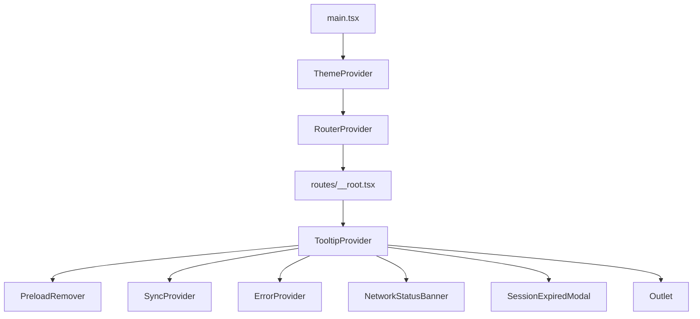
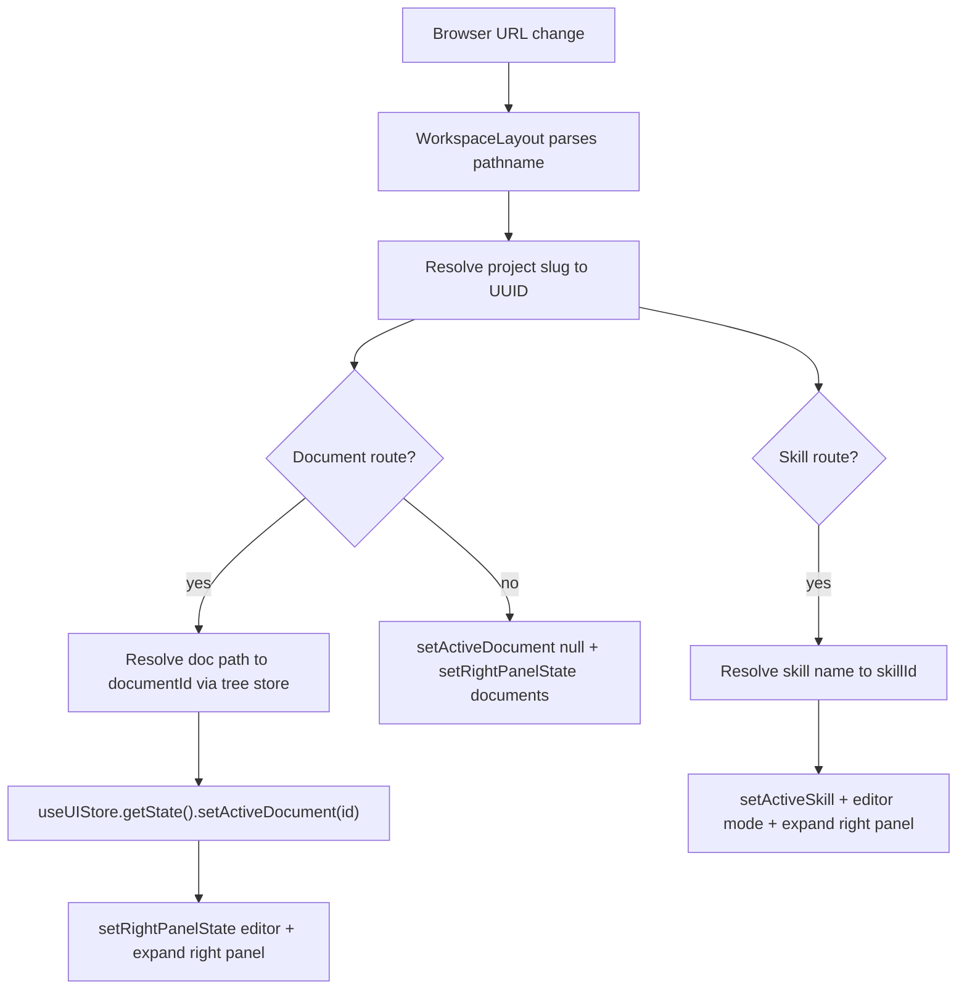
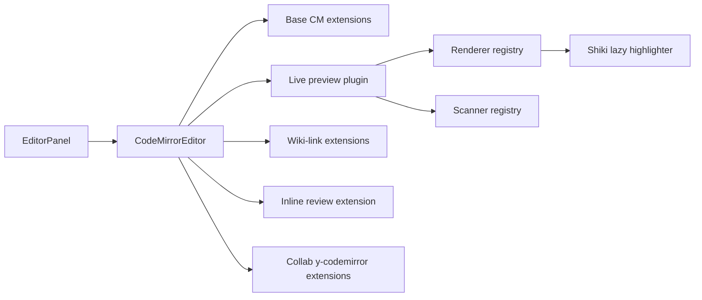
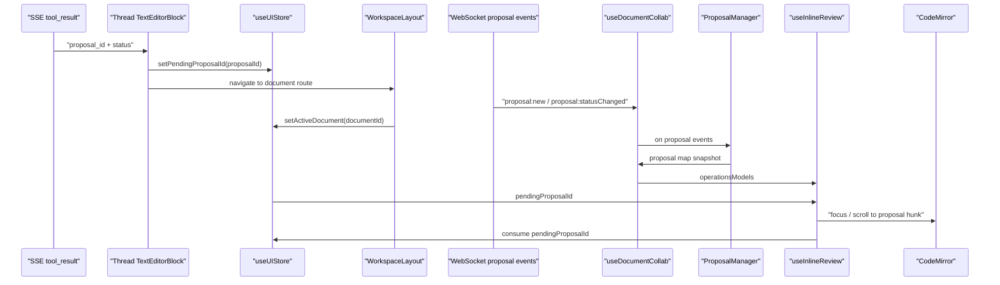
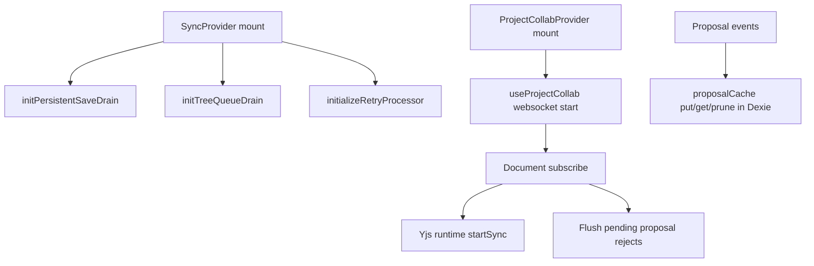
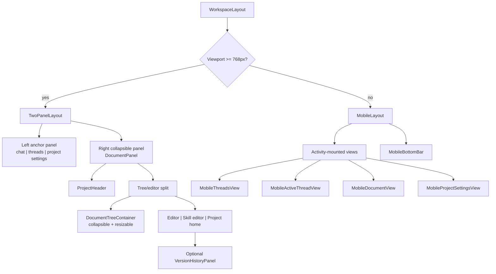

# Frontend Technical Documentation

Vite + TanStack Router + TypeScript + CodeMirror + Supabase

_Architecture sections verified against `frontend/src` on 2026-03-08._

## Quick Links

### Getting Started

- [Setup Quickstart](setup-quickstart.md)
- [Theme System](themes/README.md)
- `frontend/CLAUDE.md` -- detailed conventions, store architecture, caching patterns

### Architecture

- [Patterns](architecture/patterns.md) -- layer structure, state management, error handling, CodeMirror
- [Navigation Pattern](architecture/navigation-pattern.md)
- [Sync System](architecture/sync-system.md)
- [Layout System](architecture/layout-system.md)

### Authentication

- [Auth Implementation](auth/auth-implementation.md)

### Editor

- [Editor Caching](editor/editor-caching.md) -- document loading, collab/non-collab paths
- [Keybindings](editor/keybindings.md)

### Thread UI

- [Thread Rendering](threads/thread-rendering.md) -- block rendering, registries, grouping pipeline, SSE flow
- [Thread Pagination](threads/thread-pagination-guide.md) -- turn pagination and scroll management

### Styling

- [Theme System](themes/README.md)
- [Tailwind Strategies](themes/tailwind-strategies.md)
- [Design Tokens](themes/design-tokens.md)

### Development

```bash
pnpm dev           # Start dev server
pnpm build         # Production build (includes tsc --noEmit)
pnpm lint          # ESLint
pnpm format        # Prettier (includes Tailwind class sorting)
pnpm test          # Vitest unit tests
```

---

## Architecture Overview

### App Bootstrap

`main.tsx` creates the TanStack router, imports `globals.css`, and wraps the app in `ThemeProvider`. `routes/__root.tsx` owns the always-mounted runtime shell.

Global providers and surfaces from `__root.tsx`:

- `TooltipProvider`: shared Radix tooltip timing/context
- `PreloadRemover`: removes the static preload shell once React takes over
- `SyncProvider`: starts the retry processor plus HTTP save/tree drains
- `ErrorProvider`: central React error plumbing
- `NetworkStatusBanner`: online/offline status UI
- `SessionExpiredModal`: shown when API auth refresh fails after a `401`
- `Outlet`: the routed application content



### Route Tree

| Path | Purpose |
|---|---|
| `/` | Redirect to `/projects` or `/login` based on session |
| `/login` | Unauthenticated entry |
| `/auth/callback` | OAuth callback |
| `/privacy`, `/terms` | Public legal routes |
| `/_authenticated` | Auth guard (`beforeLoad` checks session) |
| `/_authenticated/projects` | Project list preload boundary |
| `/_authenticated/projects/$slug` | Workspace root |
| `/_authenticated/projects/$slug/tree` | Tree view |
| `/_authenticated/projects/$slug/threads` | Thread-focused view |
| `/_authenticated/projects/$slug/documents/$` | Splat document route |
| `/_authenticated/projects/$slug/skills/$skillName` | Skill editor |
| `/_authenticated/settings` | Settings page |

### URL / State Synchronization

`WorkspaceLayout` is the synchronization hub between URL changes and Zustand store state. Navigation helpers in `core/lib/panelHelpers.ts` do immediate state updates plus route navigation.



### State Management

| Store | Location | Owns | Persistence |
|---|---|---|---|
| `useUIStore` | `core/stores` | Panel state, active doc/thread/skill IDs, mobile tab, review toggles, pending queues | `persist` partialized |
| `useProjectStore` | `core/stores` | Project list, current project, CRUD, favorites | `persist` |
| `useTreeStore` | `core/stores` | Documents/folders/tree, load status, CRUD, multi-select, proposal badges | In-memory (Dexie tree cache) |
| `useEditorStore` | `core/stores` | Active document data, load/save status | In-memory |
| `useThreadStore` | `core/stores` | Thread list, active turn window, pagination, streaming turns, sibling nav | `persist` (empty partialize) |
| `useStreamStore` | `core/stores` | Per-stream runtime metadata | In-memory |
| `useSkillStore` | `core/stores` | Skills list, selected skill content, CRUD | In-memory |
| `useThreadPrefsStore` | `core/stores` | Thread request options | `persist` (global options only) |
| `useRecentDocumentsStore` | `core/stores` | Recent doc IDs per project | `persist` |
| `useErrorStore` | `core/stores` | Offline/online status, session-expired modal | In-memory |
| `useCollabStore` | `features/documents/stores` | Collab connection state, proposal map snapshots | In-memory |
| `useToolStreamStore` | `features/threads/stores` | Streaming tool-call state per toolCallId | In-memory |

#### Persistence mental model

| Layer | What lives there |
|---|---|
| Zustand `persist` (`localStorage`) | UI preferences, small metadata |
| Dexie (`IndexedDB`) | Project tree cache, retry queues, proposal `yjsUpdate` cache |
| Yjs IndexedDB (`y-indexeddb`) | Per-document collab mirror (`meridian-collab:{documentId}`) |
| Server | Projects, tree structure, documents, skills, threads, turn content |

### CodeMirror / Editor System

`EditorPanel` composes four independent concerns: content loading (`useDocumentContent`), REST sync (`useDocumentSync`), collab sync (`useDocumentCollab`), and inline review + wiki-links.

Collab is extension-gated: only collab-enabled file extensions get Yjs/WebSocket; others use REST autosave.



`core/cm6-collab` is the frontend collab library: `sync/` (transport-agnostic Yjs runtime), `proposals/` (event contracts + manager + commands), `review/` (inline review decorations/widgets).

### Frontend Collab System

One project-scoped WebSocket transport (`useProjectCollab`) feeds per-document subscriptions (`useDocumentCollab`). Each document gets its own `Y.Doc`, `Y.Text`, awareness, and IndexedDB persistence.

#### Dual-transport proposal discovery

New AI proposals arrive through two independent async paths. `pendingProposalId` bridges the gap -- the thread UI can navigate before the WebSocket payload arrives, or vice versa.



### Sync System

Five transport types coordinate data persistence:

| Transport | Mechanism | Key files |
|---|---|---|
| HTTP document save drain | Optimistic local write, Dexie retry queue, drain on startup/online/tick | `documentSyncService.ts`, `persistentSaveDrain.ts` |
| HTTP tree operation drain | Queue optimistic ops, coalesce, replay to REST, conflict-aware errors | `treeSyncService.ts`, `treeQueueDrain.ts` |
| WebSocket Yjs binary sync | Per-document subscribe, custom envelope framing | `useProjectCollab.ts`, `useDocumentCollab.ts`, `cm6-collab/sync/*` |
| WebSocket pending reject flush | Buffer reject commands when gate fails, flush on next `doc:subscribed` | `useDocumentCollab.ts` |
| Local proposal update cache | Fire-and-forget write-through Dexie cache, merged on reopen, stale-pruned | `proposalCache.ts` |



### Layout Architecture

`useLayoutStrategy()` selects `TwoPanelLayout` (>= 768px) or `MobileLayout` (< 768px).



Desktop: left panel (chat/threads/settings) is the non-collapsible anchor, right panel (documents) collapses. Collapse state derived from `selectEffectiveRightCollapsed`.

Mobile: all views stay mounted via React `Activity`, switching visibility by `mobileActiveTab`. Bottom nav sets tab in store; state-driven tabs preserve component state/scroll.

For layer boundaries (core vs features vs shared), see [Patterns](architecture/patterns.md).

### Common Gotchas

- **Deep-link resolution is async.** Document and skill routes require tree/skill hydration before IDs resolve. `WorkspaceLayout` triggers background loads when needed.
- **Mobile views stay mounted.** React `Activity` hides tabs without unmounting -- do not assume tab switches cause cleanup.
- **Right panel collapse bugs** usually live in `rightPanelReady`, `rightPanelUserOverride`, or `selectEffectiveRightCollapsed`.
- **Collab is extension-gated.** Non-collab files use `useDocumentSync()` + REST autosave, not Yjs.
- **Proposal discovery is race-tolerant.** SSE may surface `proposal_id` before or after the WebSocket `proposal:new` event; `pendingProposalId` bridges the gap.
- **Resolved proposals disappear from collab store.** Thread badges infer status from both the initial SSE status and current collab-map presence.
