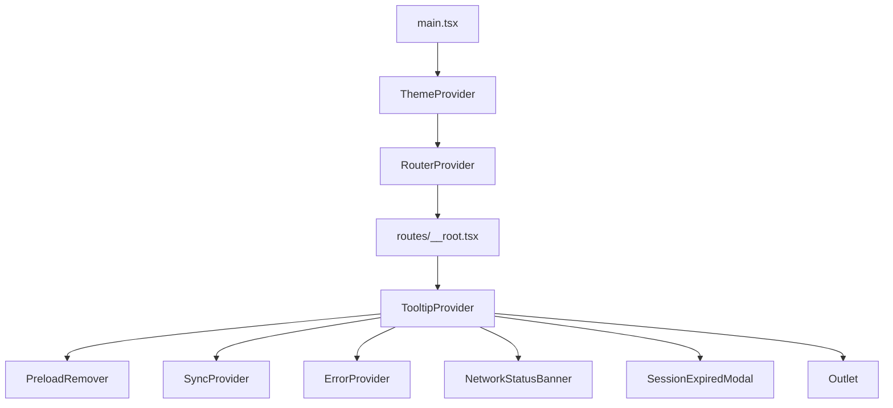
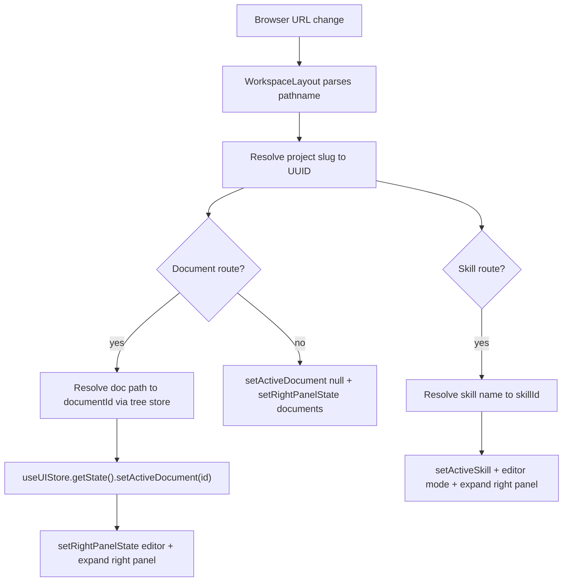
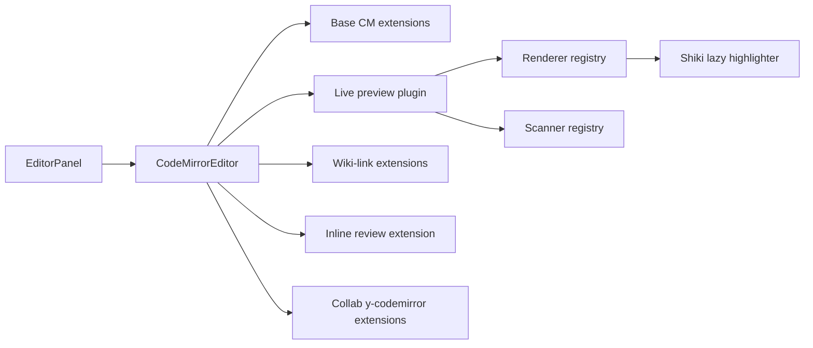
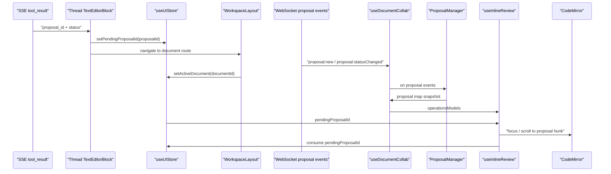
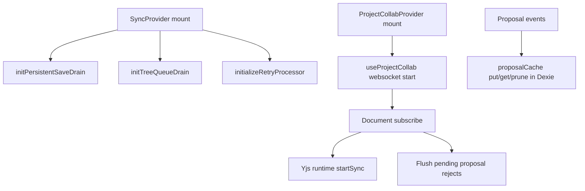
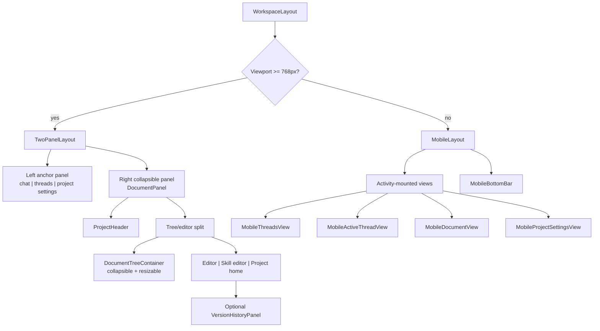
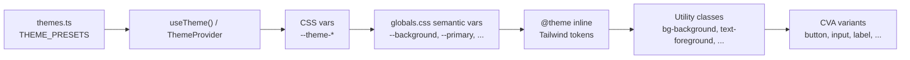

# Frontend Architecture Map (Actual Code)

_Last verified against `frontend/src` on 2026-03-08._

This document describes what currently exists in the Meridian frontend codebase.

## 1. Start Here

If you are tracing runtime behavior for the first time, read files in this order:

1. `frontend/src/main.tsx` - app bootstrap (`ThemeProvider` + `RouterProvider`).
2. `frontend/src/routes/__root.tsx` - global providers and always-mounted runtime surfaces.
3. `frontend/src/routes/_authenticated.tsx` and `frontend/src/routes/_authenticated/projects.tsx` - auth guard and project preload boundary.
4. `frontend/src/routes/_authenticated/projects/$slug/*` - workspace entry routes (`index`, `threads`, `tree`, `documents/$`, `skills/$skillName`).
5. `frontend/src/features/workspace/components/WorkspaceLayout.tsx` - project resolution, URL/state sync, layout selection, and collab-provider mount.

Then jump to the main feature entrypoints:

- `features/documents/components/DocumentPanel.tsx` and `EditorPanel.tsx`
- `features/threads/components/ThreadListPanel.tsx` and `ActiveThreadView.tsx`
- `features/projects/components/ProjectSettingsPanel.tsx`
- `features/skills/components/SkillEditorPanel.tsx`

Read next: [navigation-pattern.md](./architecture/navigation-pattern.md), [layout-system.md](./architecture/layout-system.md)

## 2. App Bootstrap and Global Providers

### Bootstrap split

- `main.tsx` creates the TanStack router, imports `globals.css`, and wraps the app in `ThemeProvider`.
- `routes/__root.tsx` owns the always-mounted runtime shell around the routed application.

### Global providers and surfaces from `__root.tsx`

- `TooltipProvider`: shared Radix tooltip timing/context.
- `PreloadRemover`: removes the static preload shell once React takes over.
- `SyncProvider`: starts the retry processor plus HTTP save/tree drains.
- `ErrorProvider`: central React error plumbing.
- `NetworkStatusBanner`: online/offline status UI.
- `SessionExpiredModal`: shown when API auth refresh fails after a `401`.
- `Outlet`: the routed application content.



Read next: [sync-system.md](./architecture/sync-system.md), [layout-system.md](./architecture/layout-system.md)

## 3. Routing, Auth, and API Boundary

### Route tree (file-based)

- `/` -> immediate redirect to `/projects` or `/login` based on Supabase session.
- `/login` -> unauthenticated entry; authed users redirected to `/projects`.
- `/auth/callback` -> OAuth callback completion.
- `/privacy`, `/terms` -> public legal routes.
- `/_authenticated` -> guarded layout (`beforeLoad` checks session, else redirect `/login`).
- `/_authenticated/projects` -> loads project list once and renders nested project routes.
- `/_authenticated/projects/` -> project index page.
- `/_authenticated/projects/$slug` -> workspace root for a project.
- `/_authenticated/projects/$slug/tree` -> workspace tree view route.
- `/_authenticated/projects/$slug/threads` -> workspace thread-focused route.
- `/_authenticated/projects/$slug/documents/$` -> splat document route (`$` captures the full path after `/documents/`).
- `/_authenticated/projects/$slug/skills/$skillName` -> skill editor route.
- `/_authenticated/settings` -> authenticated settings page.

### Auth and API boundary

- Route guards (`/`, `/login`, `/_authenticated`) use Supabase `getSession()` checks inside TanStack `beforeLoad`.
- `/_authenticated/projects` loads projects once at the layout route, before nested workspace routes render.
- `fetchAPI()` is the REST boundary: it reads the current Supabase session, injects the JWT as `Authorization: Bearer <token>`, converts backend snake_case JSON to camelCase, and retries some transient GET failures once.
- On REST `401`, `fetchAPI()` attempts `supabase.auth.refreshSession()` once, retries the request on success, and otherwise marks the session expired so `SessionExpiredModal` opens.
- WebSocket collab has a separate auth path: `useProjectCollab` gets an access token from Supabase and can refresh the session when the socket needs a newer token.

### URL ↔ UI state synchronization

`WorkspaceLayout` is the synchronization hub:

- Parses `location.pathname` to derive `urlDocumentPath` and `urlSkillName`.
- Resolves path/name to IDs using `useTreeStore.documents` and `useSkillStore.skills`.
- Uses `useUIStore.getState()` inside effects for write-side synchronization (no reactive dependency loops).
- On deep-linked document URLs, loads the tree in the background if the project is resolved but the tree is still empty.
- On deep-linked skill URLs, loads skills in the background if the project is resolved but the skills list is still empty.
- On document URL: sets `activeDocumentId`, `rightPanelState="editor"`, expands right panel.
- On tree/non-document URL: clears active document and sets `rightPanelState="documents"`.
- On skill URL: sets `activeSkillId`, forces editor mode, expands right panel.
- On project switch: clears project-scoped UI state and stale skills.

Navigation helpers in `core/lib/panelHelpers.ts` do immediate state updates plus route navigation (`openDocument`, `openSkill`, `closeEditor`).



Read next: [auth-implementation.md](./auth-implementation.md), [navigation-pattern.md](./architecture/navigation-pattern.md)

## 4. Directory Structure (`frontend/src`)

```text
frontend/src/
├── core/                 # Cross-feature infrastructure (editor engine, stores, API, sync, theme)
├── features/             # Product feature modules (auth, documents, threads, projects, skills, workspace)
├── routes/               # TanStack file-based route definitions
├── shared/               # Shared UI/layout primitives and reusable components
├── lib/                  # Small global helpers (`utils.ts`)
├── types/                # Cross-app type declarations (`api.ts`, ambient types)
├── globals.css           # Tailwind v4 theme tokens + global component styles
├── main.tsx              # App bootstrap (ThemeProvider + RouterProvider)
└── routeTree.gen.ts      # Generated TanStack route tree
```

### `core/` subdirectories

- `core/editor/`: CodeMirror editor implementation, live-preview renderer system, adapter/registry layer, editor cache.
- `core/cm6-collab/`: Frontend collab library (Yjs sync runtime, proposal contracts/manager, inline review runtime/extensions).
- `core/stores/`: Global Zustand stores (projects, tree, editor, threads, UI, stream, skills, error, prefs).
- `core/lib/`: API client, Dexie schema, cache/retry/sync drains, panel helpers, tree utilities, proposal cache, logging/errors.
- `core/services/`: Domain services (`documentSyncService`, tree queue service, document cleanup).
- `core/references/`: Wiki-link/reference path resolution.
- `core/retrieval/`: Shared stale-while-revalidate and terminal-error selection policies.
- `core/theme/`: Theme state + CSS variable application.
- `core/components/`: App-wide providers (`SyncProvider`, `ErrorProvider`, preload removal).
- `core/hooks/`: Shared hooks (`useAbortableEffect`, `useLayoutStrategy`, etc).
- `core/supabase/`: Supabase client setup.
- `core/clipboard/`: Cross-editor clipboard codec/CM extension.

### `features/` modules (actual)

- `auth/`: login/session/profile/user-menu.
- `documents/`: document tree, editor panel, collab hooks/context/store, inline review UI.
- `threads/`: thread list/chat UI, SSE streaming pipeline, composer, tool-stream store.
- `projects/`: project list/cards/settings dialogs/panels.
- `skills/`: skill list/editor/create flows + hooks/types.
- `workspace/`: top-level workspace composition (`WorkspaceLayout`).
- `folders/`: folder type exports.
- `editor/`: currently empty placeholder directory.

### `shared/`

- `shared/components/ui/`: shadcn/Radix-style UI primitives (`button`, `dialog`, `dropdown-menu`, `sheet`, etc).
- `shared/components/layout/`: layout strategies (`TwoPanelLayout`, `MobileLayout`), rail, mobile headers/bars, toggles.
- `shared/reference-pill/`: reusable inline reference pill rendering + behavior/popover navigation.
- `shared/components/`: reusable app-level components (`ErrorPanel`, `NetworkStatusBanner`, `SessionExpiredModal`, etc).

## 5. State Management (All Zustand Stores)

### Stores inventory

| Store | Location | Owns | Persistence |
|---|---|---|---|
| `useUIStore` | `core/stores` | Panel collapse/ready state, active doc/thread/skill IDs, mobile tab, tree collapse, review UI toggles, pending proposal/ref queues | `persist` (`ui-store`) partialized |
| `useProjectStore` | `core/stores` | Project list, current project, load/create/update/delete/favorite | `persist` (`project-store`) |
| `useTreeStore` | `core/stores` | Documents/folders/tree/expanded folders, tree load status, tree CRUD, multi-select, proposal count badges | In-memory (tree cache via Dexie, not Zustand persist) |
| `useEditorStore` | `core/stores` | Active document data, load/save status/errors, refresh | In-memory |
| `useThreadStore` | `core/stores` | Thread list, active thread turn window, pagination, thread mutations, streaming turn content mutations, sibling navigation | `persist` configured with empty `partialize` (effectively non-persistent data) |
| `useStreamStore` | `core/stores` | Per-stream runtime metadata (`streamId -> threadId/url/block info`) | In-memory |
| `useSkillStore` | `core/stores` | Skills list, selected skill content, skill CRUD/loading state | In-memory |
| `useThreadPrefsStore` | `core/stores` | Thread request options (global + current) | `persist` (`thread-prefs`, global options only) |
| `useRecentDocumentsStore` | `core/stores` | Recent doc IDs per project | `persist` (`recent-documents`) |
| `useErrorStore` | `core/stores` | Offline/online status, session-expired modal state | In-memory |
| `useCollabStore` | `features/documents/stores` | Collab connection state per document + proposal map snapshots per document | In-memory |
| `useToolStreamStore` | `features/threads/stores` | Streaming tool-call state per `toolCallId` | In-memory |

### Key patterns used in stores

- Display subscriptions: components subscribe with selectors (`useStore((s) => ...)`) for render data.
- Action-side reads: effects/actions often read with `useStore.getState()` to avoid effect dependency loops while mutating store state.
- Abort/race control:
  - `useProjectStore`: module-level `AbortController` for `loadProjects`.
  - `useThreadStore`: `navigationAbortController` for sibling navigation and signal chaining.
  - `useTreeStore`: monotonic `loadTreeRequestId` stale-response guard + optional signal.
  - `useEditorStore`: `_activeDocumentId` intent guard prevents stale load writes.
- Stale-while-revalidate loaders (`runBackgroundRetrieval`) in projects/threads/skills.

### Persistence mental model

- Persisted Zustand (`localStorage`): UI preferences and small metadata (`useUIStore`, `useProjectStore`, `useThreadPrefsStore`, `useRecentDocumentsStore`).
- Dexie (`IndexedDB`): project tree cache, retry queues, and proposal `yjsUpdate` cache.
- Yjs IndexedDB (`y-indexeddb`): per-document collab mirror under `meridian-collab:{documentId}`.
- Server-authoritative data: projects, tree structure, documents, skills, threads, and turn content.

Read next: [sync-system.md](./architecture/sync-system.md)

## 6. Feature Modules (`features/`)

### `features/auth`

- Components: login form, user avatar/menu/button.
- Hooks: `useSupabaseSession`, `useUserProfile`, `useAuthActions`.
- Utility: menu item builders.

### `features/documents`

- Components: tree panel/container/items, editor panel/header, version history, import dialogs, review toolbar/dialog, collab indicator.
- Hooks: `useDocumentContent`, `useDocumentSync`, `useDocumentCollab`, `useInlineReview`, `useProjectCollab`, wiki-link hook.
- Contexts: `ProjectCollabContext` (project-scoped collab transport).
- Store: `useCollabStore`.
- Operations: bulk delete abstraction.
- Types/Utils: document/import/snapshot types, file/import helpers.

### `features/threads`

- Components: thread list/tree/row, active chat view, turn renderer blocks, turn composer/input, thread header/actions.
- Hooks: thread list loader, turns loader, SSE connection stack (`hooks/sse/*`), scroll controller.
- Store: `useToolStreamStore` (tool streaming metadata).
- Composer subsystem: CM-based composer model + inline element/reference mapping.

### `features/projects`

- Project listing cards/sections, sort/search UI, create/rename/delete dialogs, project settings panel/mobile settings view.

### `features/skills`

- Skill list/panel, create panel, editor panel, form validation.
- Hook: `useSkillsForProject`.

### `features/workspace`

- `WorkspaceLayout`: project resolution, URL/state sync, layout strategy selection, panel composition, collab provider mount.

### `features/folders`

- Folder type and export boundary.

## 7. Layer Boundaries

`core/` provides reusable platform capabilities, `features/` owns product workflows, and `shared/` holds UI primitives plus layout building blocks.

- `core` examples: API client auth injection, Dexie schema, sync drains, global stores, editor engine internals, theme system.
- `features` examples: thread UI workflows, document tree interactions, project settings screens, skill CRUD views.
- `shared/components/ui/*`: design-system primitives built with Radix + class-variance-authority (`button` variants, dialogs, menus, sheets, resizable panels).
- `shared/components/layout/*`: reusable layout framework elements (desktop/mobile strategies, rail, headers, toggles).
- `shared/reference-pill/*`: reusable reference pill rendering/interaction used by editor and thread surfaces.
- `shared/components/*`: generic app components (`EmptyState`, `ErrorPanel`, `NetworkStatusBanner`, etc).

Practical dependency rule: features import from core frequently, and feature surfaces compose shared UI, but core does not depend on feature-specific UI components.

## 8. CodeMirror / Editor System

### Editor composition

`EditorPanel` composes four independent concerns:

- `useDocumentContent`: load/hydrate local editor state.
- `useDocumentSync`: debounced REST saves for non-collab files.
- `useDocumentCollab`: Yjs/WebSocket sync + proposal state for collab-enabled extensions.
- `useInlineReview` + `useEditorWikiLinks`: proposal hunks and wiki-link interactions.

### Base CodeMirror extensions (`CodeMirrorEditor`)

Loaded at editor creation:

- History + keymaps (`default`, `history`, close-brackets).
- Markdown language extension.
- Live preview plugin (renderer/scanner registry).
- Theme extension + line wrapping + scroll margins + click-below-content behavior.
- Compartments for runtime reconfigure (`editable`, `theme`, `livePreview`).

Additional extensions are injected from `EditorPanel`:

- Collab extensions (y-codemirror integration from `cm6-collab`).
- Wiki-link interaction extensions.
- Inline review extension.
- Optional plaintext font theme extension for `.txt`.

### Live preview system

- `livePreview/plugin.ts` scans visible syntax ranges and builds decorations.
- Built-in renderers: emphasis, headings, links, inline/fenced code, lists, blockquote, HR, strikethrough, tables.
- Scanner path includes wiki-link scanner for normal `[[path | name]]` syntax, with legacy `@[[...]]` compatibility still supported by the regex/parser.
- Shiki highlighter is lazy-loaded; once ready, a state effect triggers decoration rebuild.

### `core/cm6-collab` library role

`core/cm6-collab` is the frontend collab library, split into:

- `sync/`: transport-agnostic Yjs runtime + envelope framing/unframing.
- `proposals/`: proposal event contracts + proposal manager + command builders.
- `review/`: derive proposal operations/hunks and render inline review decorations/widgets.



## 9. Frontend Collab System (Yjs + WebSocket + Proposals)

### Runtime layering

- `ProjectCollabProvider` creates one project-scoped WebSocket transport (`useProjectCollab`).
- Each open document (`useDocumentCollab`) subscribes to that transport with document-specific listeners.
- `createCollabSyncRuntime` owns `Y.Doc`, `Y.Text`, awareness, and y-codemirror extensions.
- IndexedDB persistence via `y-indexeddb` is attached per document (`meridian-collab:{documentId}`).

### Proposal flow on frontend

- WebSocket proposal events are parsed in `useProjectCollab` and forwarded per document.
- `useDocumentCollab` updates `ProposalManager` and mirrors state into `useCollabStore`.
- `useInlineReview` derives hunks from `operationsModels` and pushes review effects into CM state.
- From thread tool results, `TextEditorBlock` sets `pendingProposalId` then navigates to editor.
- `useInlineReview` consumes `pendingProposalId` to auto-focus the relevant proposal hunk.

### Dual-transport proposal discovery

New AI proposals can become visible through two independent async paths:

- WebSocket: `proposal:new` and `proposal:statusChanged` events flow into `useDocumentCollab` -> `ProposalManager` -> `operationsModels`.
- SSE: the thread tool result includes `proposal_id` and `status`; `TextEditorBlock` reads those fields, sets `pendingProposalId`, and navigates to the document.

`pendingProposalId` is the bridge between those paths. The thread UI can navigate before the WebSocket proposal payload has been processed, or the WebSocket event can arrive first; `useInlineReview` waits until the relevant proposal has ready operations, scrolls to the first hunk, then clears the pending ID.

Some proposals arrive pre-accepted. In that case the thread result carries `status="accepted"`, `useProposalStatus()` shows an accepted badge immediately, and the proposal may never appear as a pending entry in the collab store.



Read next: [sync-system.md](./architecture/sync-system.md)

## 10. Sync System (5 transport types and coordination)

### Transport types in current code

1. HTTP document save drain:
   - Write optimistic content locally, queue failed saves in Dexie `pendingDocumentSaves`, drain on startup/online/5s tick.
   - Files: `documentSyncService.ts`, `persistentSaveDrain.ts`.

2. HTTP tree operation drain:
   - Queue optimistic rename/move/delete ops in `pendingTreeOps`, coalesce, replay to REST API, conflict-aware error handling.
   - Files: `treeSyncService.ts`, `treeQueueDrain.ts`, tree store mutation paths.

3. WebSocket Yjs binary sync:
   - Per-document `doc:subscribed` -> `runtime.startSync()`; binary frames wrapped with custom envelope.
   - Files: `useProjectCollab.ts`, `useDocumentCollab.ts`, `cm6-collab/sync/*`.

4. WebSocket pending reject command flush:
   - `pendingRejectsRef` buffers proposal reject commands when gate/send fails; flushes on next `doc:subscribed`.
   - File: `useDocumentCollab.ts`.

5. Local proposal update cache:
   - Fire-and-forget write-through cache of proposal `yjsUpdate` in Dexie `proposalUpdates`; merged on reopen and stale-pruned.
   - File: `proposalCache.ts` wired via `useDocumentCollab.ts`.

### Coordination point

- `SyncProvider` initializes and cleans up HTTP drain subsystems globally.
- WebSocket collab transports are lifecycle-managed by workspace/document hooks, not by `SyncProvider`.



Read next: [sync-system.md](./architecture/sync-system.md)

## 11. Layout Architecture

### Strategy pattern

- `useLayoutStrategy()` chooses:
  - `TwoPanelLayout` for `>= 768px`.
  - `MobileLayout` for `< 768px`.

### Desktop (`TwoPanelLayout`)

- Panel group: left chat/threads/settings anchor (default 42%), right documents panel (default 58%).
- Right panel is collapsible (collapsed size `0`), left panel is always visible and remains the anchor.
- Collapse state is derived from UI store selectors (`selectEffectiveRightCollapsed`), mixing readiness + user override.
- `WorkspaceRail` controls left panel view and collapse behavior.

### Documents area (`DocumentPanel`)

- Nested split: document tree (collapsible/resizable) + editor/home panel.
- Active right-side content is chosen by `activeSkillId`/`activeDocumentId`/route-resolving state.
- Optional version history side panel appears when toggled.

### Mobile (`MobileLayout` + `MobileDocumentView`)

- All major views remain mounted using React `Activity` and switch visibility by `mobileActiveTab`.
- Bottom nav (`MobileBottomBar`) sets tab in store; state-driven tabs preserve component state/scroll.
- Initial tab is derived once from URL path on mount.



Read next: [layout-system.md](./architecture/layout-system.md), [layout-data-flow.md](./architecture/layout-data-flow.md)

## 12. Design System and Writer-First Implementation

### Theme/token architecture

- Theme runtime: `ThemeProvider` + `useTheme`.
- Active preset: single `modern-literary` theme (theme switching intentionally no-op).
- `themes.ts` defines `THEME_PRESETS`; `useTheme()` applies the active preset's colors, typography, and radius to CSS variables on `<html>`.
- `globals.css` maps `--theme-*` to semantic tokens (`--background`, `--card`, `--primary`, etc) and Tailwind custom tokens via `@theme inline`.



### Typography and palette in code

- Typography utilities: `.type-display`, `.type-section`, `.type-body`, `.type-label`, `.type-meta`.
- Primary/foundation colors are warm-paper + sage + gold in light mode, warm-dark equivalents in dark mode.
- Global focus-ring and pointer/cursor behavior are standardized in `globals.css`.

### Component variant system

- UI primitives use `class-variance-authority` patterns (`button` variants: `default`, `secondary`, `outline`, `ghost`, `destructive`, `accent`, `link`; multiple size variants including icon scales).
- Layout/header primitives (`PanelHeader`, `MultiRowHeader`, rail/toggles) are shared across document/thread panes.

### Writer-first behavior visible in implementation

- Desktop shell is conversation-anchored: chat/threads/settings stay mounted in the non-collapsible left panel, while documents are the collapsible right panel.
- Writing still gets a dedicated document zone inside that right panel: tree + editor/skill/home + optional version history.
- Progressive reveal: panel readiness auto-collapses until data is loaded, then auto-expands unless user override exists.
- Low-friction writing flow: debounced autosave, flush-on-unmount, direct route deep-linking to documents/skills, minimal navigation interruption.

Read next: [themes/README.md](./themes/README.md), [tailwind-strategies.md](./tailwind-strategies.md)

## 13. Common Gotchas

- Deep-linked document routes do not resolve immediately. `WorkspaceLayout` first resolves the project, then hydrates the tree in the background if `effectiveDocumentPath` exists and the tree is still empty.
- Deep-linked skill routes have the same shape: skills are loaded lazily, and an unresolved `skillName` redirects back to the project root once the skill list finishes loading.
- Mobile views stay mounted via React `Activity`. Hidden tabs pause effects and preserve state; do not assume tab switches cause unmount/remount cleanup.
- The desktop documents panel is the collapsible side. Bugs around unexpected collapsing usually live in `rightPanelReady`, `rightPanelUserOverride`, or `selectEffectiveRightCollapsed`.
- Collab is extension-gated. `EditorPanel` only enables Yjs/WebSocket proposal flow for collab-enabled extensions; non-collab documents use `useDocumentSync()` and REST autosave instead.
- Proposal discovery is intentionally race-tolerant. SSE may surface `proposal_id` before or after the WebSocket `proposal:new` event; `pendingProposalId` exists specifically to bridge that gap.
- Resolved proposals are removed from the collab store map. Thread badges infer `pending` vs `accepted` vs `resolved` from both the initial SSE status and current collab-map presence.

Read next: [navigation-pattern.md](./architecture/navigation-pattern.md), [sync-system.md](./architecture/sync-system.md), [layout-system.md](./architecture/layout-system.md)
