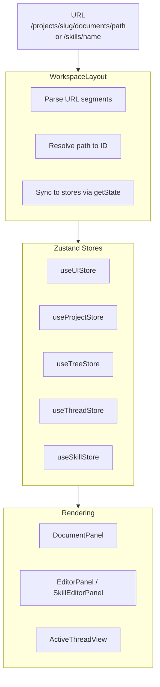
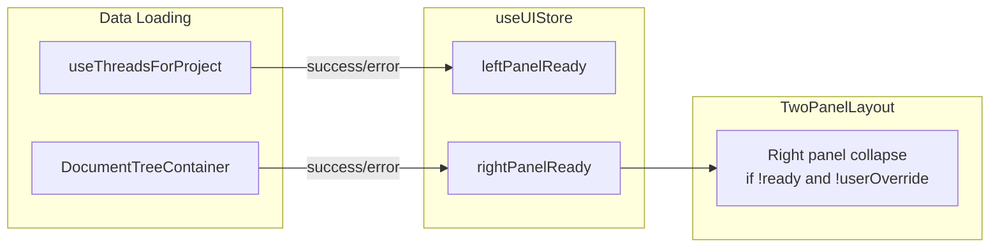
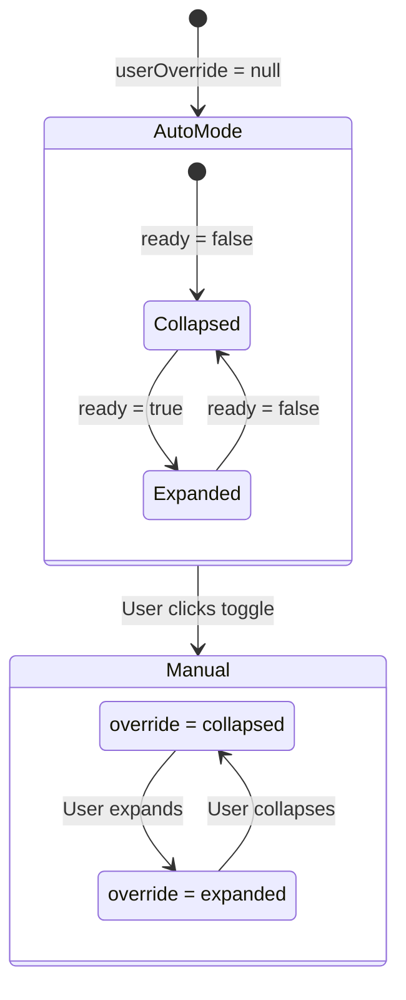

# Layout Data Flow

How URL state, Zustand stores, and ready flags coordinate to render the workspace.

## URL to Rendering Pipeline

Stores are in `frontend/src/core/stores/`. See `frontend/CLAUDE.md` for store conventions and the "Subscribe for Display, Read for Action" pattern.

## Ready Flag Flow

Ready flags control right panel auto-collapse during data loading.

`leftPanelReady` is only used by `WorkspaceRail` for icon highlighting -- it does not collapse the left panel.

## Right Panel Collapse Logic

Priority: `userOverride !== null` wins over `ready` flag. Override is persisted to localStorage; ready flags are session-scoped.

## Navigation Helpers

`frontend/src/core/lib/panelHelpers.ts` provides state-first navigation (instant feedback, then URL update for browser history):

| Function | Purpose |
|----------|---------|
| `openDocument(documentId, documentPath, projectSlug, navigate)` | Opens doc in editor, expands right panel |
| `openSkill(skillId, skillName, projectSlug, navigate)` | Opens skill in editor, expands right panel |
| `closeEditor(projectSlug, navigate)` | Clears active doc, returns to tree view |
| `decodeDocumentPath(urlPath)` | Decodes URL path back to document path (handles double-encoding) |

## Project Switching

When switching projects, `WorkspaceLayout` resets all document/skill/thread state to prevent context leakage. User panel override is preserved (it's a preference, not project-specific). First load skips reset to preserve deep-link state.

See `WorkspaceLayout.tsx` project change effect.
