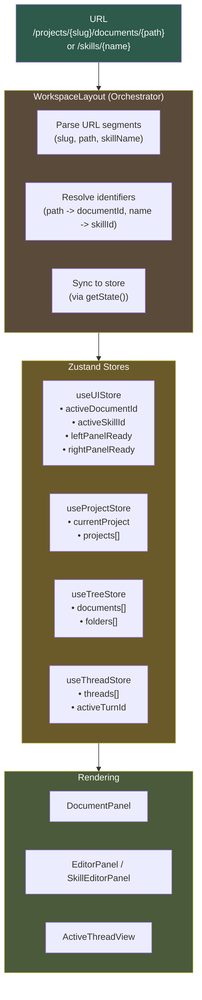
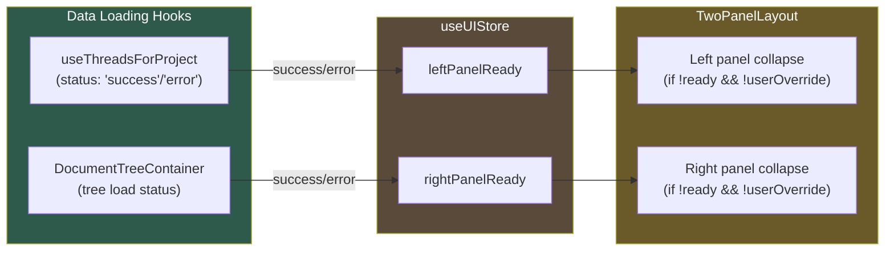
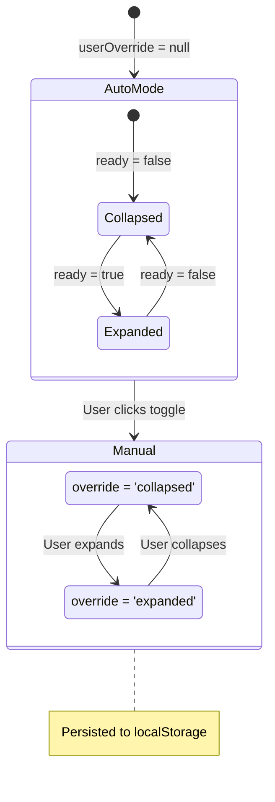
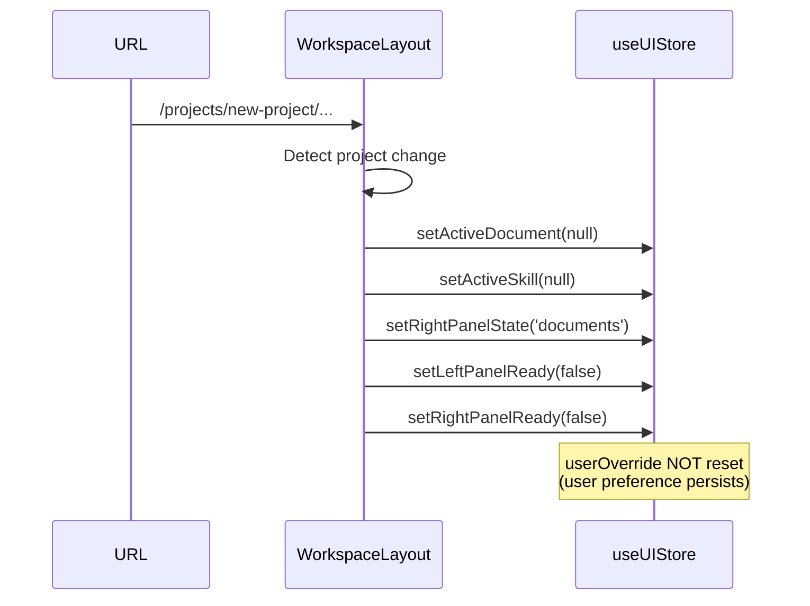

# Layout Data Flow

How URL state, Zustand stores, and ready flags coordinate to render the workspace.

## URL -> State Flow



## Store Interaction Patterns

### Subscribe for Display, Read for Action

```typescript
// ✅ Subscribe: Component re-renders when value changes
const { activeDocumentId } = useUIStore()

// ✅ Read: Get current value without subscribing (in effects/handlers)
useEffect(() => {
  const store = useUIStore.getState()
  if (effectiveDocumentId) {
    store.setActiveDocument(effectiveDocumentId)
  }
}, [effectiveDocumentId])
```

**Why?** Prevents subscription loops where a component subscribes to state it also updates.

### Key Stores

| Store | Purpose | Key State |
|-------|---------|-----------|
| `useUIStore` | UI state, panel collapse, active selections | `activeDocumentId`, `activeSkillId`, `*PanelReady`, `*PanelUserOverride` |
| `useProjectStore` | Project data, current selection | `currentProject`, `projects` |
| `useTreeStore` | Document tree data | `documents`, `folders` |
| `useThreadStore` | Thread/turn data | `threads`, `activeTurnId` |

## Ready Flag Flow

Ready flags control panel auto-collapse behavior during data loading.



**Who Sets Ready Flags:**

| Flag | Set By | Condition |
|------|--------|-----------|
| `leftPanelReady` | `useThreadsForProject` | `status === 'success' \|\| status === 'error'` |
| `rightPanelReady` | `DocumentTreeContainer` | Tree data loaded or errored |

## Panel Collapse State Machine



**State Priority:**
1. `userOverride !== null` -> Use override value (persisted)
2. `userOverride === null` -> Follow `ready` flag (session-scoped)

## URL Resolution

### Document Path Resolution

```typescript
// URL: /projects/my-novel/documents/characters/heroes/aria
// effectiveDocumentPath = "characters/heroes/aria"

const effectiveDocumentId = useMemo(() => {
  if (!effectiveDocumentPath) return undefined
  const doc = documents.find(d => d.path === effectiveDocumentPath)
  return doc?.id
}, [effectiveDocumentPath, documents])
```

### Skill Name Resolution

```typescript
// URL: /projects/my-novel/skills/writing-coach
// effectiveSkillName = "writing-coach"

const effectiveSkillId = useMemo(() => {
  if (!effectiveSkillName) return undefined
  const skill = skills.find(s => s.name === effectiveSkillName)
  return skill?.id
}, [effectiveSkillName, skills])
```

## Navigation Helpers

`frontend/src/core/lib/panelHelpers.ts` provides navigation functions that update both state and URL:

```typescript
// Opens a document: updates state immediately, then URL
openDocument(documentId, projectSlug, documentPath)

// Opens a skill: updates state immediately, then URL
openSkill(skillId, projectSlug, skillName)

// Navigates to tree view (no document selected)
openTree(projectSlug)
```

**Pattern**: State-first navigation for instant feedback, URL update for browser history.

## Project Switching

When switching projects, state must reset to prevent context leakage:



**First Load Exception**: When `previousProjectId === null`, skip reset to preserve deep-link state.

## Related Documentation

- **Layout Architecture**: `layout-system.md` - Component structure, panel sizing
- **Navigation Pattern**: `navigation-pattern.md` - URL patterns, routing
- **State Management**: `frontend/CLAUDE.md` - Store conventions
