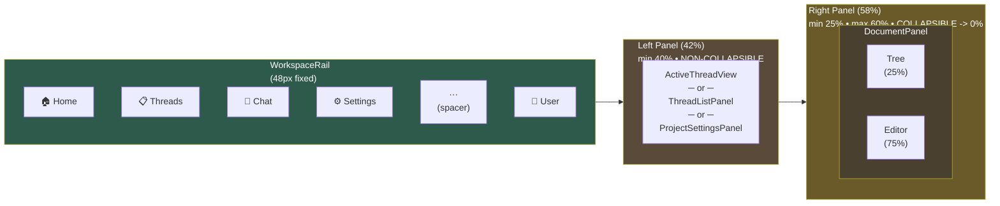
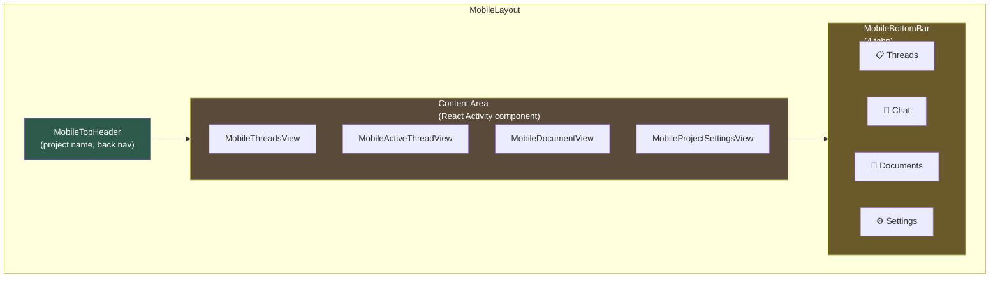
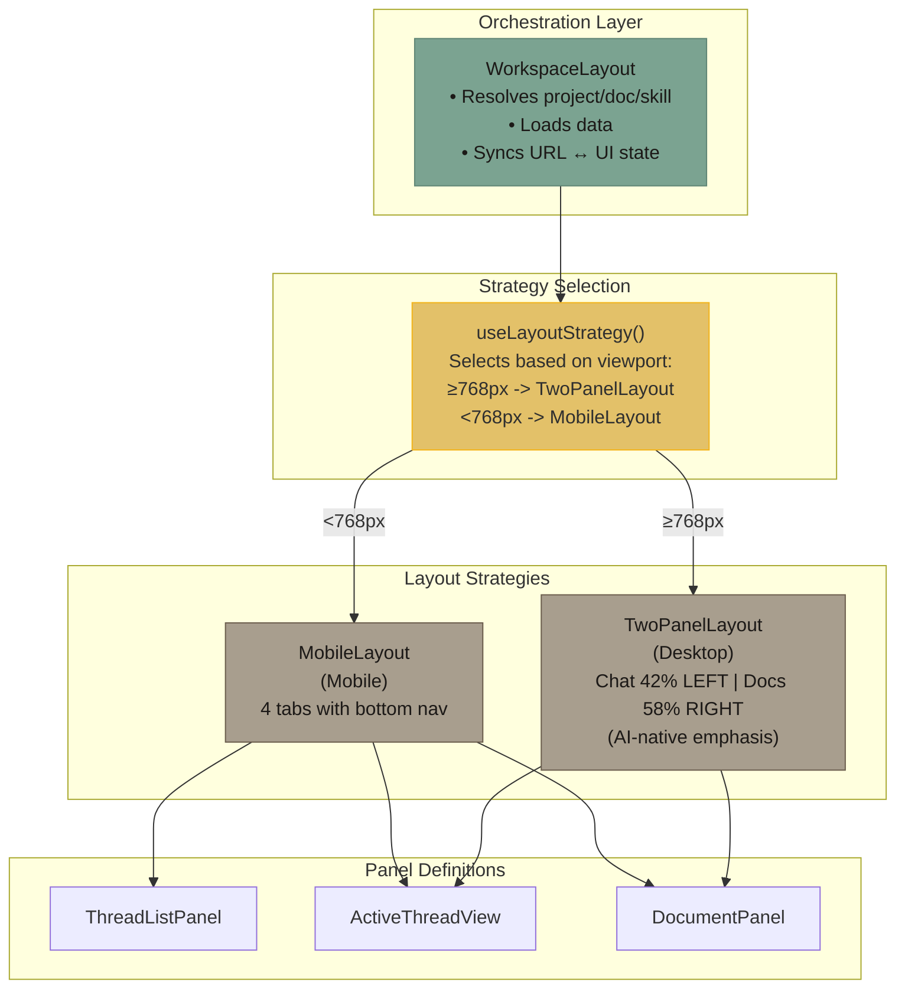
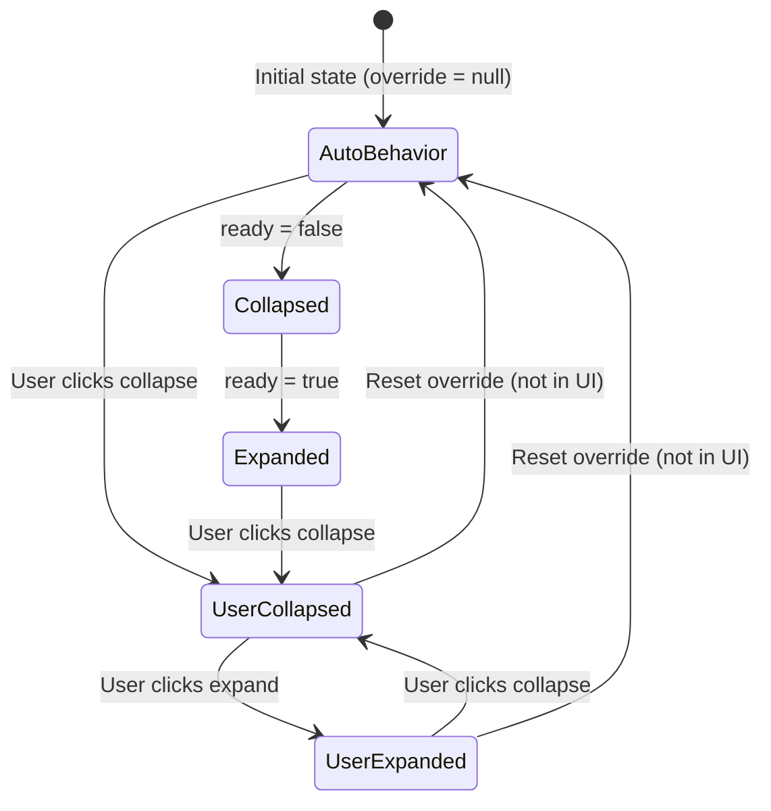

# Layout System Architecture

## Overview

The workspace layout system uses the **Strategy Pattern** to provide responsive layouts that adapt to viewport size while maintaining a consistent component API. The system separates **orchestration** (WorkspaceLayout), **strategy selection** (useLayoutStrategy), and **rendering strategies** (TwoPanelLayout, MobileLayout).

## Visual Layout

### Desktop Layout (≥768px)



**WorkspaceRail Icons** (top to bottom):

| Order | Icon | Action |
|-------|------|--------|
| 1 | `Home` | Navigate to `/projects` |
| 2 | `List` | Toggle to threads view |
| 3 | `MessageSquare` | Toggle to chat view |
| 4 | `Settings` | Toggle to project settings |
| — | spacer | `flex-1` |
| 5 | `UserMenuButton` | Sign out, settings |

**Panel Sizing**:

| Panel | Default | Min | Max | Collapsible |
|-------|---------|-----|-----|-------------|
| Left (Chat) | 42% | 40% | — | ❌ (anchor) |
| Right (Docs) | 58% | 25% | 60% | ✅ to 0% |

**DocumentPanel Internal Split**:

| Panel | Default | Min | Max | Collapsible |
|-------|---------|-----|-----|-------------|
| Tree | 25% | 15% | 50% | ✅ |
| Editor | 75% | 50% | — | ❌ |

### Mobile Layout (<768px)



**MobileBottomBar Tabs**:

| Tab | Icon | View |
|-----|------|------|
| Threads | `List` | MobileThreadsView |
| Chat | `MessageSquare` | MobileActiveThreadView |
| Documents | `FileText` | MobileDocumentView |
| Settings | `Settings` | MobileProjectSettingsView |

---

## Architecture Diagram



## Key Components

### WorkspaceLayout (Orchestrator)

**Responsibilities:**
- Resolve project identifier (UUID or slug) to project
- Parse URL to extract document path or skill name
- Load document tree and skills data
- Sync URL state ↔ UI store (bidirectional)
- Reset state when switching projects
- Pass data to layout strategies

**Key Pattern**: Uses `getState()` in effects to avoid subscription loops:
```typescript
// ✅ GOOD: Read without subscribing
useEffect(() => {
  const store = useUIStore.getState()
  if (effectiveDocumentId) {
    store.setActiveDocument(effectiveDocumentId)
  }
}, [effectiveDocumentId])

// ❌ BAD: Subscribe and update in effect (creates loop)
const { activeDocumentId } = useUIStore()
useEffect(() => {
  setActiveDocument(effectiveDocumentId)
}, [effectiveDocumentId, activeDocumentId])  // Loop!
```

**Location**: `frontend/src/features/workspace/components/WorkspaceLayout.tsx`

### useLayoutStrategy (Strategy Selector)

**Responsibilities:**
- Detect viewport size changes
- Return appropriate layout strategy component
- Use `md:` breakpoint (768px) as threshold

**Implementation**:
```typescript
export function useLayoutStrategy() {
  const [isMobile, setIsMobile] = useState(
    () => typeof window !== 'undefined' && window.innerWidth < 768
  )

  useEffect(() => {
    const handleResize = () => setIsMobile(window.innerWidth < 768)
    window.addEventListener('resize', handleResize)
    return () => window.removeEventListener('resize', handleResize)
  }, [])

  return isMobile ? MobileLayout : TwoPanelLayout
}
```

**Location**: `frontend/src/core/hooks/useLayoutStrategy.ts`

### TwoPanelLayout (Desktop Strategy)

**Layout**: `[Chat (42%)] | [Documents (58%)]`

**Design Philosophy**:
- **Left position gives chat visual prominence** - AI conversation is the "special thing" (AI-native focus)
- **42% chat** (vs 35% before) - Substantial space for multi-turn conversations without dominating
- **58% docs** (vs 65% before) - Still ample room for writing, not cramped
- **Unified workspace** - Tree and editor stay together on right as cohesive unit
- **User control** - Resizable and collapsible based on current workflow

**Features:**
- Resizable panels via `react-resizable-panels`
- Chat panel is collapsible (left), min 25%, max 60%
- Document panel always visible (right), min 40%
- Panel sizes persist via `autoSaveId`
- Smooth transitions when not dragging

**Why These Sizes?**
- **40-45% chat**: Emphasizes AI-native nature without overwhelming content
- **55-60% docs**: Writer-first - substantial space for document editing
- **Resizable**: Users can adjust based on task (more chat for brainstorming, more docs for writing)

**Panel Collapse Behavior:**
- **Auto-collapse**: Panels collapse during data loading (ready = false)
- **Auto-expand**: Panels expand after data loads (ready = true)
- **User override**: User can manually collapse/expand (persists across sessions)

**Callback Stability**: Uses `useCallback` to prevent re-creating callbacks on every render:
```typescript
const handleCollapse = useCallback(() => {
  const collapsed = selectEffectiveLeftCollapsed(useUIStore.getState())
  if (!collapsed) {
    useUIStore.getState().toggleLeftPanel()
  }
}, [])
```

**Location**: `frontend/src/shared/components/layout/TwoPanelLayout.tsx`

### MobileLayout (Mobile Strategy)

**Layout**: Full-screen tabs with bottom navigation

**Features:**
- Bottom tab bar with 4 tabs: Threads | Chat | Documents | Settings
- State-driven navigation (preserves scroll/component state across tab switches)
- Uses React 19.2's `Activity` component for efficient tab switching
- All views stay mounted but hidden (no re-mount on tab switch)
- Deep link support: URL path determines initial tab on first load

**Tab Views:**
- `MobileThreadsView` - Thread list
- `MobileActiveThreadView` - Active chat
- `MobileDocumentView` - Tree + editor (single screen flow)
- `MobileProjectSettingsView` - Project settings

**Location**: `frontend/src/shared/components/layout/MobileLayout.tsx`

## Panel State Machine

The UI store manages panel collapse state with a three-state system for each panel:

### State Values

1. **null** (default): Follow auto behavior
   - Collapsed when `!ready` (data not loaded)
   - Expanded when `ready` (data loaded)

2. **'collapsed'**: User explicitly collapsed
   - Stay collapsed regardless of ready state
   - Persists across sessions

3. **'expanded'**: User explicitly expanded
   - Stay expanded regardless of ready state
   - Persists across sessions

### State Transitions



### Implementation

**Store State**:
```typescript
interface UIStore {
  // Session-scoped (not persisted)
  leftPanelReady: boolean   // Set by data loaders
  rightPanelReady: boolean  // Set by data loaders

  // Persisted across sessions
  leftPanelUserOverride: 'expanded' | 'collapsed' | null
  rightPanelUserOverride: 'expanded' | 'collapsed' | null
}
```

**Computed Selectors**:
```typescript
export const selectEffectiveLeftCollapsed = (s: UIStore): boolean =>
  s.leftPanelUserOverride !== null
    ? s.leftPanelUserOverride === 'collapsed'
    : !s.leftPanelReady  // Auto: collapsed if not ready

export const selectEffectiveRightCollapsed = (s: UIStore): boolean =>
  s.rightPanelUserOverride !== null
    ? s.rightPanelUserOverride === 'collapsed'
    : !s.rightPanelReady
```

**Actions**:
```typescript
toggleLeftPanel: () => {
  const currentlyCollapsed = selectEffectiveLeftCollapsed(get())
  set({ leftPanelUserOverride: currentlyCollapsed ? 'expanded' : 'collapsed' })
}
```

### Why This Design?

**Problem**: Need to support three behaviors:
1. Auto-collapse during loading (prevents showing stale/empty data)
2. User can override auto behavior (manual collapse/expand)
3. User preference should persist across sessions

**Solution**: Separate `ready` (session) and `userOverride` (persisted) state:
- `ready` = false -> panel should hide (data not loaded)
- `ready` = true -> panel should show (data loaded)
- `userOverride` = null -> follow `ready` state
- `userOverride` = 'collapsed'/'expanded' -> ignore `ready` state

**Alternative Considered**: Single `collapsed: boolean` flag
- **Problem**: Can't distinguish "user collapsed" from "auto-collapsed during loading"
- **Impact**: If user manually expands during loading, panel would auto-collapse when data arrives

## Hydration Handling

The panel state uses Zustand's `persist` middleware, which loads from localStorage asynchronously. This causes a **flash of wrong state** if not handled correctly.

### Problem

```typescript
// ❌ BAD: Renders default state before localStorage loads
const { leftPanelUserOverride } = useUIStore()
const collapsed = leftPanelUserOverride === 'collapsed'  // false initially, then true after hydration
```

**Result**: Panel flashes expanded -> collapsed on page load.

### Solution

```typescript
// ✅ GOOD: Wait for hydration before computing state
const [hasHydrated, setHasHydrated] = useState(useUIStore.persist.hasHydrated())

useEffect(() => {
  const unsub = useUIStore.persist.onFinishHydration(() => {
    setHasHydrated(true)
  })
  return unsub
}, [])

const { effectiveLeftCollapsed } = useUIStore(useShallow((s) => ({
  // Before hydration: default to collapsed
  // After hydration: use computed effective state
  effectiveLeftCollapsed: hasHydrated ? selectEffectiveLeftCollapsed(s) : true,
})))
```

**Result**: Panel renders collapsed initially (safe default), then transitions to correct state after hydration completes.

## URL Navigation Pattern

The layout implements **bidirectional URL-state synchronization**:

### Forward Navigation (User Action)

User clicks document/skill -> Helper updates state + URL:

```typescript
// panelHelpers.ts
export function openDocument(documentId: string, projectSlug: string, documentPath: string) {
  const store = useUIStore.getState()

  // 1. Update UI state immediately (instant feedback)
  store.setActiveDocument(documentId)
  store.setRightPanelState('editor')

  // 2. Update URL (triggers WorkspaceLayout effect for confirmation)
  navigate({ to: '/projects/$slug/documents/$', params: { slug: projectSlug, _: documentPath } })
}
```

### Backward Navigation (Browser Back/Forward)

Browser changes URL -> Effect updates state:

```typescript
// WorkspaceLayout.tsx
useEffect(() => {
  const store = useUIStore.getState()

  if (effectiveDocumentId) {
    // Document URL -> open editor
    if (store.activeDocumentId !== effectiveDocumentId) {
      store.setActiveDocument(effectiveDocumentId)
    }
    store.setRightPanelState('editor')
  } else {
    // Tree URL -> close editor
    store.setActiveDocument(null)
    store.setRightPanelState('documents')
  }
}, [effectiveDocumentId])
```

### URL Path Resolution

**Documents**: Project-relative paths (e.g., `characters/heroes/aria`)
**Skills**: Simple names (e.g., `writing-coach`)

Resolution happens in `useMemo` hooks:

```typescript
// Document path -> ID
const effectiveDocumentId = useMemo(() => {
  if (!effectiveDocumentPath) return undefined
  const doc = documents.find(d => d.path === effectiveDocumentPath)
  return doc?.id
}, [effectiveDocumentPath, documents])

// Skill name -> ID
const effectiveSkillId = useMemo(() => {
  if (!effectiveSkillName) return undefined
  const skill = skills.find(s => s.name === effectiveSkillName)
  return skill?.id
}, [effectiveSkillName, skills])
```

## Deep Linking & Loading States

### Problem

User navigates directly to `/projects/my-project/skills/writing-coach`:
1. URL parsed -> `effectiveSkillName = 'writing-coach'`
2. Skills not loaded yet -> `skills = []`
3. Resolution fails -> `effectiveSkillId = undefined`
4. Editor doesn't open until skills finish loading

### Solution

Pass loading state to `DocumentPanel`:

```typescript
// WorkspaceLayout.tsx
<DocumentPanel
  projectId={projectId}
  projectSlug={projectSlug}
  isLoadingSkills={isLoadingSkills}
  effectiveSkillName={effectiveSkillName}
/>

// DocumentPanel.tsx
{isLoadingSkills && effectiveSkillName && !activeSkillId ? (
  <div>Loading skill...</div>
) : activeSkillId ? (
  <SkillEditorPanel skillId={activeSkillId} projectId={projectId} />
) : (
  // ... other states
)}
```

**Result**: Shows "Loading skill..." while resolving, then opens editor when ready.

## Project Switching

When user switches projects, state must be reset to prevent **context leakage** (seeing documents/skills from previous project).

### Implementation

```typescript
useEffect(() => {
  const store = useUIStore.getState()

  // First project load: skip reset (preserve deep-link state)
  if (previousResolvedProjectIdRef.current === null && projectId !== null) {
    previousResolvedProjectIdRef.current = projectId
    return
  }

  // Project switch: reset state
  if (projectId !== null && projectId !== previousResolvedProjectIdRef.current) {
    store.setActiveDocument(null)
    store.setActiveSkill(null)
    store.setRightPanelState('documents')
    store.setLeftPanelReady(false)   // Reset ready state
    store.setRightPanelReady(false)
    // Note: Do NOT reset userOverride (user preference persists)
    previousResolvedProjectIdRef.current = projectId
  }
}, [projectId])
```

**Why skip first load?**
- Deep link: `/projects/my-project/documents/chapter-1`
- Project resolves (null -> UUID)
- If we reset, the document selection is lost
- Solution: Only reset on subsequent project switches (UUID -> different UUID)

## Component Reference

The layout system uses these core components:

- **GlobalHeader** - App-wide navigation bar ([docs](./components/global-header.md))
- **ProjectSelector** - Project switcher dropdown ([docs](./components/project-selector.md))
- **CollapsibleSidebar** - Reusable sidebar wrapper ([docs](./components/collapsible-sidebar.md))
- **TwoPanelLayout** - Desktop layout strategy (covered in this doc)
- **WorkspaceLayout** - Layout orchestrator (covered in this doc)

These components work together to create the authenticated workspace experience.

## Extension Points

### Adding a New Layout Strategy

1. Create new component implementing `LayoutStrategyProps`:
```typescript
export function ThreePanelLayout({ panels }: LayoutStrategyProps) {
  return (
    <div className="flex h-full">
      {panels.threadList}
      {panels.activeThread}
      {panels.documentPanel}
    </div>
  )
}
```

2. Update `useLayoutStrategy` to return new strategy:
```typescript
export function useLayoutStrategy() {
  const isLargeScreen = useMediaQuery('(min-width: 1440px)')
  if (isLargeScreen) return ThreePanelLayout
  // ... existing logic
}
```

3. No changes needed to `WorkspaceLayout` or panel components!

### Adding a New Panel

1. Add to `PanelDefinitions` type:
```typescript
export interface PanelDefinitions {
  threadList: React.ReactNode
  activeThread: React.ReactNode
  documentPanel: React.ReactNode
  newPanel: React.ReactNode  // Add here
}
```

2. Update `WorkspaceLayout` to provide panel content:
```typescript
const panels: PanelDefinitions = {
  threadList: <ThreadListPanel projectId={projectId} />,
  activeThread: <ActiveThreadView projectId={projectId} />,
  documentPanel: <DocumentPanel projectId={projectId} projectSlug={projectSlug} />,
  newPanel: <NewPanel projectId={projectId} />,  // Add here
}
```

3. Update layout strategies to render the new panel:
```typescript
export function TwoPanelLayout({ panels }: LayoutStrategyProps) {
  return (
    <div className="flex h-full">
      {panels.activeThread}
      {panels.newPanel}  {/* Add rendering logic */}
    </div>
  )
}
```

## Performance Considerations

### Memoization

**Leaf components** are memoized to prevent cascading re-renders:
- `DocumentTreeItem`, `SkillTreeItem`, `FolderTreeItem`
- Use `React.memo()` with stable props (IDs, not objects)

**Callbacks** use `useCallback` with proper dependencies:
- Navigation helpers in `WorkspaceLayout`
- Event handlers in `TwoPanelLayout`

### AbortControllers

All data fetching uses AbortController to cancel stale requests:
```typescript
useEffect(() => {
  const abortController = new AbortController()
  loadTree(projectId, abortController.signal)
  return () => abortController.abort()
}, [projectId, loadTree])
```

**Why?** Prevents race conditions when user rapidly switches views.

### Transition Optimization

Panels only animate when NOT being manually dragged:
```typescript
const [isResizing, setIsResizing] = useState(false)

<ResizablePanel
  className={cn(!isResizing && 'transition-all duration-200 ease-out')}
/>

<ResizableHandle
  onDragging={(isDragging) => setIsResizing(isDragging)}
/>
```

**Why?** CSS transitions interfere with manual drag operations, causing jank.

## Testing Recommendations

### Layout System Tests

- [ ] Desktop viewport renders `TwoPanelLayout`
- [ ] Mobile viewport renders `MobileLayout`
- [ ] Switching viewport mid-session swaps layout
- [ ] Panel sizes persist after refresh (via `autoSaveId`)

### Panel State Tests

- [ ] Panel auto-collapses when `ready = false`
- [ ] Panel auto-expands when `ready = true`
- [ ] User override takes precedence over auto behavior
- [ ] User override persists across page refresh
- [ ] Hydration doesn't cause flash of wrong state

### Navigation Tests

- [ ] Opening document updates URL and UI state
- [ ] Browser back syncs UI to URL
- [ ] Same-document click toggles editor (doesn't navigate)
- [ ] Deep link to document opens correct editor
- [ ] Deep link to skill shows loading state, then opens editor

### Project Switching Tests

- [ ] Switching projects resets active document/skill
- [ ] Switching projects resets panel ready state
- [ ] Switching projects preserves user override
- [ ] First project load preserves deep-link state

## Related Documentation

- **Navigation Pattern**: `_docs/technical/frontend/architecture/navigation-pattern.md`
- **State Management**: `frontend/CLAUDE.md` (Store Architecture section)
- **Theme System**: `_docs/technical/frontend/themes/README.md`
- **Skills Feature**: `_docs/features/fb-skills/README.md`
