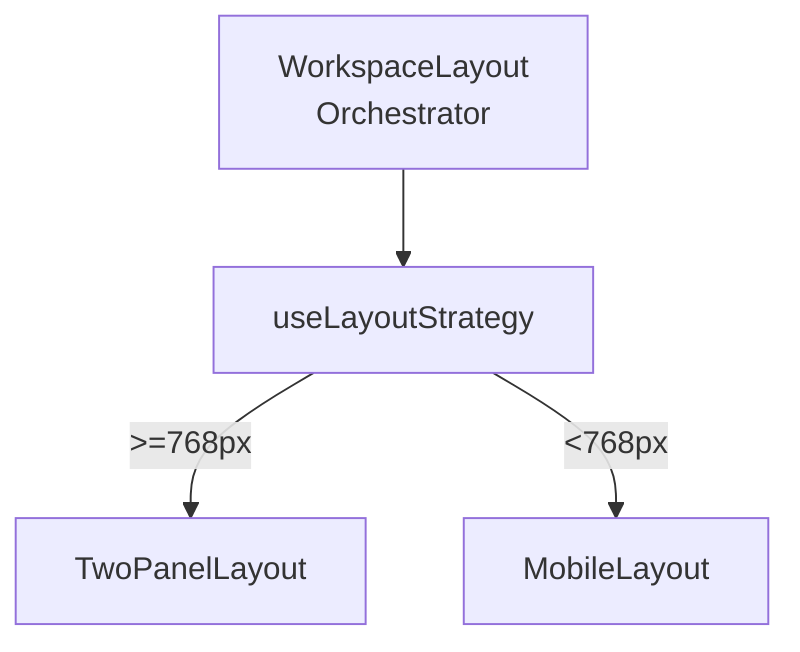
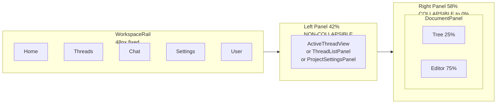
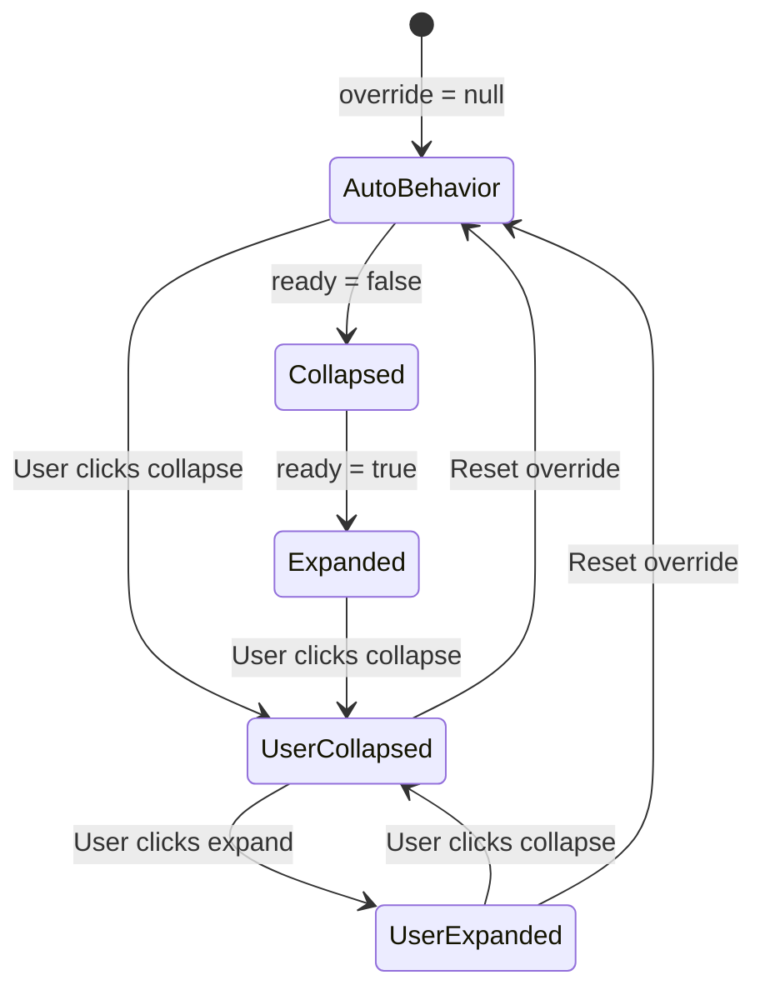

# Layout System Architecture

Strategy Pattern: `WorkspaceLayout` orchestrates data, `useLayoutStrategy` picks a renderer by viewport width, layout components render.

## Desktop Layout (>=768px)

| Panel | Default | Min | Max | Collapsible |
|-------|---------|-----|-----|-------------|
| Left (Chat) | 42% | 40% | -- | No |
| Right (Docs) | 58% | 25% | 60% | Yes, to 0% |

**Left panel** is the non-collapsible anchor. Uses React `Activity` to keep all views mounted (chat, threads, settings) while only one is visible.

**Right panel** auto-collapses during data loading, auto-expands when ready. User override persists across sessions.

### Rail Toggle Behavior

The rail manages `leftPanelUserOverride` in `useUIStore`, but `TwoPanelLayout` sets `collapsible={false}` on the left panel -- so the override **only affects rail icon highlighting**, not panel visibility. Clicking the active view toggles the highlight; clicking a different view switches `leftPanelView` and turns the highlight on.

See `WorkspaceRail.tsx` (lines 47-63) and `TwoPanelLayout.tsx` (line 103, `collapsible={false}`).

## Mobile Layout (<768px)

Full-screen tabs with `MobileBottomBar` (4 tabs: Threads, Chat, Documents, Settings). Uses `Activity` for tab switching without remounting. Deep link support via `deriveTabFromPath()`.

See `MobileLayout.tsx`.

## Key Files

| File | Role |
|------|------|
| `features/workspace/components/WorkspaceLayout.tsx` | Orchestrator: resolves project/doc/skill, syncs URL to store |
| `core/hooks/useLayoutStrategy.ts` | Returns TwoPanelLayout or MobileLayout based on viewport |
| `shared/components/layout/TwoPanelLayout.tsx` | Desktop two-panel with resizable panels |
| `shared/components/layout/MobileLayout.tsx` | Mobile tab-based layout |
| `shared/components/layout/WorkspaceRail.tsx` | Desktop navigation rail (48px) |
| `routes/_authenticated.tsx` | Route wrapper: WorkspaceRail + Outlet |

## Right Panel State Machine

State lives in `useUIStore`: `rightPanelUserOverride` (persisted) + `rightPanelReady` (session-scoped).

## Data Flow

### Ready Flags

Ready flags control right panel auto-collapse during data loading.

- `leftPanelReady`: set by `useThreadsForProject` on success/error. Only used by `WorkspaceRail` for icon highlighting -- does not collapse the left panel.
- `rightPanelReady`: set by `DocumentTreeContainer` on success/error. Drives right panel auto-collapse when `userOverride` is null.

Priority: `userOverride !== null` wins over `ready` flag. Override is persisted to localStorage; ready flags are session-scoped.

### Project Switching

When switching projects, `WorkspaceLayout` resets all document/skill/thread state to prevent context leakage. User panel override is preserved (it is a preference, not project-specific). First load skips reset to preserve deep-link state. See `WorkspaceLayout.tsx` project change effect.
