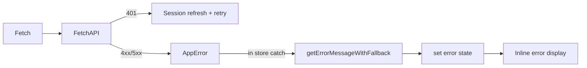

# Frontend Patterns

Architectural patterns and conventions for the Meridian frontend.

## Layer Structure

```
frontend/src/
├── core/       # Infrastructure (stores, services, editor, api, cache)
├── features/   # Feature modules (auth, threads, documents, projects, ...)
├── shared/     # Reusable UI components (layout, primitives)
└── types/      # Shared TypeScript types (DTOs, api types)
```

### Import Rules

```
features/ -> can import from core/, shared/, types/
shared/   -> can import from core/, types/
core/     -> imports feature TYPES for store/api definitions (pragmatic exception)
```

**Why the exception**: `core/` stores and API client need feature domain types (e.g., `Document`, `Turn`). These are type-only imports that don't create circular runtime dependencies. See `core/lib/api.ts`, `core/stores/useEditorStore.ts` for examples.

## Caching Strategies

| Strategy | Use Case | Example |
|----------|----------|---------|
| **Reconcile-Newest** | Always fetch server; compare with cache by `updatedAt`; show newest | Documents (`useEditorStore`) |
| **Network-First** | Server is source of truth | Threads, Projects |
| **Persist Middleware** | Small UI state via localStorage | `useProjectStore`, `useUIStore` |

See `core/lib/cache.ts` for `ReconcileNewestPolicy` and `frontend/CLAUDE.md` for full details.

## State Management (Zustand)

Key conventions across all stores:

1. **Intent flags** (`_activeId`): Prevent stale async responses from applying
2. **Module-level AbortControllers**: Cancel previous requests on new load
3. **`useShallow()`**: Prevent unnecessary re-renders
4. **Subscribe for display, `getState()` for action**: Avoid infinite loops when effects update store state

See `frontend/CLAUDE.md` "Store Architecture" for the canonical patterns.

## Error Handling



- `AppError` class with typed `ErrorType` enum -- see `core/lib/errors.ts`
- Network errors (5xx, TypeError): One-shot GET retry in `fetchAPI`
- Abort errors: Silent early return via `isAbortError()`
- No global error handler -- each store/component handles its own errors inline

## CodeMirror 6

### Extension Organization

```
core/editor/codemirror/
├── CodeMirrorEditor.tsx  # Main component
├── extensions/           # General extensions
├── livePreview/          # Obsidian-style preview
│   ├── plugin.ts         # Single ViewPlugin coordinator
│   └── renderers/        # NodeRenderer + InlineScanner providers
├── state/                # Shared state fields
└── wikiLinks/            # Scanner, click handler, clipboard
```

**Live Preview Coordinator**: One `ViewPlugin` (`livePreview/plugin.ts`) coordinates all inline decorations. Two provider types: `NodeRenderer` (syntax tree nodes) and `InlineScanner` (regex patterns). Owns the pointer-defer pattern.

### React-to-CM6 Sync

Use `StateEffect` + `StateField` to push React state into CM6. See examples in `core/editor/codemirror/state/`.

## Component Patterns

- **Container/Presenter split**: Container accesses stores; presenter is pure props
- **Callback ref for scroll containers**: `useState<HTMLDivElement | null>` (triggers re-render, unlike `useRef`)
- **DTO conversion**: Backend snake_case auto-converted to camelCase by `fetchAPI` via `convertKeysToCamelCase`. See `types/api.ts` for mapper functions.
- **Empty content**: `""` is valid. Always check `!== undefined`, never falsy checks.
