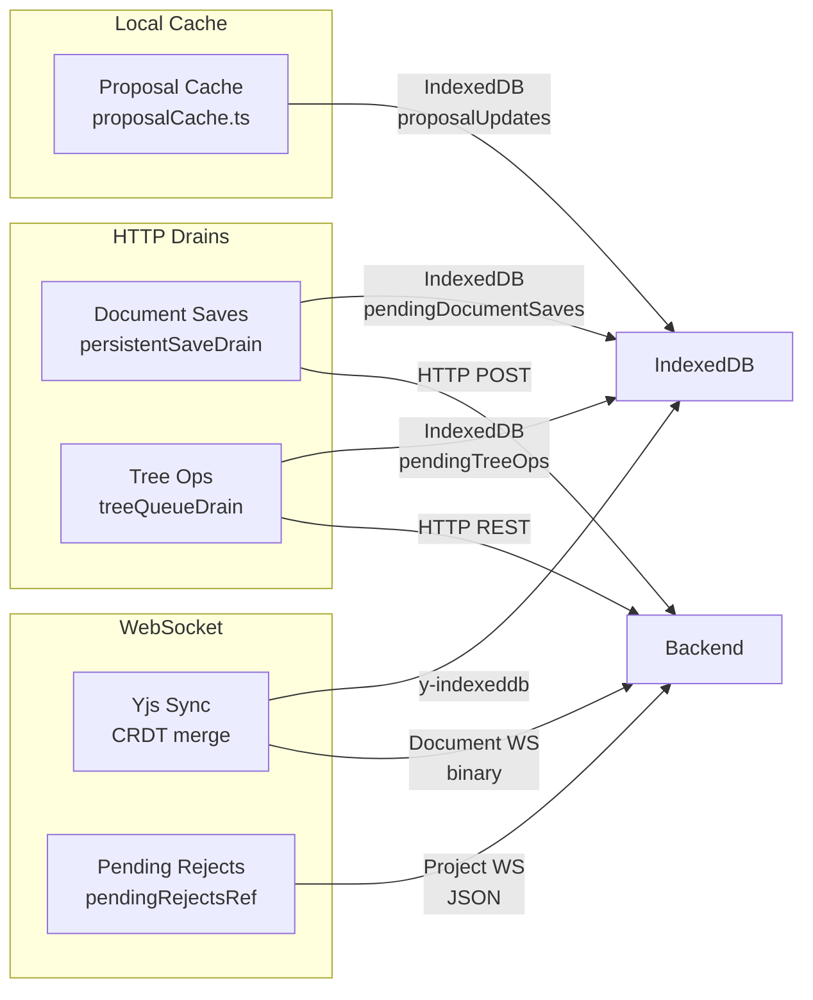
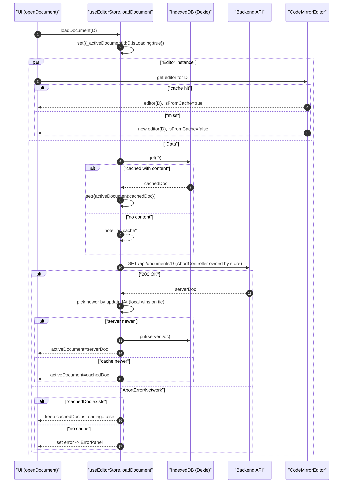
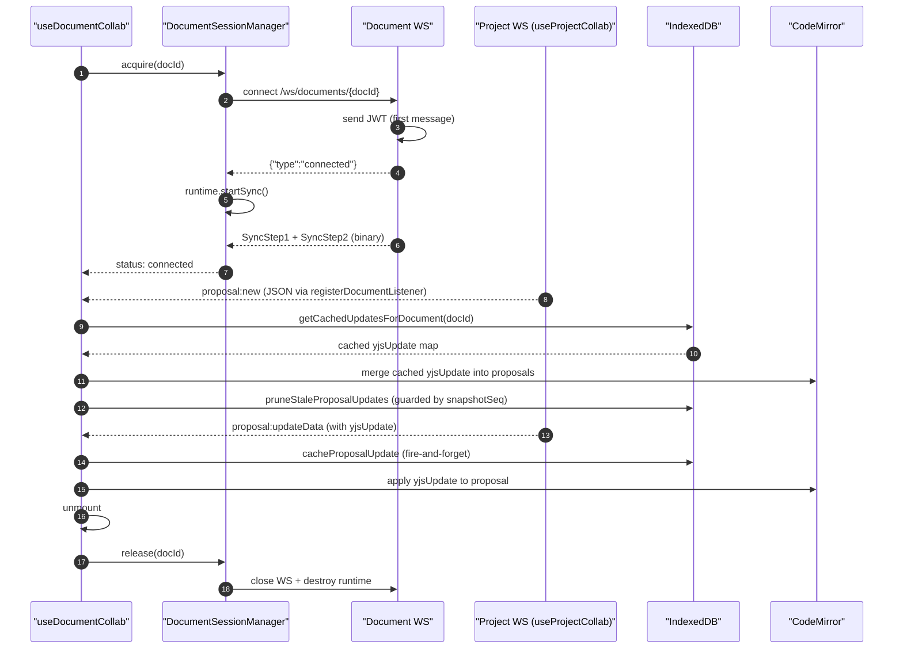
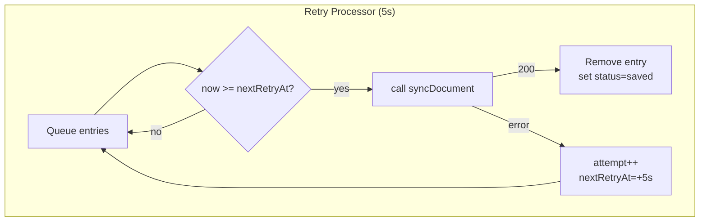

# Frontend Sync System

## Why
- Remove races, keep UX snappy, and make failure modes obvious.
- Render newest by `updatedAt`; local wins on tie. Server timestamps become canonical once applied.

## Transport Architecture

The frontend uses three distinct transports. Each has its own offline/retry strategy because the failure modes and data semantics differ fundamentally:

| Transport | Subsystem | Storage | Flush Trigger | Retry | Error Handling |
|-----------|-----------|---------|---------------|-------|----------------|
| **HTTP** | Document saves | IndexedDB `pendingDocumentSaves` | startup + online + 5s tick | Cycle-based (no backoff) | Transient: keep; 4xx: drop |
| **HTTP** | Tree ops | IndexedDB `pendingTreeOps` | startup + online + 30s tick | Op coalescing | 404: drop; 409: drop + refresh; 5xx: stop |
| **WebSocket** | Collab commands | In-memory (proposal command queue) | Project WS `project:connected` | Immediate | Auth refresh on `AUTH_FAILED`/`AUTH_EXPIRED` |
| **WebSocket** | Yjs doc sync | Y.Doc (in-memory + IDB) | Document WS `connected` → `startSync()` | Yjs sync protocol (automatic) | CRDTs handle merge |
| **Local only** | Proposal cache | IndexedDB `proposalUpdates` | N/A (write-through) | Fire-and-forget | Swallow errors; auto-request fallback |

### Why Not a Shared Abstraction?

These look similar at a high level ("buffer → flush → retry") but diverge in every important detail:

- **Retry strategies are domain-specific**: Document saves are last-write-wins (no backoff needed). Tree ops coalesce redundant mutations. WS commands flush immediately on subscribe ack. A generic queue would need callbacks for everything that matters.
- **Error handling varies**: Only tree ops need 409 conflict recovery (drop + refresh tree). Only document saves distinguish transient vs permanent HTTP errors. WS commands just re-queue.
- **Storage tiers differ**: HTTP queues need IndexedDB (survive page reload). WS buffers are ephemeral (collab session re-initializes on reload). Proposal cache is a read-through optimization, not a queue.

The only shared code is ~20 lines of init/cleanup boilerplate (timer + online listener) in the two HTTP drains. Not enough to justify an abstraction.

## HTTP Sync: Document Saves

- **Pattern**: Optimistic IDB write → direct server sync → persistent retry on failure
- **Last-write-wins**: Newer saves overwrite older; `deletePendingSaveIfUnchanged()` guards against clobbering newer edits during drain
- **Trigger**: startup + `online` event + 5s periodic tick
- **Files**: `core/services/documentSyncService.ts`, `core/lib/persistentSaveDrain.ts`

### Loads
- Policy-based reconciliation (cache emit + server reconcile). See `core/lib/cache.ts:120` and `:205`.

### Saves
- Optimistic IDB write, then direct server sync; network errors enqueue transient retries. See `core/services/documentSyncService.ts:10`.

### Retries
- In-memory `RetryScheduler`: jittered exponential backoff (5s base, ±20% jitter, max 3 attempts), inspectable snapshot. See `core/lib/retry.ts:1` and `core/lib/sync.ts:198`.

## HTTP Sync: Tree Operations

- **Pattern**: Optimistic update → IndexedDB queue → coalesce → replay in FIFO order
- **Coalescing**: Redundant ops merged before drain (e.g., rename→rename = single rename)
- **Pre/post-drain tree refresh**: Server state reconciled before and after replay
- **Error handling**: 404 → drop (entity deleted server-side); 409 → drop + stop + refresh tree; 5xx → stop drain entirely
- **Trigger**: startup + `online` event + 30s safety-net tick
- **Files**: `core/services/treeSyncService.ts`, `core/lib/treeQueueDrain.ts`

## WebSocket Sync: Yjs Document Collab

- **Pattern**: `DocumentSessionManager.acquire(docId)` opens a dedicated document WS. Server sends `connected` JSON → runtime sends SyncStep1 → Yjs protocol handles the rest.
- **Transport**: Per-document WebSocket (`/ws/documents/{documentId}`), binary frames with 1-byte prefix (`0x00`=sync, `0x01`=awareness). No envelope framing.
- **Session lifecycle**: refCount-based. `acquire()` creates or reuses session (refCount++). `release()` decrements; refCount 0 destroys WS + runtime immediately.
- **Reconnect**: Per-session exponential backoff (`min(5s, 250ms * 2^attempt) + 15% jitter`). Calls `runtime.reset()` to clear handshake state.
- **IndexedDB persistence**: `y-indexeddb` (`IndexeddbPersistence`) provides durability across page reload
- **No manual queue**: Yjs CRDTs handle merge/conflict resolution automatically
- **Files**: `core/cm6-collab/sync/DocumentSessionManager.ts`, `core/cm6-collab/sync/runtime.ts`, `features/documents/hooks/useDocumentCollab.ts`

## WebSocket Sync: Project Events (Proposals)

- **Pattern**: Single project WS (`/ws/projects/{projectId}`) carries JSON proposal events + commands. No binary traffic.
- **Transport factory**: `createProjectCollabTransport()` with injected dependencies for testability. Thin `useProjectCollab` hook wrapper.
- **Proposal routing**: `registerDocumentListener(docId, listener)` routes per-document proposal events to hooks.
- **Commands**: `proposal:accept`, `proposal:reject`, `proposal:groupAccept`, `proposal:requestUpdate` -- all include `documentId`.
- **Error routing**: `doc:error` events forwarded to document listeners without closing the WS.
- **Files**: `features/documents/hooks/useProjectCollab.ts`, `features/documents/hooks/useDocumentCollab.ts`

## Local Cache: Proposal yjsUpdate

- **Pattern**: Write-through cache — store on receive, merge on re-open, prune stale entries
- **Storage**: IndexedDB `proposalUpdates` table (keyed by proposalId, indexed by documentId)
- **Not a queue**: No retry logic. All writes are fire-and-forget (no `await` blocking event handlers)
- **Fallback**: If cache is empty (first visit), auto-request mechanism fetches yjsUpdate from server
- **Race guard**: Monotonic `snapshotSeq` counter prevents stale async prune from deleting entries written by newer `proposal:new` events
- **Files**: `core/lib/proposalCache.ts`, wired in `features/documents/hooks/useDocumentCollab.ts`

## Shared Patterns (Convention, Not Code)

All offline subsystems follow these conventions even though they don't share implementation:

1. **Concurrency guard**: Single-threaded flag-based lock (`if (draining) return; draining = true; try {...} finally { draining = false; }`)
2. **Init/cleanup API**: Export `init()`, `cleanup()` functions; registered in `SyncProvider`
3. **Failure classification**: Transient (network/5xx) → keep/retry; Permanent (4xx) → drop + log
4. **Fire-and-forget for non-critical ops**: IndexedDB writes in proposal cache and pending-reject queue don't block event handlers
5. **Staleness guards**: Check intent flags / sequence counters after async operations before writing state

## Derivation Cost: Review Pipeline

The inline review pipeline derives proposal hunks from `operationsModels`, which are recomputed via `useMemo` whenever `reviewRevision` bumps. Each derivation pass clones the Y.Doc and applies the proposal update — O(N×D) where N=proposals and D=doc size. Three guards prevent this from running on every keystroke:

1. `handleTextChange` only bumps `reviewRevision` when `proposalManager.hasProposals()` is true
2. `operationsModels` useMemo early-returns `EMPTY_OPERATIONS_MODELS` when `proposals.size === 0`
3. `useInlineReview` sync effect computes a hunk signature and skips CM6 dispatch when unchanged

## Races Prevented
- Document load: intent flag `_activeDocumentId` guards post-await sets. See `core/stores/useEditorStore.ts:35`.
- Save: post-sync guard ensures we only apply to the currently active doc. See `core/stores/useEditorStore.ts:132`.
- Editor init: content only applies after `isInitialized` to avoid stale overwrites. See `features/documents/components/EditorPanel.tsx:84`.
- Proposal cache prune: `snapshotSeq` counter prevents stale snapshot prune from deleting fresh cache entries.
- Document session: `DocumentSessionManager` guards stale socket references via `session.ws === ws` checks on all callbacks.

## Timestamp Handling
- Missing timestamps return `NaN` (not `0`/epoch) to distinguish "unknown" from "very old"
- When either timestamp is `NaN`, comparison returns `0` (equal) -> local wins on tie
- See `core/lib/cache.ts:133-158`

## Failure Handling
- Network/5xx -> retry; 4xx/validation -> toast error, no retry. See `core/lib/errors.ts:73`.
- On new edits, cancel older retries so newer content wins. See `core/lib/sync.ts:103`.
- AUTH_FAILED/AUTH_EXPIRED (WS): trigger Supabase session refresh + reconnect. See `DocumentSessionManager.ts`, `useProjectCollab.ts`.

## Observability
- `getRetryQueueState()` returns `{ id, attempt, nextAt }[]` for dev tooling. See `core/lib/sync.ts:202`.
- Scoped loggers: `makeLogger('sync'|'cache'|'editor-cache'|'persistent-save-drain'|'tree-queue-drain'|'proposal-cache')`. See `core/lib/logger.ts`.

## Test Matrix (unit)
- RetryScheduler: success path, backoff retries, cancel, permanent failure.
- Cache policies: cache-emit + newest; tie->local; abort/network fallback.
- DocumentSyncService: optimistic put, server application, retry scheduling on server error, bubble validation.
- Transport wiring: mock WebSocket events, proposal event routing, subscribe gate behavior.

Implementation references in tests: `frontend/tests/*.test.ts`.

## Diagrams

### Transport Overview

### Document Open (Reconcile Newest)

### Document WS Sync + Project WS Proposal Flow

### Retry Processor (Background)

