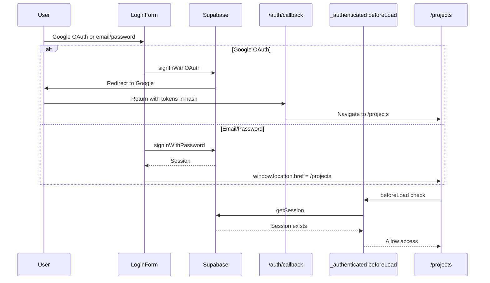
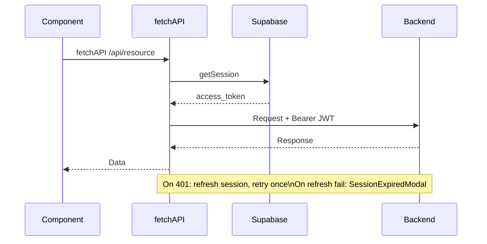
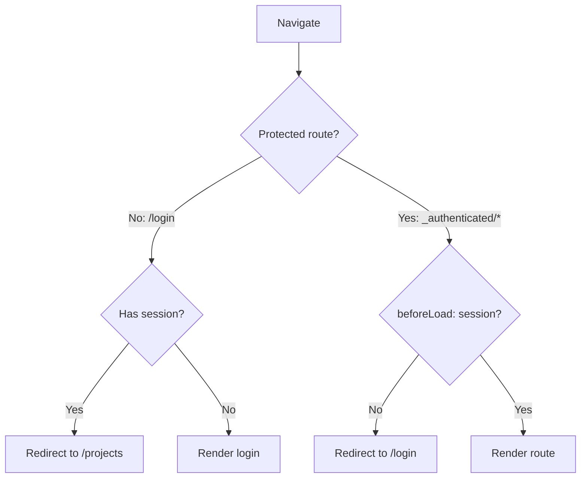

# Frontend Authentication Implementation

Supabase Auth integration for Vite + TanStack Router SPA. Implicit flow with automatic JWT injection.

## Auth Flow



## API Request Flow



## Route Protection



## Key Files

| File | Role |
|------|------|
| `src/core/supabase/client.ts` | Singleton Supabase client, session in localStorage |
| `src/routes/_authenticated.tsx` | Route guard: no session -> redirect to /login |
| `src/core/lib/api.ts` | `fetchAPI` with auto JWT injection + 401 retry |
| `src/features/auth/components/LoginForm.tsx` | Google OAuth + email/password + sign-up, errors via `InlineError` |
| `src/routes/auth/callback.tsx` | OAuth callback: listens for `SIGNED_IN` event, redirects to /projects |

## Auth Methods

- **Google OAuth**: Implicit flow, redirects through `/auth/callback`. TODO in code to switch to PKCE.
- **Email/password**: Direct `signInWithPassword` call. Sign-up with email confirmation.
- **Errors**: Displayed inline via `InlineError` component (not toast).

## Env Vars

```bash
VITE_SUPABASE_URL=https://your-project.supabase.co
VITE_SUPABASE_PUBLISHABLE_KEY=your-publishable-key  # anon/public key
```

## References

- **Cross-stack auth overview**: `_docs/technical/auth-overview.md`
- **Supabase docs**: https://supabase.com/docs/guides/auth
