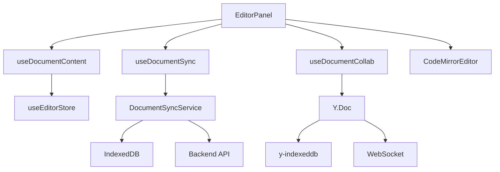
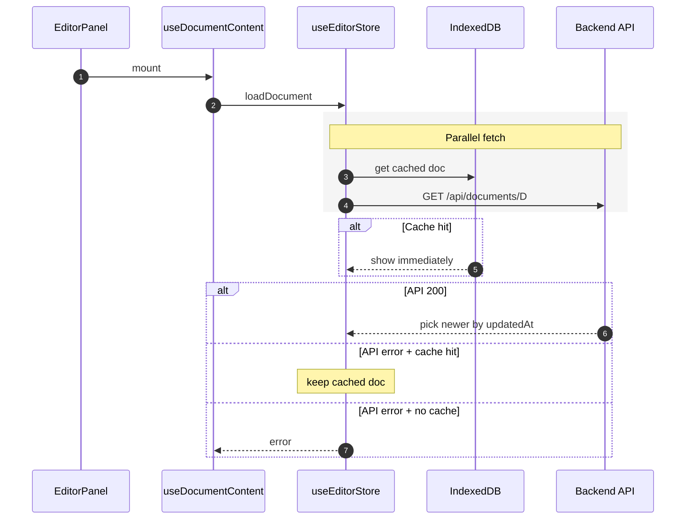
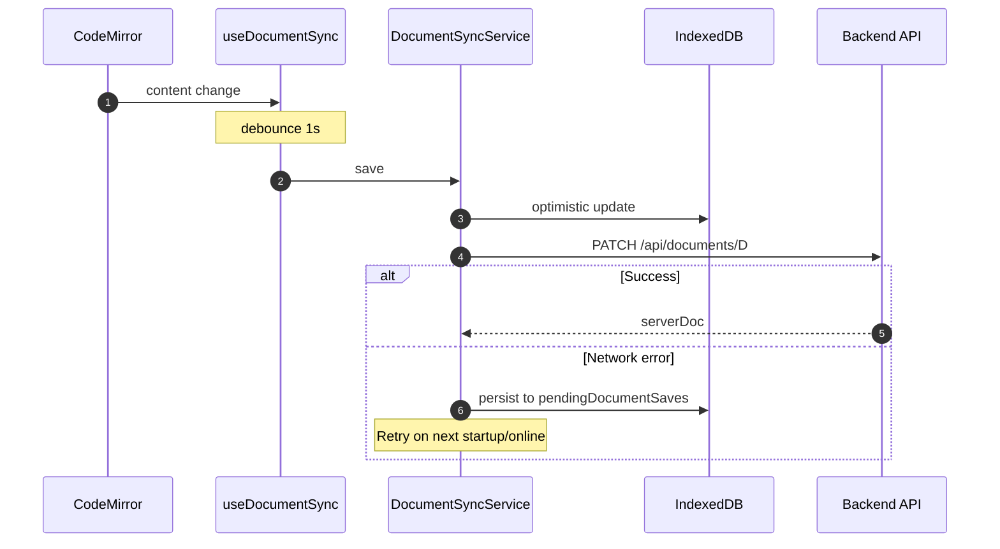
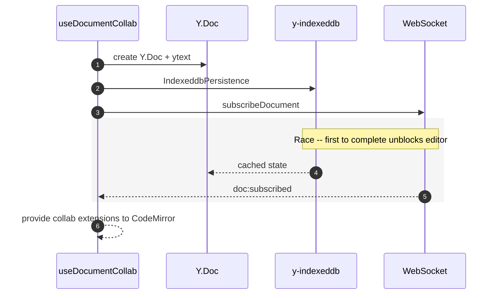

# Editor Caching and Document Loading

Two document modes based on `isCollabEnabled(extension)`:

| Mode | Extensions | Content owner | Hook |
|------|-----------|--------------|------|
| **Non-collab** | `.json`, `.yaml`, etc. | REST API + IndexedDB | `useDocumentContent` + `useDocumentSync` |
| **Collab** | `.md`, `.markdown`, `.txt` | Yjs Y.Doc | `useDocumentCollab` |

See `features/documents/lib/collabFeatureFlag.ts` for the gate function.

## Architecture

### Hook Responsibilities

- **`useDocumentContent`** -- Loads document (reconcile-newest), hydrates editor, tracks local state and edit versions. See `features/documents/hooks/useDocumentContent.ts`.
- **`useDocumentSync`** -- Debounced save (1s), fire-and-forget async flush on unmount, corruption repair. Pure effect, no return value. Non-collab only. See `features/documents/hooks/useDocumentSync.ts`.
- **`useDocumentCollab`** -- Yjs sync runtime, y-indexeddb, WebSocket transport, proposal management. See `features/documents/hooks/useDocumentCollab.ts`.

## Non-Collab: Open Document (reconcile-newest)

## Non-Collab: Typing to Autosave

**Flush on unmount**: Cleanup reads latest content from editor ref and calls `documentSyncService.save()` as fire-and-forget async (not synchronous). Ensures last-second edits are not lost.

## Collab Path (Yjs)

When collab is enabled, `useDocumentContent` loads metadata but skips REST hydration. `useDocumentSync` is disabled. `useDocumentCollab` takes over:

**Key behaviors**: IDB timeout at 3s. IDB destroyed after initial sync, then recreated for ongoing offline caching. AI edits arrive as proposals via WebSocket (see `ProposalManager`).

## Race Condition Guards

1. **Intent flag** (`_activeDocumentId`): Every await checks this before applying state
2. **AbortSignal**: Per-load controller; cleanup aborts in-flight requests
3. **editVersion tracking**: Functional setState avoids reverting edits during save round-trip
4. **pendingServerSnapshot**: Server updates stashed (not applied) while user has unsaved edits

## Key Files

- `features/documents/components/EditorPanel.tsx` -- Orchestrates all hooks
- `features/documents/hooks/useDocumentContent.ts` -- Loading, hydration, local state
- `features/documents/hooks/useDocumentSync.ts` -- Debounced save, flush on unmount
- `features/documents/hooks/useDocumentCollab.ts` -- Yjs sync, proposals, connection state
- `core/stores/useEditorStore.ts` -- Document loading (reconcile-newest)
- `core/services/documentSyncService.ts` -- Optimistic save + persistent retry
- `core/lib/cache.ts` -- Cache policy framework
