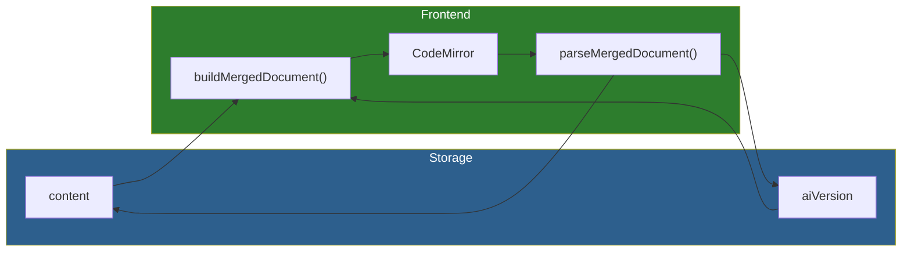

# Inline Editing Architecture

**Deep-dive into the AI suggestions system architecture.**

---

## Overview

Inline editing displays AI-suggested changes directly in the CodeMirror editor, with accept/reject buttons per hunk and full undo/redo support.

**Key insight**: Storage always contains clean markdown. PUA markers only exist in the frontend editor.

---

## Architecture Documents

| Document | Purpose |
|----------|---------|
| [merged-document-pattern.md](merged-document-pattern.md) | PUA markers, build/parse, invariants |
| [concurrency-model.md](concurrency-model.md) | CAS tokens, conflict handling, polling |

---

## Key Components

### Core Library
- `frontend/src/core/lib/mergedDocument.ts` - Build, parse, extract hunks

### CodeMirror Extension
- `frontend/src/core/editor/codemirror/diffView/` - Full extension bundle

### React Hooks
- `useDocumentContent.ts` - Hydration, local state, CAS token tracking
- `useDocumentSync.ts` - Debounced save, conflict handling
- `useDiffView.ts` - Extension management, navigation

### UI
- `AIHunkNavigator.tsx` - Navigator pill with bulk operations
- `HunkActionWidget.ts` - Inline accept/reject buttons

---

## Design Decisions

### Why PUA Markers (Not CodeMirror Merge View)

Standard merge view treats original as a baseline to compare against. Meridian's requirement: **edits outside hunks update both versions**.

With PUA markers, shared text exists once -> `parseMergedDocument()` naturally includes it in both projections.

### Why Transactions (Not State)

Accept/reject are CM6 transactions, not React state updates. This gives us:
- **Undo/redo for free** - Cmd+Z works naturally
- **Single source of truth** - Document is authoritative
- **No sync issues** - CM6 history tracks everything

### Why Polling (Not SSE)

Lightweight polling (2s interval) was chosen over SSE for document updates:
- Simpler implementation
- No connection management
- Sufficient for non-real-time use case
- Uses lightweight `/ai-status` endpoint (~100 bytes)

---

## Related

- `/_docs/features/fb-ai-editing/` - Feature documentation
- `/_docs/plans/ai-editing/inline-suggestions-impl-2/` - Implementation guides
