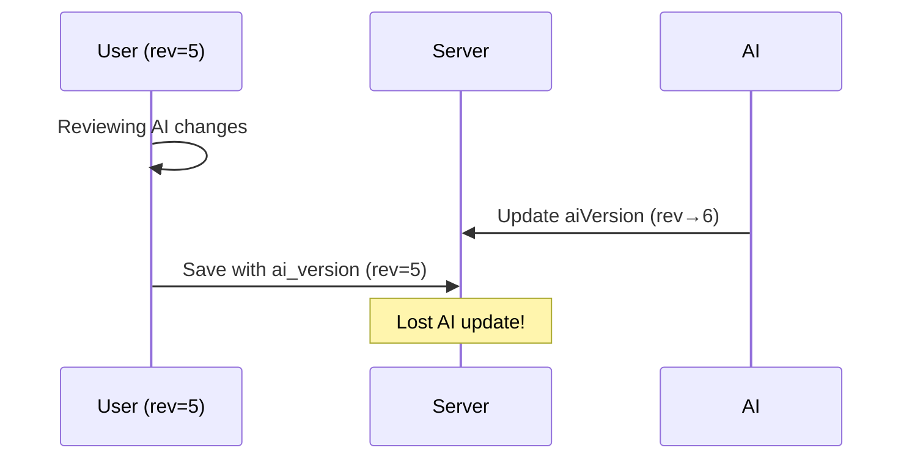
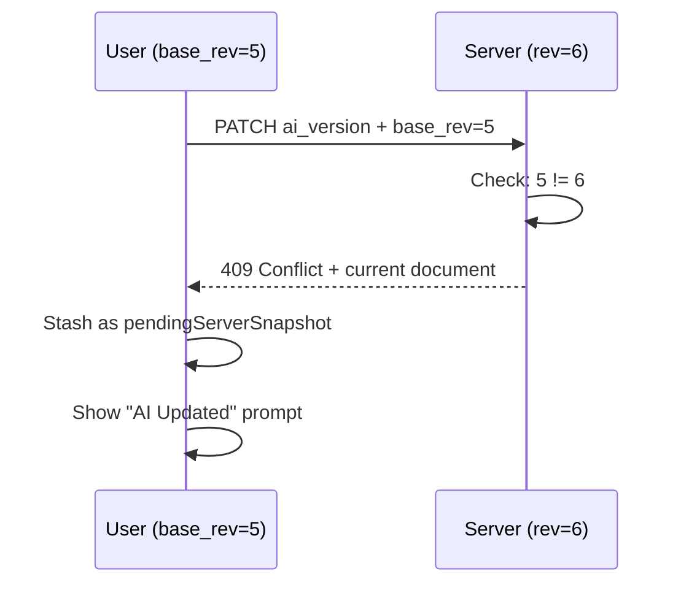
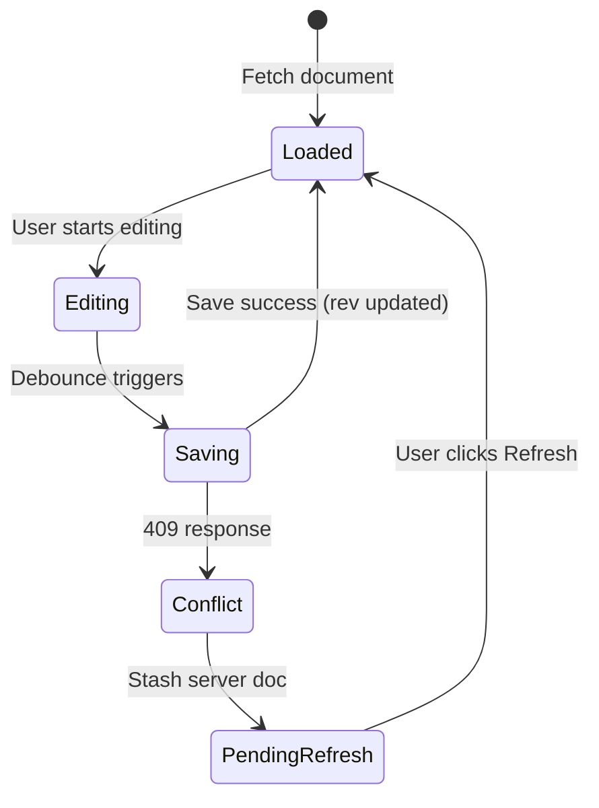
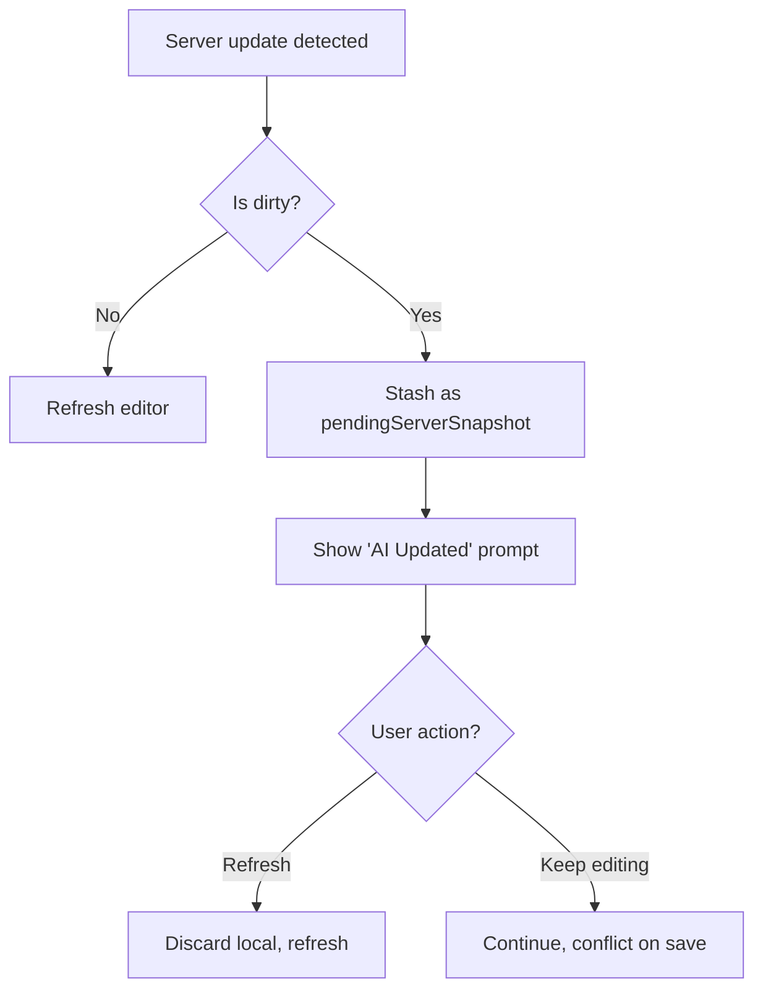

# Concurrency Model

**How we prevent stomping unseen AI updates.**

---

## Problem

AI can update `aiVersion` while the user is reviewing/editing. Without protection, a client save could overwrite a newer AI version it hasn't seen.



---

## Solution: CAS Token

Compare-and-Swap using `ai_version_rev`:



---

## Token Lifecycle



### States

| State | aiVersionBaseRevRef | UI |
|-------|---------------------|-----|
| Loaded | Server's `ai_version_rev` | Normal editing |
| Editing | Unchanged | Normal editing |
| Saving | Sent as `ai_version_base_rev` | Saving indicator |
| Conflict | Stale (mismatch) | "AI Updated" prompt |
| PendingRefresh | Stale | Refresh button visible |

---

## Detection: Lightweight Polling

Frontend polls `/api/documents/{id}/ai-status` every 2 seconds:

```json
{
  "ai_version_rev": 6,
  "has_ai_version": true
}
```

~100 bytes vs ~50KB for full document.

**When `ai_version_rev` changes:**
1. If not dirty → fetch full doc, refresh editor
2. If dirty → stash as `pendingServerSnapshot`, show prompt

---

## Dirty State

"Dirty" means: editor has unsaved changes (`hasUserEdit === true`).

**`hasUserEdit` Lifecycle:**
- Set `true` by: user typing, accept/reject operations (via `onContentChanged` callback)
- Set `false` by: `hydrateDocument()` and `onServerSaved` callbacks after successful save

**Rule**: Never update editor underneath an active user.



---

## PATCH Scenarios

| Client State | Server State | Outcome |
|--------------|--------------|---------|
| base_rev=5 | rev=5 | ✅ Success, rev→6 |
| base_rev=5 | rev=6 | ❌ 409 Conflict |
| base_rev=5 | rev=4 | ❌ Invalid (shouldn't happen) |

---

## Implementation Details

### Frontend: Ref Tracking

```typescript
// useDocumentContent.ts
const aiVersionBaseRevRef = useRef<number | null>(null)

// On hydration
aiVersionBaseRevRef.current = document.aiVersionRev ?? null

// On save success
aiVersionBaseRevRef.current = result.document.aiVersionRev ?? null
```

### Backend: Validation

```go
// handler/document.go
if req.AIVersionBaseRev != nil {
    if *req.AIVersionBaseRev != doc.AIVersionRev {
        return c.Status(409).JSON(ConflictResponse{
            Error:    "ai_version_conflict",
            Document: doc,
        })
    }
}
```

---

## Edge Cases

### No Base Rev Known
If `aiVersionBaseRevRef.current === null` but save includes markers:
- Set `pendingServerSnapshot` to current document
- Show refresh prompt
- Don't attempt save

### Last Hunk Resolved
When all hunks are accepted/rejected, merged doc has no markers:
- `parseMergedDocument()` returns `aiVersion: null`
- PATCH sends `ai_version: null` to close AI session
- Still uses CAS token for the null write

### Undo After Close
If user undoes and markers return:
- Next save sends `ai_version` (non-null) again
- AI session reopens

---

## Related

- [merged-document-pattern.md](merged-document-pattern.md) - How markers work
- `frontend/src/features/documents/hooks/useDocumentSync.ts` - Save logic
- `frontend/src/features/documents/hooks/useDocumentPolling.ts` - Polling
