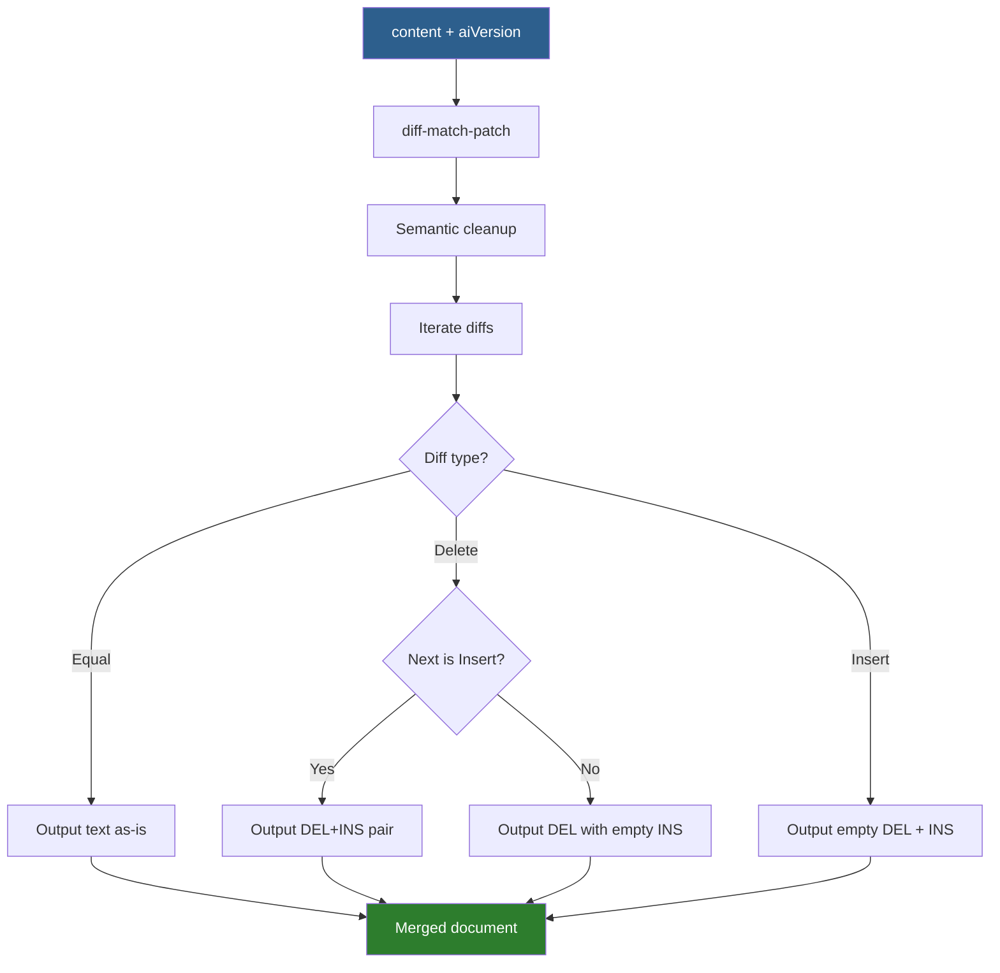
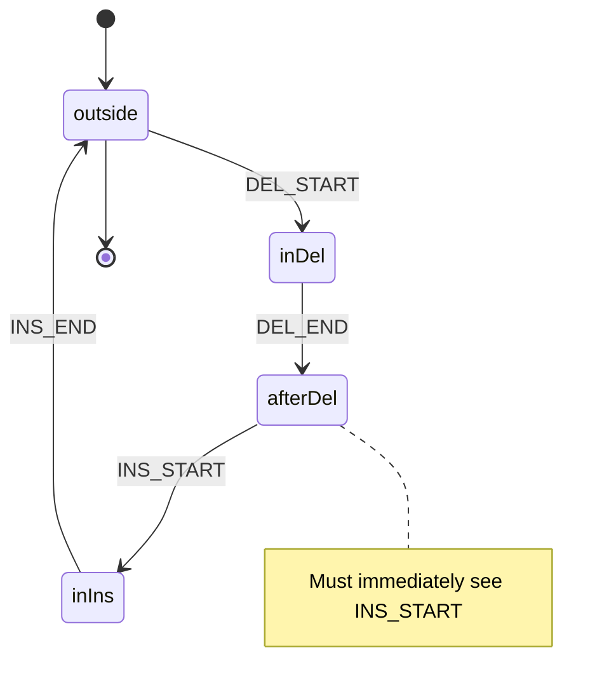

# Merged Document Pattern

**How PUA markers enable inline diff display with unified undo/redo.**

---

## Problem

We need to display AI suggestions inline with:
- Visual distinction between original and AI text
- Per-hunk accept/reject operations
- Full undo/redo support (Cmd+Z)
- Edits outside hunks updating both versions

Standard diff tools don't support this combination.

---

## Solution: PUA Markers

Unicode Private Use Area (U+E000-U+E003) characters mark diff regions:

```typescript
const MARKERS = {
  DEL_START: '\uE000',  // Start of deletion
  DEL_END:   '\uE001',  // End of deletion
  INS_START: '\uE002',  // Start of insertion
  INS_END:   '\uE003',  // End of insertion
}
```

**Example:**
```
Storage:
  content:   "She felt sad. The rain fell."
  aiVersion: "A heavy melancholia. The rain continued."

Merged:
  "\uE000She felt sad.\uE001\uE002A heavy melancholia.\uE003 The rain \uE000fell\uE001\uE002continued\uE003."
   └─ hunk 1 ─────────────────────────────────────────┘            └─ hunk 2 ────────────────────┘
```

---

## Hunk Structure

Every hunk follows the pattern: `DEL_START + del_text + DEL_END + INS_START + ins_text + INS_END`

| Type | DEL content | INS content | Example |
|------|-------------|-------------|---------|
| Replacement | Original | AI | `\uE000old\uE001\uE002new\uE003` |
| Pure deletion | Original | Empty | `\uE000old\uE001\uE002\uE003` |
| Pure insertion | Empty | AI | `\uE000\uE001\uE002new\uE003` |

**Invariant**: DEL_END is always immediately followed by INS_START (no text between).

---

## Build Algorithm

`buildMergedDocument(content, aiVersion)`:



See `frontend/src/core/lib/mergedDocument.ts:150-232`

---

## Parse Algorithm

`parseMergedDocument(merged)`:

1. **Validate** marker structure (state machine)
2. **Extract content**: Keep DEL text, remove INS regions
3. **Extract aiVersion**: Keep INS text, remove DEL regions

```typescript
// Content projection
content = merged
  .replace(/\uE002[^\uE003]*\uE003/g, '')  // Remove INS regions
  .replace(/[\uE000\uE001]/g, '')          // Remove DEL markers

// aiVersion projection
aiVersion = merged
  .replace(/\uE000[^\uE001]*\uE001/g, '')  // Remove DEL regions
  .replace(/[\uE002\uE003]/g, '')          // Remove INS markers
```

See `frontend/src/core/lib/mergedDocument.ts:338-388`

---

## Hunk Extraction

`extractHunks(merged)` returns array of `MergedHunk`:

```typescript
interface MergedHunk {
  id: string           // "hunk-0", "hunk-1", etc.
  from: number         // Start position (DEL_START)
  to: number           // End position (after INS_END)
  delStart: number     // Position of DEL_START
  delEnd: number       // Position of DEL_END
  insStart: number     // Position of INS_START
  insEnd: number       // Position of INS_END
  deletedText: string  // Text between DEL markers
  insertedText: string // Text between INS markers
}
```

Used for decoration positioning and accept/reject operations.

---

## Core Invariants

### 1. Marker Pairing
Every DEL_START has matching DEL_END, every INS_START has matching INS_END. No orphans.

### 2. DEL->INS Adjacency
DEL_END must be immediately followed by INS_START. Edit filter blocks inserts at INS_START.

### 3. No Marker Leakage
- Server content/aiVersion never contains markers
- Clipboard strips markers on copy/paste
- AI output is sanitized before merging

### 4. Empty as Valid
Empty string `""` is valid deletion/insertion content. Marker presence, not content truthiness, signals AI changes.

---

## Validation

`validateMarkerStructure(merged)` uses a state machine:



If validation fails, `parseMergedDocument()` throws `DiffMarkersCorruptedError`.

---

## Why PUA Characters

| Alternative | Problem |
|-------------|---------|
| Text markers (`[[DEL:]]`) | Collision with user content, needs escaping |
| Separate document state | No unified undo/redo |
| CM6 merge view | Doesn't support "edit both" semantics |
| DOM-based diffing | Can't leverage CM6 history |

PUA characters:
- Never appear in normal text
- No escaping needed
- CM6 tracks them in history
- Easy to hide via decorations

---

## Related

- [concurrency-model.md](concurrency-model.md) - CAS token handling
- `frontend/src/core/lib/mergedDocument.ts` - Implementation
- `frontend/src/core/editor/codemirror/diffView/editFilter.ts` - Edit protection
