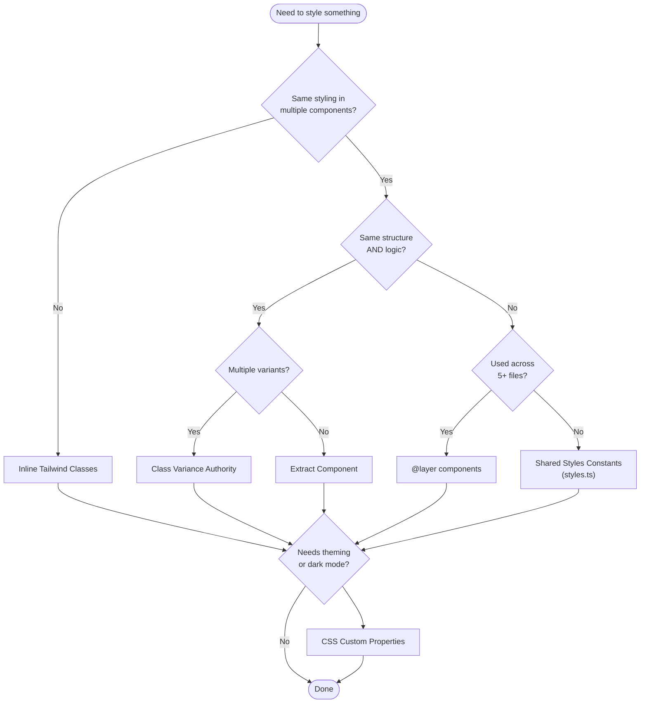

# Tailwind CSS Styling Strategies

This document describes the styling strategies used in Meridian and when to use each one.

## Strategy Selection Flowchart



---

## 1. Inline Tailwind Classes (Default)

**What**: Direct utility classes in JSX.

**Why**: Tailwind's core philosophy - colocation means you see what styles apply without jumping to another file. No indirection, no naming overhead.

**When to use**:

- Default choice for all styling
- Component-specific styles that don't repeat elsewhere

**When NOT to use**:

- Pattern repeats in 3+ places with no structural similarity (consider `@layer`)
- Need dark mode or theme participation (combine with CSS vars)

**Example**:

```tsx
// Most components - just write the classes inline
<div className="flex items-center gap-2 px-3 py-2 rounded-lg bg-muted">
  {children}
</div>
```

---

## 2. `cn()` Utility

**What**: Combines `clsx` (conditional classes) + `tailwind-merge` (conflict resolution).

**Why**:

- Merge conditional classes cleanly
- Resolve Tailwind conflicts correctly (e.g., `cn('px-2', 'px-4')` -> `'px-4'`)
- Allow components to accept `className` prop for customization

**When to use**:

- Any component that accepts a `className` prop
- Conditional styling based on props or state
- Merging base styles with overrides

**When NOT to use**:

- Simple static classes with no conditions (just use string)

**Example**: `frontend/src/lib/utils.ts`

```tsx
import { cn } from '@/lib/utils'

// Conditional + prop merging
<button
  className={cn(
    'px-3 py-2 rounded-md transition-colors',
    isActive && 'bg-primary text-primary-foreground',
    isDisabled && 'opacity-50 cursor-not-allowed',
    className  // Allow parent to override
  )}
>
```

---

## 3. CSS Custom Properties (Design Tokens)

**What**: CSS variables for colors, spacing, typography, shadows.

**Why**:

- Centralized theming - change one variable, update everywhere
- Runtime theme switching without rebuild
- Dark mode via single class toggle (`.dark`)
- Semantic naming (`--color-primary` vs `#3b82f6`)

**When to use**:

- Colors that participate in the theme
- Values that change between light/dark mode
- Design tokens that should be consistent project-wide

**When NOT to use**:

- One-off values that won't change
- Arbitrary pixel values for layout

**Example**: `frontend/src/globals.css`

```css
@theme inline {
  --color-primary: var(--theme-primary);
  --color-background: var(--theme-bg);
  --shadow-1: 0 1px 3px rgb(0 0 0 / 0.1);
  --duration-fast: 150ms;
}
```

Usage in components:

```tsx
<div className="bg-background text-foreground shadow-[var(--shadow-1)]">
```

---

## 4. Class Variance Authority (CVA)

**What**: Type-safe variant definitions with defaults.

**Why**:

- Compile-time safety for variant props
- Clear API: `variant="outline"` instead of remembering classes
- Automatic defaults - no forgotten base styles
- IntelliSense support for valid variants

**When to use**:

- Reusable UI primitives with multiple visual states
- Components with 2+ orthogonal variant dimensions (e.g., `variant` + `size`)
- Shared components used across features

**When NOT to use**:

- Single-use components
- Components with only one variant dimension (simpler to use `cn()`)
- Feature-specific components that won't be reused

**Example**: `frontend/src/shared/components/ui/button.tsx`

```tsx
import { cva, type VariantProps } from "class-variance-authority";

const buttonVariants = cva(
  // Base styles always applied
  "inline-flex items-center justify-center rounded text-sm font-medium transition-all",
  {
    variants: {
      variant: {
        default: "bg-primary text-primary-foreground hover:opacity-90",
        outline: "border border-border bg-background hover:bg-[var(--hover)]",
        ghost: "hover:bg-[var(--hover)]",
      },
      size: {
        default: "h-9 px-4 py-2",
        sm: "h-8 px-3",
        lg: "h-10 px-6",
        icon: "size-8",
      },
    },
    defaultVariants: {
      variant: "default",
      size: "default",
    },
  },
);

function Button({ className, variant, size, ...props }: ButtonProps) {
  return (
    <button
      className={cn(buttonVariants({ variant, size, className }))}
      {...props}
    />
  );
}
```

---

## 5. Shared Styles Constants (`styles.ts`)

**What**: Export class strings as TypeScript constants.

**Why**:

- Keep visual styling in sync between related components
- Explicit coupling with documentation (comment explains relationship)
- Type-safe imports - typos caught at compile time
- Single source of truth without component extraction overhead

**When to use**:

- Same visual appearance in 2-3 structurally different components
- Display mode and edit mode of the same concept
- Components that can't share a common parent/wrapper

**When NOT to use**:

- More than 3-4 consumers (consider `@layer components`)
- Same structure AND logic (extract a component instead)
- Simple styles (just duplicate - it's fine)

**Example**: `frontend/src/features/threads/components/styles.ts`

```tsx
/**
 * Base Card className for user turn bubbles.
 * Used by UserTurn (display) and EditTurnInput (edit) - keep in sync.
 */
export const userTurnCardBase =
  "px-3 py-2 min-w-0 max-w-[95%] thread-message thread-message--user";
```

Usage:

```tsx
// UserTurn.tsx - display mode
<Card className={userTurnCardBase}>
  <BlockRenderer ... />
</Card>

// EditTurnInput.tsx - edit mode (different children, same appearance)
<Card className={cn(userTurnCardBase, 'gap-2 w-full')}>
  <AutosizeTextarea ... />
</Card>
```

---

## 6. `@layer components`

**What**: Custom CSS classes using `@apply` in the component layer.

**Why**:

- Semantic class names (`.thread-message` vs long utility string)
- Reuse across many files without import overhead
- Good for patterns used 5+ times across different features
- Works with pseudo-elements and complex selectors

**When to use**:

- Pattern repeated 5+ times across different features
- Need pseudo-element styling (`:before`, `:after`)
- Complex state selectors (`.dark .thread-message`)
- Third-party library styling (CodeMirror classes)

**When NOT to use**:

- Component-specific styles (use inline)
- Just to make JSX "look cleaner"
- If you can solve it with a component extraction

**Example**: `frontend/src/globals.css`

```css
@layer components {
  /* Used across thread feature for all message types */
  .thread-message {
    border-radius: var(--radius-lg);
    transition: box-shadow var(--duration-medium) var(--easing-default);
  }

  .thread-message--user {
    @apply bg-sidebar text-sidebar-foreground;
    border: 1px solid var(--theme-border);
  }

  /* Typography classes used across editor and preview */
  .type-display {
    @apply font-serif font-semibold;
    font-size: 20px;
    line-height: 1.3;
  }
}
```

---

## Quick Reference Table

| Strategy    | Complexity | Reuse Scope       | Type Safety | When to Reach For                    |
| ----------- | ---------- | ----------------- | ----------- | ------------------------------------ |
| Inline      | Low        | Single component  | N/A         | Default choice                       |
| `cn()`      | Low        | Single component  | Partial     | Conditional/mergeable styles         |
| CSS Vars    | Medium     | Project-wide      | N/A         | Theme values, dark mode              |
| CVA         | Medium     | Shared components | Full        | Multi-variant primitives             |
| `styles.ts` | Low        | 2-3 components    | Full        | Visual coupling, no shared structure |
| `@layer`    | Medium     | Project-wide      | None        | 5+ usages, complex selectors         |

---

## Anti-Patterns

### Don't: Extract everything to `styles.ts`

```tsx
// BAD - over-abstraction for one-off styles
export const containerStyles = "flex items-center gap-2";
export const titleStyles = "text-lg font-bold";
export const buttonStyles = "px-3 py-2 rounded";
```

### Don't: Use `@apply` just for "cleaner" JSX

```css
/* BAD - adds indirection without real benefit */
.my-button {
  @apply px-3 py-2 rounded bg-primary text-white;
}
```

### Don't: Duplicate theme values

```tsx
// BAD - hardcoded color that should use theme
<div className="bg-[#1C1917]">  // Should be bg-background
```

### Don't: Override core Tailwind utilities globally

```css
/* BAD - changes the meaning of a built-in utility everywhere */
@media (max-width: 767px) {
  .text-sm {
    font-size: 1rem !important;
  }
}
```

### Do: Keep it simple

Most styling should be inline Tailwind classes. Only reach for abstractions when there's clear, repeated need.

## Team Guardrails

- Delete unused `@layer components` classes by default. Keep classes only when they are referenced by app code or needed for third-party selectors.
- Use `@layer components` for shared semantic hooks and complex selectors; use inline utilities/CVA/components for everything else.
- Class sorting should be enforced by formatter tooling when dependency installs are available.
