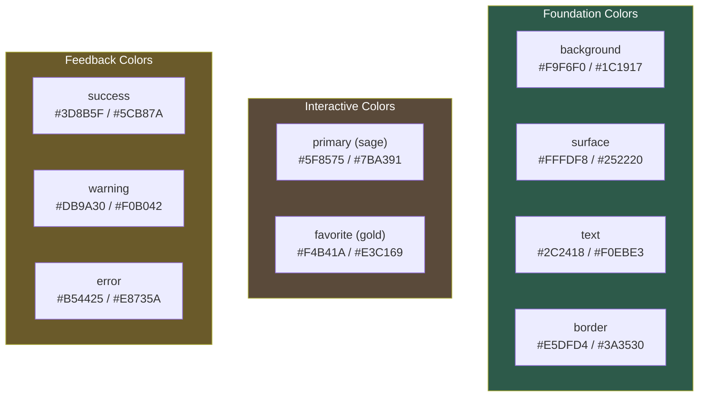
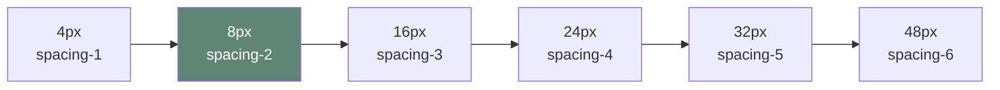

# Theme System

Single theme architecture with **Modern Literary** as the only theme. Users can toggle between light/dark modes, but cannot switch theme presets.

## Architecture

```
ThemeProvider (React Context)
    │
    ├── useTheme() hook
    │   ├── Reads/writes localStorage
    │   ├── Applies CSS variables to :root
    │   └── Loads theme fonts dynamically
    │
    └── Components use CSS variables via Tailwind
```

**Implementation**: `frontend/src/core/theme/`

## Design System Overview

### Color Hierarchy



### Spacing Scale (8pt Grid)



**Standard unit**: 8px (`spacing-2`). All spacing should be multiples of 4px.

### Typography Stack

| Role | Font | Usage | Fallback |
|------|------|-------|----------|
| Display | Source Serif 4 | Headings, titles | Georgia, serif |
| Body | Source Serif 4 | Document content | Georgia, serif |
| UI | Inter | Buttons, labels, nav | system-ui, sans-serif |
| Mono | JetBrains Mono | Code/plaintext surfaces | ui-monospace, monospace |

### Shadow Elevation

| Level | Name | Usage |
|-------|------|-------|
| 1 | `shadow-sm` | Subtle lift (cards at rest) |
| 2 | `shadow-md` | Interactive hover states |
| 3 | `shadow-lg` | Modals, dropdowns, overlays |

### Component Heights

| Component | Height |
|-----------|--------|
| WorkspaceRail | 48px width |
| MobileBottomBar | 64px |
| Touch targets | min 44px |

## Quick Start

### Using Theme in Components

```typescript
import { useThemeContext } from '@/core/theme';

function MyComponent() {
  const { isDark, setMode } = useThemeContext();

  // Switch mode: 'light' | 'dark' | 'system'
  setMode('dark');

  // Note: setThemeId is available but disabled (single theme)
}
```

### Available Themes

- [`modern-literary`](./modern-literary.md) - Only theme. Warm paper + sage green + gold, browser default sans + JetBrains Mono for mono surfaces

**Design Decision**: Single theme simplifies the UX and ensures consistent visual identity. Theme switching can be re-enabled in the future if needed by reversing these changes.

## CSS Variables

Theme system sets `--theme-*` variables on `:root`. Key variables:

| Variable | Description |
|----------|-------------|
| `--theme-bg` | Page background |
| `--theme-surface` | Card/panel background |
| `--theme-text` | Primary text |
| `--theme-text-muted` | Secondary text |
| `--theme-favorite` | Favorite/special marking color (gold) |
| `--theme-primary` | Primary action/interactive color (sage) |
| `--theme-sidebar` | Sidebar background |
| `--theme-font-display` | Heading font family |
| `--theme-font-body` | Body text font family |
| `--theme-font-ui` | UI element font family |

## Color Semantics

Theme v3+ uses semantic color naming with clear intent:

**`favorite`** (#F4B41A gold): Special markings
- Stars, bookmarks, featured content
- "I want this to stand out as special"

**`primary`** (#5F8575 sage): Interactive UI elements
- Buttons, focus rings, hover states, selection
- "This is the main action color"

**Migration from v2**: The legacy `accent` color was split for clearer intent:
- `accent` -> `favorite` for starred items, special markings
- `accent` -> `primary` for interactive UI elements

## Adding New Themes

1. Define preset in `frontend/src/core/theme/themes.ts`
2. Add to `THEME_PRESETS` record
3. Theme appears automatically in `getAvailableThemes()`

Detailed guide: `_docs/hidden/handoffs/design-system-theme-architecture.md`

## Persistence

- Mode: `localStorage` key `meridian-theme-mode`
- System preference detected via `prefers-color-scheme`
- Theme ID persistence removed (single theme architecture)

## File Structure

```
frontend/src/core/theme/
├── index.ts           # Public exports
├── types.ts           # TypeScript interfaces
├── themes.ts          # Theme preset definitions
├── fonts.ts           # Dynamic font loading
├── useTheme.ts        # Core hook
└── ThemeProvider.tsx  # React context
```
