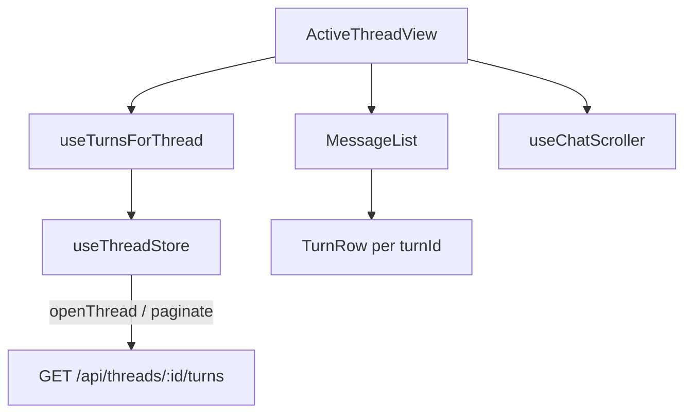
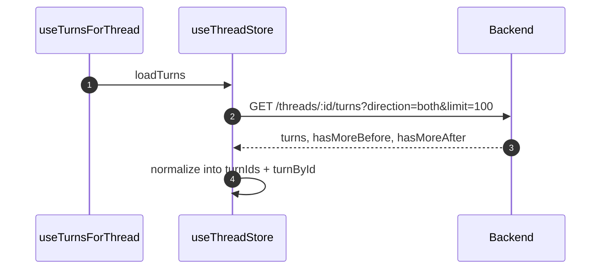

# Thread Pagination

**Status:** Server-driven pagination implemented. Dexie turn caching and virtualization are planned follow-ups.

## Architecture

## Pagination Flow

**Scroll-up**: `paginateBefore` fetches older turns, prepends to window.
**Scroll-down**: `paginateAfter` fetches newer turns, appends to window.
**Branch switch**: `switchSibling` replaces entire turn window with new branch path.

## Scroll Management

`useChatScroller` handles initial scroll-to-bookmark, streaming auto-follow (unless user scrolled up), and scroll-to-bottom button.

## Stale Data Guards

- `useTurnsForThread` skips redundant fetches when threadId matches and turns are loaded/loading
- `openThread` sets `threadId` synchronously before async fetch -- rapid thread switches detected
- Post-fetch guard: `if (get().threadId !== threadId) return`

## Key Files

- `features/threads/hooks/useTurnsForThread.ts` -- Wraps `loadTurns`, exposes turnIds + loading state
- `features/threads/components/ActiveThreadView.tsx` -- Thread panel layout, scroll container
- `features/threads/components/MessageList.tsx` -- Renders turn rows (`TurnList.tsx` is a re-export)
- `core/stores/useThreadStore.ts` -- Turn state, pagination, streaming
- `backend/internal/handler/thread.go` -- Pagination API
