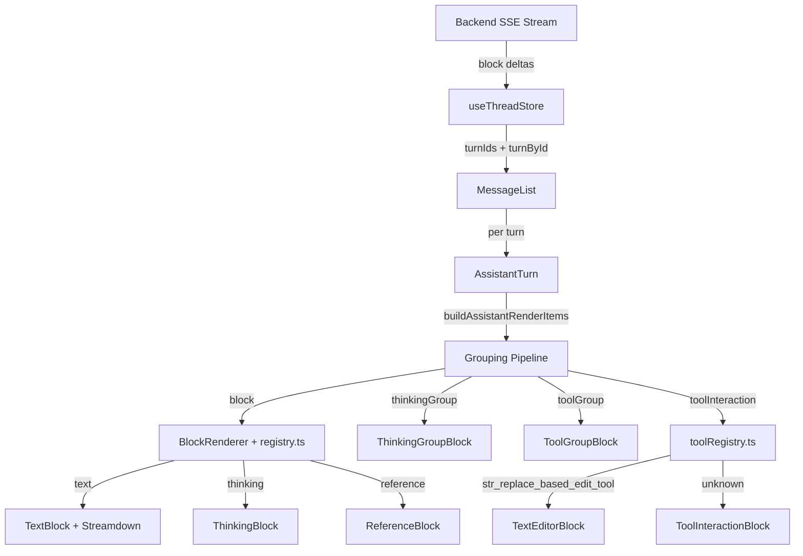
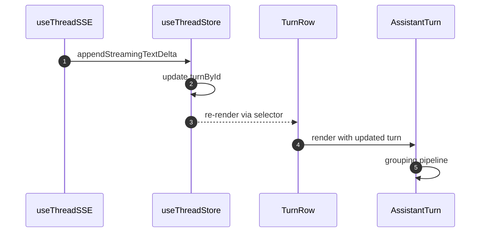

# Thread Rendering Architecture

How assistant turn blocks are rendered in the thread UI.

**See also:** `_docs/technical/llm/streaming/README.md` -- Backend SSE architecture

## Architecture

## Grouping Pipeline

`AssistantTurn` runs three passes on `turn.blocks` (see `toolGrouping.ts`):

1. **`buildAssistantRenderItems`** -- Pairs `tool_use` + `tool_result` by `toolUseId`. Handles out-of-order arrival during streaming.
2. **`groupThinkingAndTools`** -- Merges consecutive thinking blocks + interleaved tool calls into collapsible `thinkingGroup` items.
3. **`groupStandaloneTools`** -- Groups 2+ consecutive standalone tool interactions into collapsible `toolGroup` items.

## Registries (OCP)

### Block Registry (`registry.ts`)

| Block Type | Renderer | Notes |
|------------|----------|-------|
| `text` | `TextBlock` (Streamdown) | Default fallback |
| `thinking` | `ThinkingBlock` | Inside ThinkingGroupBlock |
| `reference` | `ReferenceBlock` | Document/file references |

### Tool Registry (`toolRegistry.ts`)

| Tool Name | Renderer |
|-----------|----------|
| `str_replace_based_edit_tool` | `TextEditorBlock` |
| _(unregistered)_ | `ToolInteractionBlock` |

To extend either registry, add an entry to the corresponding map. See `registry.ts` / `toolRegistry.ts` for the pattern.

## SSE to UI Flow

## Performance

- `AssistantTurn` is `React.memo` -- only re-renders when `turn` reference changes
- `TurnRow` subscribes to `turnById[turnId]` -- only the streaming turn re-renders
- `BlockRenderer` is `React.memo` -- individual blocks skip re-render when unchanged
- Grouping pipeline runs in `useMemo` keyed on `turn.blocks` and `turn.id`

## Key Files

- `features/threads/components/AssistantTurn.tsx` -- Grouping pipeline + render dispatch
- `features/threads/components/MessageList.tsx` -- Turn list rendering (`TurnList` re-exports this)
- `features/threads/components/blocks/BlockRenderer.tsx` -- Delegates to registry
- `features/threads/components/blocks/registry.ts` -- Block type registry
- `features/threads/components/blocks/toolRegistry.ts` -- Tool name registry
- `features/threads/components/blocks/ThinkingGroupBlock.tsx` -- Collapsible thinking + tools
- `features/threads/components/blocks/ToolGroupBlock.tsx` -- Collapsible standalone tools
- `features/threads/utils/toolGrouping.ts` -- Three-pass grouping algorithms
- `core/stores/useThreadStore.ts` -- Normalized turn state + streaming helpers
