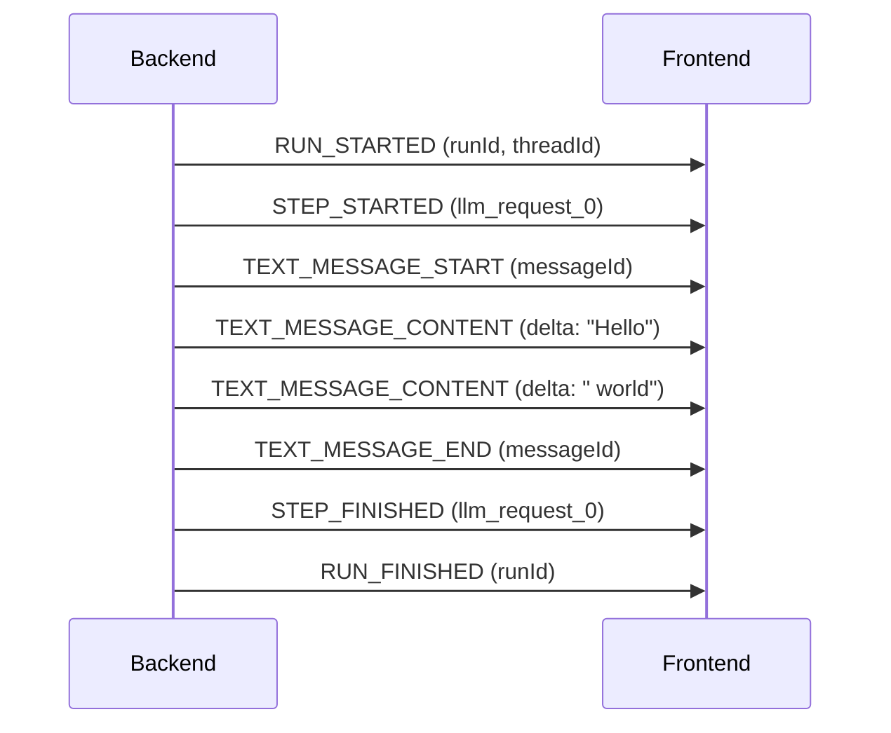
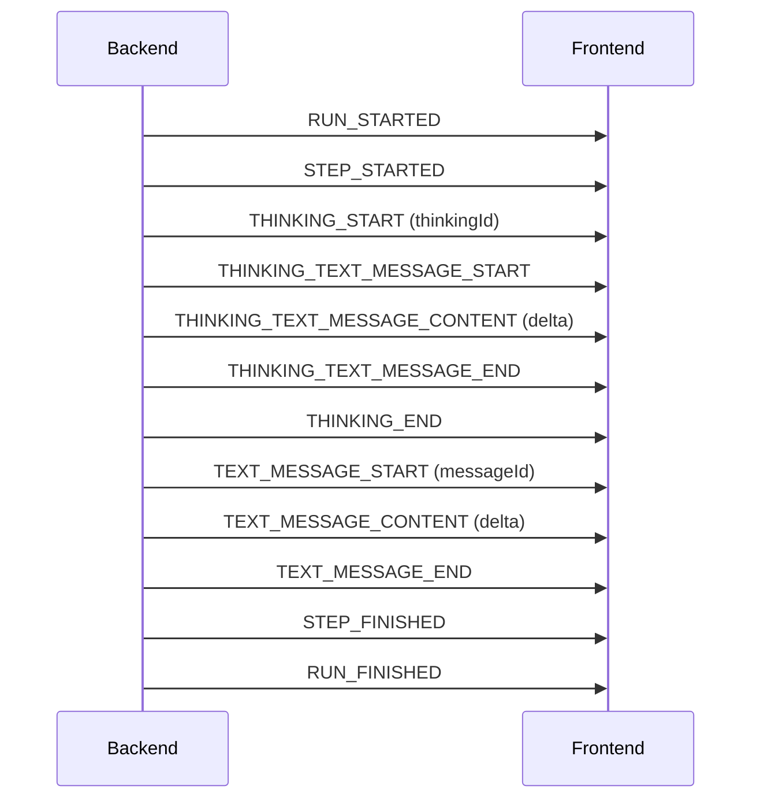
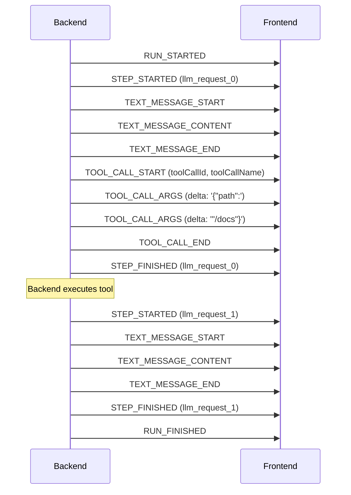

# AG-UI Protocol Reference

Reference guide for the AG-UI (Agent-UI) protocol used in Meridian's streaming system.

## What is AG-UI?

AG-UI is an open protocol for real-time communication between AI agents and user interfaces. It defines a standard set of events for streaming text, tool calls, and lifecycle management.

**Why Meridian uses AG-UI:**
- **Standardized**: Community-driven specification with clear event semantics
- **SDK Support**: Official Go and TypeScript SDKs for consistent implementation
- **Portable**: Protocol-agnostic—works over SSE, WebSocket, or other transports

**Official resources:**
- GitHub: https://github.com/ag-ui-protocol/ag-ui
- Go SDK: https://github.com/ag-ui-protocol/ag-ui/tree/main/sdks/community/go
- TypeScript SDK: https://github.com/ag-ui-protocol/ag-ui/tree/main/sdks/community/ts

---

## Event Categories

### Text Message Events

Streaming assistant text content.

| Event | Purpose | Key Fields |
|-------|---------|------------|
| `TEXT_MESSAGE_START` | Begin new text message | `messageId`, `role` (optional) |
| `TEXT_MESSAGE_CONTENT` | Incremental text delta | `messageId`, `delta` |
| `TEXT_MESSAGE_END` | Complete text message | `messageId` |

**Flow:**
```
TEXT_MESSAGE_START → TEXT_MESSAGE_CONTENT* → TEXT_MESSAGE_END
```

### Thinking Events

Extended thinking/reasoning content (e.g., Claude's thinking blocks).

| Event | Purpose | Key Fields |
|-------|---------|------------|
| `THINKING_START` | Begin thinking phase | `thinkingId` |
| `THINKING_TEXT_MESSAGE_START` | Start thinking text | `thinkingId` |
| `THINKING_TEXT_MESSAGE_CONTENT` | Incremental thinking delta | `thinkingId`, `delta` |
| `THINKING_TEXT_MESSAGE_END` | End thinking text | `thinkingId` |
| `THINKING_END` | End thinking phase | `thinkingId` |

**Flow:**
```
THINKING_START → THINKING_TEXT_MESSAGE_START → THINKING_TEXT_MESSAGE_CONTENT* → THINKING_TEXT_MESSAGE_END → THINKING_END
```

### Tool Call Events

Streaming tool invocations with incremental JSON arguments.

| Event | Purpose | Key Fields |
|-------|---------|------------|
| `TOOL_CALL_START` | Begin tool invocation | `toolCallId`, `toolCallName`, `parentMessageId` (optional) |
| `TOOL_CALL_ARGS` | Incremental JSON argument chunk | `toolCallId`, `delta` |
| `TOOL_CALL_END` | Complete tool call | `toolCallId` |

**Flow:**
```
TOOL_CALL_START → TOOL_CALL_ARGS* → TOOL_CALL_END
```

**Note:** `TOOL_CALL_RESULT` exists in the spec but Meridian handles tool results internally.

### Lifecycle Events

Run and step management for orchestration.

| Event | Purpose | Key Fields |
|-------|---------|------------|
| `RUN_STARTED` | Execution began | `runId`, `threadId` |
| `RUN_FINISHED` | Execution completed successfully | `runId` |
| `RUN_ERROR` | Execution failed | `runId`, `message` |
| `STEP_STARTED` | Sub-step began | `stepName` |
| `STEP_FINISHED` | Sub-step ended | `stepName` |

**Flow (success):**
```
RUN_STARTED → (STEP_STARTED → events... → STEP_FINISHED)* → RUN_FINISHED
```

**Flow (error):**
```
RUN_STARTED → ... → RUN_ERROR
```

---

## ID Semantics

AG-UI uses several ID types for event correlation:

| ID | Scope | Format (Meridian) | Purpose |
|----|-------|-------------------|---------|
| `runId` | Entire turn | `run_{turnId}` | Correlates all events in one execution |
| `messageId` | Text message lifecycle | `msg_{turnId}_{stepIdx}` | Links TEXT_MESSAGE_* events |
| `thinkingId` | Thinking lifecycle | `thinking_{turnId}_{stepIdx}` | Links THINKING_* events |
| `toolCallId` | Tool invocation | Provider-assigned (e.g., `toolu_xxx`) | Links TOOL_CALL_* events |
| `stepName` | Sub-step within run | `llm_request_{stepIdx}` | Tracks individual LLM requests in tool loops |

**Step index increments** on each LLM request during tool continuation loops. A single turn may have multiple steps if tools are called and the model continues.

---

## Event Flow Diagrams

### Simple Text Response



### Text with Thinking



### Tool Call Flow



---

## SSE Format

AG-UI events are transmitted over SSE with this format:

```
event: TEXT_MESSAGE_CONTENT
data: {"type":"TEXT_MESSAGE_CONTENT","messageId":"msg_xxx","delta":"Hello"}

event: TOOL_CALL_START
data: {"type":"TOOL_CALL_START","toolCallId":"toolu_xxx","toolCallName":"str_replace_based_edit_tool"}
```

- **`event:`** - AG-UI event type (used for routing)
- **`data:`** - Full JSON payload including `type` field

---

## Related Documentation

- [Meridian AG-UI Bridge](meridian-agui-bridge.md) - How Meridian integrates with AG-UI
- [Streaming README](README.md) - Backend streaming system overview
- [Block Types Reference](block-types-reference.md) - Turn block data structures
