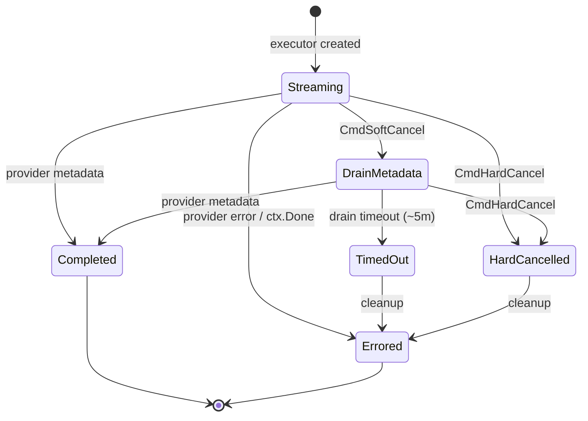
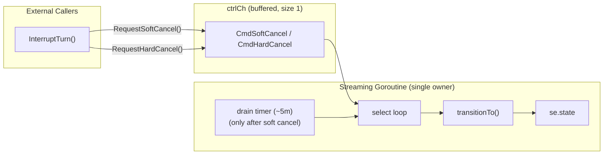
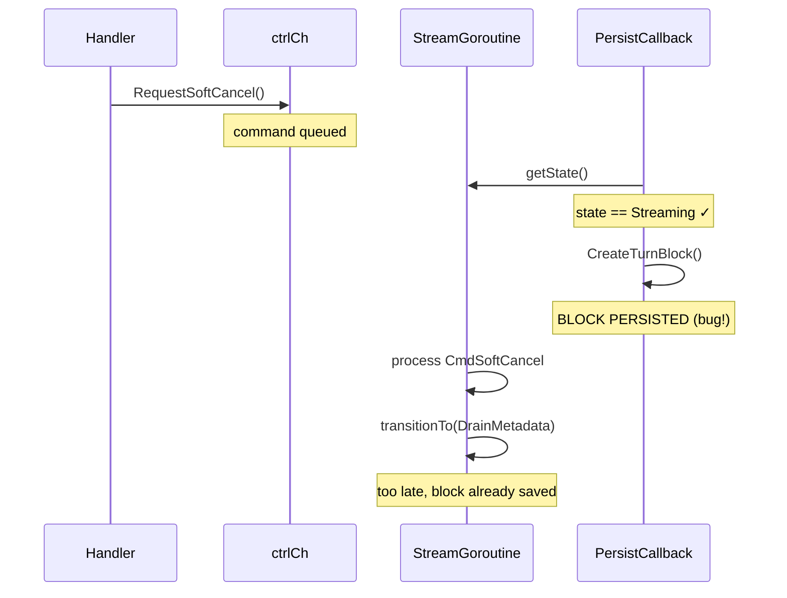
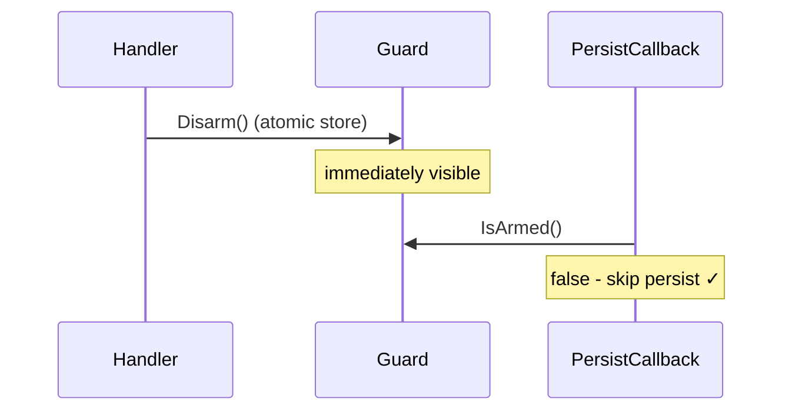

# StreamExecutor State Machine

The `StreamExecutor` uses an actor pattern with a finite state machine to manage streaming lifecycle and cancellation.

## State Diagram



## Actor Pattern

**Invariant:** Only the streaming goroutine transitions state.



| Component | Role |
|-----------|------|
| `ctrlCh` (buffered, size 1) | Command channel for cancel requests |
| `stateMu` | Protects state reads from other goroutines via `getState()` |
| `transitionTo()` | Only called from streaming goroutine |

## Commands

| Command | Sender | Effect |
|---------|--------|--------|
| `CmdSoftCancel` | `InterruptTurn()` | Transition to DrainMetadata, persist partial text, disconnect SSE clients |
| `CmdHardCancel` | `InterruptTurn()` | Transition to HardCancelled, trigger handleError |

## States

| State | Description | AllowsPersistence | AllowsSSE |
|-------|-------------|-------------------|-----------|
| `Streaming` | Normal operation - blocks persisted, SSE events sent | Yes | Yes |
| `DrainMetadata` | Soft cancel - waiting for provider to send final token counts | No | No |
| `HardCancelled` | Hard cancel requested - immediate termination | No | No |
| `TimedOut` | Soft cancel timeout fired (5m) - forcing cleanup | No | No |
| `Completed` | Provider finished normally | No | No |
| `Errored` | Error occurred or cleanup after cancel/timeout | No | No |

**Note:** `TimedOut` is primarily for observability/debuggability. After the drain timeout fires, the executor cancels the provider request, finalizes best-effort tokens, and exits (ending in `Errored`).

## Soft Cancel vs Hard Cancel

```mermaid
flowchart TD
    subgraph Soft["Soft Cancel (most providers)"]
        S1["User clicks Stop"] --> S2["RequestSoftCancel()"]
        S2 --> S3["State → DrainMetadata"]
        S3 --> S4["Persist partial text"]
        S4 --> S5["SSE: turn_error (cancelled)"]
        S5 --> S6["Disconnect clients"]
        S6 --> S7["Provider continues..."]
        S7 --> S8{"Metadata arrives?"}
        S8 -->|"Yes (< 5m)"| S9["Save tokens → Completed"]
        S8 -->|"No (timeout)"| S10["Cancel provider + Estimate tokens → Errored"]
    end

    subgraph Hard["Hard Cancel (Anthropic)"]
        H1["User clicks Stop"] --> H2["RequestHardCancel()"]
        H2 --> H3["State → HardCancelled"]
        H3 --> H4["Context cancelled"]
        H4 --> H5["Estimate tokens"]
        H5 --> H6["Persist partial text"]
        H6 --> H7["SSE: turn_error (cancelled)"]
        H7 --> H8["State → Errored"]
    end
```



**When each is used:**
- **Soft cancel**: Providers that ignore cancellation (OpenRouter, most models). Provider continues streaming in background to get accurate token counts.
- **Hard cancel**: Providers that support cancellation (Anthropic). Context is cancelled immediately, tokens are estimated.

## PersistenceGuard

The `PersistenceGuard` is an atomic flag that prevents a race condition where blocks are persisted after a cancel is requested.

**The Race Condition Problem:**



**The Fix:**

The `PersistenceGuard` uses an atomic bool that is disarmed **immediately** when cancel is requested, before queueing the command. This ensures no race window:



**Implementation:**

```go
// In RequestSoftCancel():
se.persistenceGuard.Disarm()  // FIRST - atomic, immediate visibility
se.ctrlCh <- CmdSoftCancel    // THEN queue command

// In PersistAndClear callback:
if !se.persistenceGuard.IsArmed() {
    return nil  // Skip persistence
}
```

**Files:**
- `streaming/persistence_guard.go` - Atomic guard implementation
- `streaming/persistence_guard_test.go` - Unit tests with race detector

## Idempotency

The buffered channel (size 1) provides natural idempotency:

```go
func (se *StreamExecutor) RequestSoftCancel() {
    se.persistenceGuard.Disarm()  // Atomic - no race
    select {
    case se.ctrlCh <- controlMsg{cmd: CmdSoftCancel}:
        // Command queued
    default:
        // Channel full - command already pending (idempotent)
    }
}
```

Multiple calls to `RequestSoftCancel()` or `RequestHardCancel()` are safe.

## Files

| File | Purpose |
|------|---------|
| `streaming/executor_state.go` | State enum and command types |
| `streaming/mstream_adapter.go` | State machine implementation in `processProviderStream()` |
| `streaming/service.go` | `InterruptTurn()` orchestration |
| `streaming/persistence_guard.go` | Atomic guard for persistence race condition |
| `streaming/persistence_guard_test.go` | Unit tests for PersistenceGuard |
| `streaming/executor_test.go` | Race condition and behavior tests |
