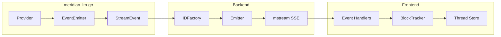
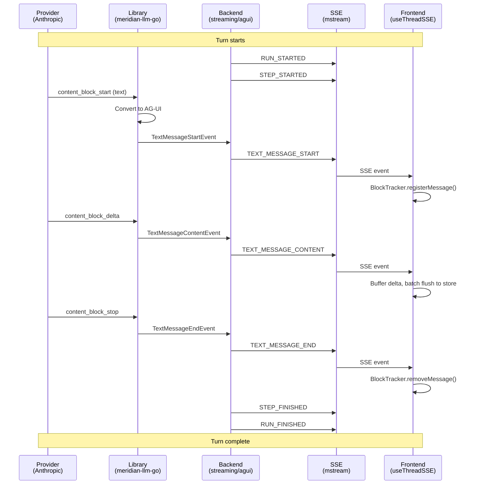

# Meridian AG-UI Bridge

How Meridian integrates AG-UI protocol across the stack—from LLM providers to the frontend UI.

## Architecture Overview



**Data flow:**
1. **Provider** emits raw LLM events (Anthropic, OpenRouter, etc.)
2. **Library** normalizes to AG-UI events via EventEmitter
3. **Backend** adds IDs (IDFactory) and serializes to SSE (Emitter)
4. **Frontend** correlates IDs (BlockTracker) and updates UI (Thread Store)

---

## Layer Responsibilities

### 1. Library (meridian-llm-go)

The library converts provider-specific events into standardized AG-UI events.

**Key components:**
- **EventEmitter** - Emits AG-UI events during streaming
- **StreamEvent** - Contains `events.Event` field with the AG-UI event
- **Type-safe accessors** - `GetTextMessageContent()`, `GetToolCallArgs()`, etc.

**Flow:**
```go
// Provider stream -> Library normalization -> AG-UI event
provider.StreamResponse(ctx, request) // Returns StreamEventIterator

for event := range iter {
    // event.Event is an AG-UI events.Event
    switch e := event.Event.(type) {
    case *events.TextMessageContentEvent:
        // Handle text delta
    case *events.ToolCallStartEvent:
        // Handle tool call
    }
}
```

**See:** `meridian-llm-go/docs/streaming.md`

### 2. Backend Bridge (streaming/agui/)

The backend adds stable IDs and serializes AG-UI events to SSE format.

#### IDFactory (`agui/id_factory.go`)

Generates deterministic IDs for event correlation:

| Method | Format | Purpose |
|--------|--------|---------|
| `RunID()` | `run_{turnId}` | Stable for entire turn |
| `MessageID()` | `msg_{turnId}_{stepIdx}` | Unique per LLM request |
| `ThinkingMessageID()` | `thinking_{turnId}_{stepIdx}` | Separate from text messages |
| `StepName()` | `llm_request_{stepIdx}` | Human-readable step identifier |
| `ToolCallID(index)` | `tool_{turnId}_{stepIdx}_{index}` | Fallback for backend-generated tools |

**Step index management:**
```go
factory := NewIDFactory(turnID, threadID)
factory.MessageID()     // msg_{turnId}_0
factory.IncrementStep() // After tool execution
factory.MessageID()     // msg_{turnId}_1
```

#### Emitter (`agui/emitter.go`)

Serializes AG-UI events and sends them via mstream:

```go
emitter := NewEmitter(send, idFactory, logger)

// Lifecycle events
emitter.EmitRunStarted()    // RUN_STARTED
emitter.EmitStepStarted()   // STEP_STARTED
emitter.EmitStepFinished()  // STEP_FINISHED
emitter.EmitRunFinished()   // RUN_FINISHED
emitter.EmitRunError(msg)   // RUN_ERROR
emitter.EmitToolCallResult(messageId, toolCallId, contentJSON) // TOOL_CALL_RESULT (local tools)

// Content events (pass-through from library)
emitter.EmitAGUIEvent(textMessageContentEvent)
```

**SSE output format:**
```
event: TEXT_MESSAGE_CONTENT
data: {"type":"TEXT_MESSAGE_CONTENT","messageId":"msg_xxx_0","delta":"Hello"}
```

### 3. Frontend (useThreadSSE.ts)

The frontend parses SSE events and updates the thread store.

#### Event Types (`sseEventTypes.ts`)

Type-safe constants prevent typos and enable autocomplete:

```typescript
export const SSE_EVENTS = {
  // AG-UI Text Events
  TEXT_MESSAGE_START: 'TEXT_MESSAGE_START',
  TEXT_MESSAGE_CONTENT: 'TEXT_MESSAGE_CONTENT',
  TEXT_MESSAGE_END: 'TEXT_MESSAGE_END',

  // AG-UI Thinking Events
  THINKING_START: 'THINKING_START',
  THINKING_TEXT_MESSAGE_CONTENT: 'THINKING_TEXT_MESSAGE_CONTENT',
  THINKING_END: 'THINKING_END',

  // AG-UI Tool Events
  TOOL_CALL_START: 'TOOL_CALL_START',
  TOOL_CALL_ARGS: 'TOOL_CALL_ARGS',
  TOOL_CALL_END: 'TOOL_CALL_END',
  TOOL_CALL_RESULT: 'TOOL_CALL_RESULT',

  // AG-UI Lifecycle
  RUN_STARTED: 'RUN_STARTED',
  RUN_FINISHED: 'RUN_FINISHED',
  RUN_ERROR: 'RUN_ERROR',

  // Meridian-specific (see below)
  TURN_COMPLETE: 'turn_complete',
  TURN_ERROR: 'turn_error',
} as const
```

#### BlockTracker (`blockTracker.ts`)

Maps AG-UI IDs to block indices for correlation:

```typescript
class BlockTracker {
  // Tool calls: toolCallId -> blockIndex
  registerToolCall(toolCallId: string, blockIndex: number): void
  getToolCallBlockIndex(toolCallId: string): number | undefined
  appendToolJson(toolCallId: string, delta: string, opts?: { maxChars?: number }): { json: string; truncated: boolean }
  appendToolArgsDelta(toolCallId: string, delta: string): ToolArgsStreamSnapshot | null

  // Messages: messageId -> blockIndex
  registerMessage(messageId: string, blockIndex: number): void
  getMessageBlockIndex(messageId: string): number | undefined

  // Thinking: thinkingId -> blockIndex
  registerThinking(thinkingId: string, blockIndex: number): void
  getThinkingBlockIndex(thinkingId: string): number | undefined

  // Cleanup (call on stream end to prevent memory leaks)
  clear(): void
}
```

**Key features:**
- **Single cleanup** - One `clear()` method for all tracking state
- **JSON buffering (capped)** - Accumulates `TOOL_CALL_ARGS` deltas for best-effort parsing
- **Active arg inference** - Incrementally infers which top-level arg key is currently streaming (string values)
- **Block index management** - Tracks current block for delta routing

#### Event Handlers (`useThreadSSE.ts`)

Each AG-UI event maps to a store action:

```typescript
// TEXT_MESSAGE_START -> Create new text block
case SSE_EVENTS.TEXT_MESSAGE_START:
  const blockIndex = tracker.nextBlockIndex()
  tracker.registerMessage(data.messageId, blockIndex)
  tracker.setCurrentBlockType('text')
  // Store: Add block to turn

// TEXT_MESSAGE_CONTENT -> Append delta (buffered)
case SSE_EVENTS.TEXT_MESSAGE_CONTENT:
  append(data.delta) // Buffer for batch flush

// TOOL_CALL_START -> Create tool_use block
case SSE_EVENTS.TOOL_CALL_START:
  const blockIndex = tracker.nextBlockIndex()
  tracker.registerToolCall(data.toolCallId, blockIndex)
  // Store: Add tool_use block with name

// TOOL_CALL_ARGS -> Accumulate JSON
case SSE_EVENTS.TOOL_CALL_ARGS:
  const meta = tracker.appendToolArgsDelta(data.toolCallId, data.delta)
  const { json, truncated } = tracker.appendToolJson(data.toolCallId, data.delta, { maxChars: ... })
  // Store: Update tool state with meta; parse json only while small/not in large string

// TOOL_CALL_RESULT -> Mark tool complete + insert tool_result block
case SSE_EVENTS.TOOL_CALL_RESULT:
  // Store: Add tool_result block + set tool stream state COMPLETE/ERROR
```

#### Ordering & Interleaving

SSE preserves **wire order**, but AG-UI event lifecycles may **interleave** (e.g. `TOOL_CALL_START` can arrive before `TEXT_MESSAGE_END`).
Frontend handlers must be **idempotent** and avoid clearing unrelated “current block” state.

---

## Event Flow Diagram



---

## Meridian-Specific Extensions

Meridian adds two events not in the AG-UI spec:

| Event | Purpose | Fields |
|-------|---------|--------|
| `turn_complete` | Turn finalization with metadata | `turn_id`, `stop_reason` |
| `turn_error` | Error details with cancellation flag | `turn_id`, `error`, `is_cancelled` |

**Why kept:**
- AG-UI's `RUN_FINISHED` / `RUN_ERROR` don't include finalization metadata (token counts, stop reason)
- `is_cancelled` flag allows frontend to suppress error toasts for user-initiated cancellations
- These events are emitted **after** the AG-UI lifecycle events

---

## Files Reference

| Layer | File | Purpose |
|-------|------|---------|
| Library | `event_emitter.go` | AG-UI event emission |
| Library | `streaming.go` | StreamEvent + type accessors |
| Backend | `agui/id_factory.go` | Deterministic ID generation |
| Backend | `agui/emitter.go` | SSE serialization + lifecycle events |
| Frontend | `sseEventTypes.ts` | Event constants + TypeScript interfaces |
| Frontend | `blockTracker.ts` | ID->blockIndex correlation |
| Frontend | `useThreadSSE.ts` | SSE connection + event handlers |

---

## Related Documentation

- [AG-UI Protocol Reference](ag-ui-protocol.md) - Protocol specification
- [Streaming README](README.md) - Backend streaming system overview
- [Library streaming docs](../../../../meridian-llm-go/docs/streaming.md) - meridian-llm-go streaming
