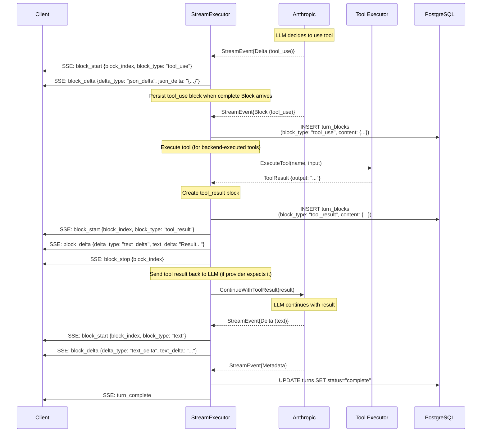

# Tool Execution Flow

How LLM tool calling works in the streaming system.

## Tool Availability (Source of Truth)

- The backend computes `request_params.tools` on the backend (project preferences + server config + model capabilities).
- The client should not send `request_params.tools` as an authoritative list.

## Complete Tool Call Cycle



---

## TurnBlock Sequence with Tools

**Example turn with tool execution:**

```sql
-- Turn ID: abc-123
-- Assistant requests tool, tool executes, assistant continues

sequence | block_type  | text_content                    | content (JSONB)
---------|-------------|----------------------------------|----------------------------------
0        | thinking    | "I need to check the file..."   | {"signature": "4k_a"}
1        | text        | "Let me read the file."         | null
2        | tool_use    | null                            | {"tool_use_id": "toolu_1", "tool_name": "read_file", "input": {"path": "..."}}
3        | tool_result | null                            | {"tool_use_id": "toolu_1", "content": "file contents..."}
4        | thinking    | "Now I can see that..."         | {"signature": "4k_a"}
5        | text        | "Based on the file, I found..." | null
```

---

## Multiple Tool Calls

**LLM can request multiple tools in one response:**

```sql
sequence | block_type  | text_content               | content (JSONB)
---------|-------------|----------------------------|----------------------------------
0        | text        | "Let me check both files." | null
1        | tool_use    | null                       | {"tool_name": "read_file", "input": {"path": "a.txt"}}
2        | tool_use    | null                       | {"tool_name": "read_file", "input": {"path": "b.txt"}}
3        | tool_result | null                       | {"tool_use_id": "toolu_1", "content": "a.txt contents"}
4        | tool_result | null                       | {"tool_use_id": "toolu_2", "content": "b.txt contents"}
5        | text        | "Comparing both files..."  | null
```

---

## Tool Execution Phases

### 1. LLM Requests Tool

Provider streams `tool_use` block:
```json
{
  "block_type": "tool_use",
  "content": {
    "tool_use_id": "toolu_abc123",
    "tool_name": "read_file",
    "input": {
      "path": "/path/to/file.txt"
    }
  }
}
```

### 2. StreamExecutor Persists Tool Request

- `StreamExecutor.processCompleteBlock` persists the `tool_use` `TurnBlock` when the library emits a complete Block.

### 3. Backend Executes Tool (Local Tools)

- For locally-executed tools (e.g., `doc_search`, `str_replace_based_edit_tool`, `web_search` via Tavily), the backend:
  - Checks `block.IsLocalTool()` (ExecutionSide: `"local"` or nil)
  - Executes the corresponding tool in application code
  - Writes a `tool_result` block with `content.tool_use_id` and `is_error`

### 4. Provider-Executed Tools (Provider-Side)

- For provider-executed tools (e.g., Anthropic's built-in web_search):
  - ExecutionSide: `"provider"`
  - Provider runs the tool; results arrive as `web_search_result` blocks
  - Backend does not execute a local tool; it only persists the result blocks
  - **Note**: Currently not used (Tavily backend execution preferred)

### ExecutionSide Values

**Library (`meridian-llm-go`)** - 2 values (behavioral distinction):
| Value | Who Executes | Examples |
|-------|--------------|----------|
| `"provider"` | LLM provider (Anthropic, OpenRouter) | Anthropic's built-in web_search |
| `"local"` | Non-provider (stop/execute/resume cycle) | Tavily, doc_search, custom tools |

**Backend (Meridian)** - 3 values (routing distinction):
| Value | Who Executes | Examples |
|-------|--------------|----------|
| `"provider"` | LLM provider | Anthropic's built-in web_search |
| `"local"` | Backend | Tavily, doc_search, custom tools |
| `"client"` | Frontend/browser | (Rarely used) |

Default: nil is treated as `"local"` (non-provider execution)

---

## Tool Result Propagation

**Flow:**
1. LLM requests tool
2. Executor executes tool synchronously
3. Tool result added to message history
4. LLM receives result and continues response

**Message history after tool execution:**
```json
[
  {"role": "user", "content": "Read file.txt"},
  {"role": "assistant", "content": [
    {"type": "text", "text": "Let me read the file."},
    {"type": "tool_use", "id": "toolu_1", "name": "read_file", "input": {...}}
  ]},
  {"role": "user", "content": [
    {"type": "tool_result", "tool_use_id": "toolu_1", "content": "file contents"}
  ]},
  {"role": "assistant", "content": [
    {"type": "text", "text": "Based on the file..."}
  ]}
]
```

---

## Error Handling

Tool errors follow a two-tier model:

### Recoverable Errors (LLM Can Retry)

Use `ErrorResult()` for errors the LLM can act on:

```go
// Missing parameter
return ErrorResult(ErrMissingParam, "Missing required parameter", map[string]any{"param": "path"}), nil

// Document not found
return ErrorResult(ErrDocNotFound, "Document not found", map[string]any{"path": path}), nil

// No match for search/replace
return ErrorResult(ErrNoMatch, "Text not found in document", nil), nil
```

**Error codes** (defined in `tools/errors.go`):
- Generic: `ErrMissingParam`, `ErrNotFound`, `ErrInvalidInput`
- Document: `ErrDocNotFound`, `ErrDocAlreadyExists`, `ErrNoMatch`, `ErrAmbiguousMatch`, `ErrInvalidLine`

**Response format** (sent to LLM as tool_result):
```json
{
  "success": false,
  "error_code": "NO_MATCH",
  "message": "Text not found in document",
  "error_data": {"path": "/chapter-1.md"}
}
```

LLM receives structured error and can retry with different input.

### System Errors (Terminates Stream)

Use `return nil, err` for unrecoverable errors:

```go
// Database failure - can't recover
if err != nil {
    return nil, fmt.Errorf("failed to get document: %w", err)
}
```

System errors propagate up and terminate the stream with `turn_error`.

### Tool Timeout

Timeouts are system errors (not recoverable):

```go
ctx, cancel := context.WithTimeout(context.Background(), 30*time.Second)
defer cancel()

result, err := tool.ExecuteWithContext(ctx, input)
if err != nil {
    // Timeout terminates the stream
    return nil, fmt.Errorf("tool execution failed: %w", err)
}
```

---

## References

**Implementation:**
- Streaming: `backend/internal/service/llm/streaming/mstream_adapter.go`
- Backend tool handling: see `_docs/technical/backend/llm-integration.md`

**Related:**
- [Streaming Architecture](../../backend/architecture/streaming-architecture.md)
- [Turn Blocks](../../backend/thread/turn-blocks.md)
- [API Endpoints](api-endpoints.md)
