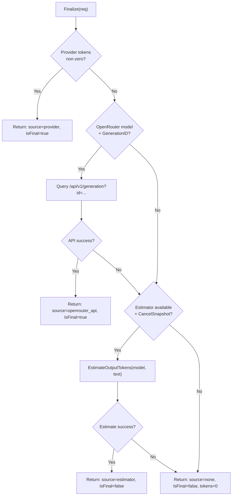

# Token Finalization

`TokenFinalizer` provides best-effort token counts for completed, cancelled, and timed-out streams.

## Strategy Chain

## When Finalization is Called

| Reason | Trigger | Typical Strategy |
|--------|---------|------------------|
| `completion` | Provider sends metadata | Provider tokens (strategy 1) |
| `soft_cancel` | Provider finishes after cancel | Provider tokens or OpenRouter API |
| `hard_cancel` | Context cancelled (Anthropic) | Estimator (strategy 3) |
| `error` | Provider errors / stream ends unexpectedly | OpenRouter API or estimator |
| `soft_cancel_timeout` | 5m timeout fires | Estimator (strategy 3) |

## Result Fields

| Field | Type | Description |
|-------|------|-------------|
| `InputTokens` | int | Input token count (0 if only output estimated) |
| `OutputTokens` | int | Output token count |
| `IsFinal` | bool | `true` if from provider/API, `false` if estimated |
| `Source` | string | `"provider"` \| `"openrouter_api"` \| `"estimator"` \| `"none"` |

## Token Estimator

The estimator supports:
- **Anthropic models**: Uses Anthropic's tokenization API for accurate counts
- **Other models**: No estimator by default (tokens may be 0 unless provider metadata or OpenRouter generation stats are available)

See `tokens/anthropic.go` for Anthropic tokenizer implementation.

## Files

| File | Purpose |
|------|---------|
| `tokens/finalizer.go` | `TokenFinalizer` interface and `DefaultTokenFinalizer` |
| `tokens/estimator.go` | `TokenEstimator` interface |
| `tokens/anthropic.go` | Anthropic tokenizer implementation |
| `tokens/registry.go` | Model-to-estimator mapping |
