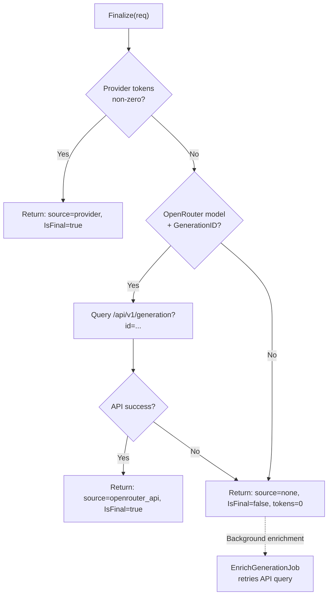
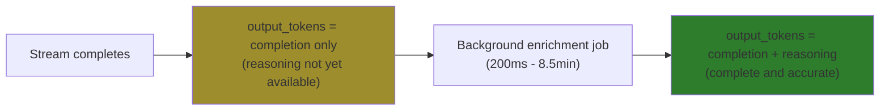

# Token Finalization

`TokenFinalizer` provides best-effort token counts for completed, cancelled, and timed-out streams.

## Strategy Chain

## When Finalization is Called

| Reason | Trigger | Typical Strategy |
|--------|---------|------------------|
| `completion` | Provider sends metadata | Provider tokens (strategy 1) |
| `soft_cancel` | Provider finishes after cancel | Provider tokens or OpenRouter API |
| `hard_cancel` | Context cancelled (Anthropic) | Returns 0, background enrichment fills in later |
| `error` | Provider errors / stream ends unexpectedly | OpenRouter API or returns 0 |
| `soft_cancel_timeout` | 5m timeout fires | Returns 0, background enrichment fills in later |

## Result Fields

| Field | Type | Description |
|-------|------|-------------|
| `InputTokens` | int | Input token count (0 if not available yet) |
| `OutputTokens` | int | Output token count (0 if not available yet) |
| `IsFinal` | bool | `true` if from provider/API, `false` if pending enrichment |
| `Source` | string | `"provider"` \| `"openrouter_api"` \| `"token_counter"` \| `"none"` |

## Token Accumulation

When a turn involves multiple LLM requests (e.g., tool continuation), tokens are **accumulated** rather than overwritten:

| Request | Input Tokens | Output Tokens | Turn Total |
|---------|--------------|---------------|------------|
| Initial | 1000 | 200 | 1200 |
| Tool continuation | 1500 | 150 | 2850 (cumulative) |
| Final response | 2000 | 100 | 4950 (cumulative) |

This ensures the turn's `input_tokens` and `output_tokens` reflect the **total cost** across all LLM requests.

**Implementation**: `AccumulateTokensAndUpdateMetadata()` in `turn.go` uses structured types (`TurnTokenUpdate`, `TurnCompletionUpdate`) for atomic accumulation with pointer semantics for conditional updates.

## Reasoning/Thinking Tokens

**Design Decision:** `output_tokens` is INCLUSIVE - it includes both completion and reasoning/thinking tokens.

**Why inclusive design:**
- Simpler billing/tracking (one number for total cost)
- Provider-agnostic (works for OpenRouter, Gemini, future providers)
- Transparent cost (users see full billable output at a glance)
- Detailed breakdown preserved in `response_metadata` for analytics

**Race Window (Expected Behavior):**

For reasoning-capable models (o1, Grok, DeepSeek-R1), there's a brief window where `output_tokens` is incomplete:

1. Stream completes → `output_tokens` set from streaming metadata (NO reasoning tokens)
2. Background job runs (200ms - 8.5 min later) → adds reasoning tokens
3. `output_tokens` now complete (completion + reasoning)

This is **acceptable** for backend tracking:
- Final token counts are eventually consistent
- Generation metadata always preserved with full details
- UI can poll or show "finalizing..." during enrichment

**Implementation:**
- Repository: `internal/repository/postgres/llm/turn.go:452` (AccumulateTokensAndUpdateMetadata with structured types)
- Enrichment: `internal/jobs/enrich_generation.go:279` (updateTurnTokens with reasoning inclusion)
- Streaming: `internal/service/llm/streaming/mstream_adapter.go:1275` (updateTurnMetadata)

## Token Counter (Optional)

The token counter provides exact counts using provider APIs:
- **Anthropic models**: Uses Anthropic's `/messages/count_tokens` API for exact counts
- **Other models**: No token counter by default (tokens are 0 until background enrichment completes)

**Note**: Token counter is currently NOT USED in production. All models rely on background enrichment for authoritative tokens.

See `tokens/anthropic.go` for Anthropic token counter implementation.

## Files

| File | Purpose |
|------|---------|
| `tokens/finalizer.go` | `TokenFinalizer` interface and `DefaultTokenFinalizer` |
| `tokens/token_counter.go` | `TokenCounter` interface (currently unused) |
| `tokens/anthropic.go` | Anthropic token counter implementation (currently unused) |
| `tokens/registry.go` | Token counter registry (currently unused) |
