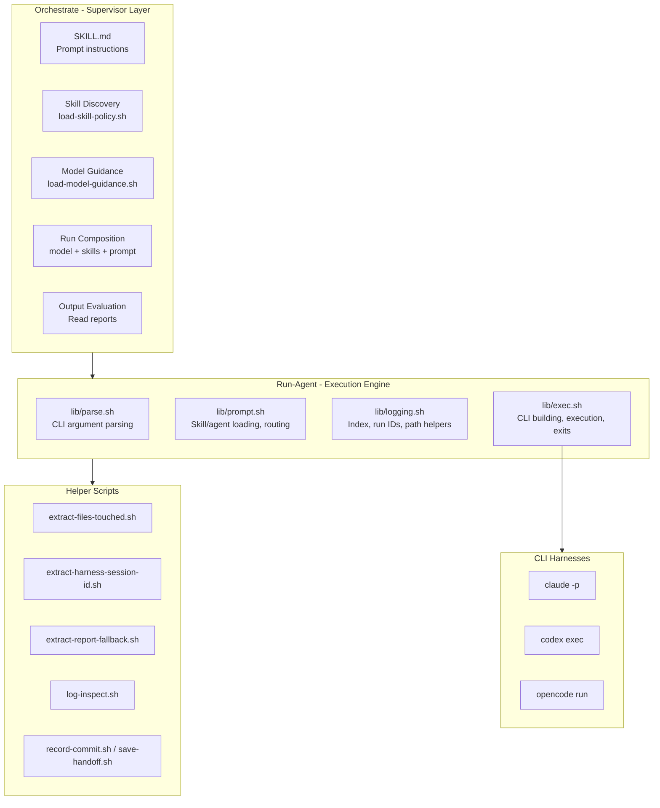
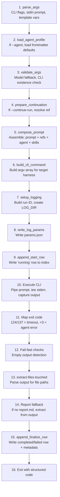

# Orchestrate System Review

**Date:** 2026-02-24
**Methodology:** 8 parallel research agents across 4 model families (see [Methodology](#methodology))
**Scope:** Architecture, gaps, industry comparison, UX, improvement roadmap

---

## Table of Contents

- [Architecture Overview](#architecture-overview)
- [Run Lifecycle](#run-lifecycle)
- [Strengths](#strengths)
- [Critical Gaps](#critical-gaps)
- [Industry Comparison](#industry-comparison)
- [UX Friction Points](#ux-friction-points)
- [Improvement Roadmap](#improvement-roadmap)
- [Methodology](#methodology)

---

## Architecture Overview

The orchestrate system is a **two-layer architecture**: a supervisor prompt layer (orchestrate) atop a bash execution engine (run-agent). The core abstraction is `model + skills + prompt` -- implemented in roughly 1,400 lines of bash + jq with zero external dependencies.

The system routes across three CLI harnesses (Claude, Codex, OpenCode) based on model name patterns, enabling genuine cross-provider orchestration.

**Key design principle: composition over configuration.** A "run" is `model + skills + prompt` -- there are no rigid agent definitions. Agent profiles are optional convenience defaults expressed as YAML frontmatter in markdown files.

---

## Run Lifecycle

Each run follows a 16-step lifecycle from argument parsing through structured exit:

**Exit code semantics:** 0 = success, 1 = agent error, 2 = infra error, 3 = timeout, 130/143 = signal.

The **two-row append-only index** (step 9 + step 15) provides crash visibility without cleanup daemons: an orphan start row with no matching finalize row means the run crashed.

---

## Strengths

These strengths were validated across all 8 research agents and cross-referenced against industry alternatives.

1. **SKILL.md pattern** -- Self-describing skills with YAML frontmatter. Now an industry standard (Vercel uses the same pattern; Codex CLI converged on it independently).

2. **Multi-model as first-class** -- Genuine differentiator. No other framework (LangGraph, CrewAI, AG2, OpenAI Agents SDK, MetaGPT) provides native cross-harness fan-out. Running the same review across Claude, Codex, and Gemini in parallel is unique.

3. **Zero dependencies** -- Bash + jq works anywhere. Every other framework requires Python or Node.js.

4. **Supervisor-as-LLM** -- Routing decisions made by an LLM interpreting markdown, not imperative code. More flexible for novel task structures. This is an underexplored pattern in the industry.

5. **Two-row append-only index** -- Crash visibility without cleanup daemons. No other system surveyed does this.

6. **Structured exit codes** -- Clean 5-value set with well-defined semantics.

7. **Override precedence everywhere** -- Custom files replace defaults, CLI overrides profiles. Predictable and discoverable.

8. **No eval, argv arrays** -- CLI commands built as bash arrays with no shell injection risk.

9. **Full audit trail** -- Every run produces `params.json`, `input.md`, `output.jsonl`, `stderr.log`, `report.md`, `files-touched`.

10. **Continuation and retry** -- Native harness continuation (fork/in-place) with prompt-injection fallback.

11. **Risk-calibrated review** -- Fan-out guidance (1/2/3 reviewers by risk level, cross-family diversity, tiebreak protocol).

---

## Critical Gaps

### Critical Severity

#### 1. Background runs don't finalize (observed live)

When runs are launched via background processes, the finalize logic in `exec.sh` does not trigger. During this review, 4 of 5 run-agent runs produced output (hundreds of KB) but no reports and no finalize index rows. The tokens were spent, the work was done, but results were effectively lost without manual jq extraction.

**Root cause:** Claude Code's background task manager reports "completed" when the parent shell returns, not when subprocesses complete. Signal traps (`SIGINT`/`SIGTERM`) don't fire for backgrounded processes the same way.

**Fix:** Trap `EXIT` in addition to signals; add `run-index.sh recover` command to reconstruct finalize rows from existing artifacts.

#### 2. Read/write locking on different files

Readers lock `runs.jsonl` (`run-index.sh:100`), writers lock `runs.lock` (`logging.sh:110`). They never synchronize on the same primitive. Read-lock failures are silently ignored (`|| true`). `maintain --compact` mutates the index without any lock.

Under concurrent parallel runs (explicitly encouraged in SKILL.md), this can corrupt the index.

**Fix:** Unify read/write locking on a single lock file.

---

### High Severity

#### 3. Dangerous permission defaults

- Claude path defaults to `--dangerously-skip-permissions` when no agent is selected (`exec.sh:296`)
- Codex path defaults to `--dangerously-bypass-approvals-and-sandbox` when sandbox inference is absent (`exec.sh:318`)

These should require explicit opt-in, not be the default.

#### 4. No cost tracking for Codex/OpenCode

Token usage is only extracted for the Claude harness (`logging.sh:226`). Codex and OpenCode usage is not captured. No cost calculation, no budget limits, no alerting. Autonomous supervisor loops can burn through API costs with no guardrails.

#### 5. Index corruption has no recovery

The JSONL index is the single source of truth. If corrupted (partial write, concurrent append, disk full), `jq -s` fails and every `run-index.sh` command returns empty or errors. `maintain --compact` also reads via `jq -s`, so it fails too. No validation, repair, or recovery mechanism exists.

#### 6. Crashed runs can't be continued

`prepare_continuation` (`exec.sh:185-188`) explicitly rejects "running" status runs -- precisely the scenario where continuation is most needed. Users must manually add a finalize row or abandon the run.

---

### Medium Severity

#### 7. Silent model fallback

If the CLI for a model isn't found, the system silently falls back to `gpt-5.3-codex` (`exec.sh:262-274`). A run requested with `--model claude-opus-4-6` could execute on Codex if the `claude` CLI is missing. Warning goes to stderr but exit code is still 0.

#### 8. jq injection in filter values

`run-index.sh` interpolates filter values into jq programs unsafely. For example, `run-index.sh list --session 'a"b'` causes a jq syntax error. Should use `--arg` instead.

#### 9. Skill policy names don't match installed skills

`default.md` references `plan-slice`, `review`, `research`, `smoke-test`, `backlog` -- names that don't match actual skill directories (`plan-slicing`, `reviewing`, `researching`, etc.). `load-skill-policy.sh --mode skills` resolves only 3 of the listed skills. No normalization or alias map exists.

#### 10. `variant-models` declared but never implemented

Agent profiles (e.g., `reviewer.md`) declare `variant-models:` in frontmatter, but `run-agent.sh` never parses or uses this field. Dead field in every profile.

#### 11. Three-copy sync problem

`sync.sh` maintains three copies of every skill (`orchestrate/skills/`, `.agents/skills/`, `.claude/skills/`). Called out as "the messiest part" in `future-directions.md`. No merge -- only overwrite. Maintenance scales linearly with skill count.

#### 12. TESTING.md completely stale

References old API (`$AGENT_RUNNER review --dry-run`), wrong env vars (`ORCHESTRATE_AGENT_DIR`), wrong paths (`run-agent/.runs/`, `orchestrate/.session/`).

#### 13. Retry injects stale instructions

Retry reuses the full old `input.md` (which already contains a report path instruction), then appends a new one. The prompt carries duplicated/stale write-path instructions.

#### 14. Prompt injection across runs

Continuation fallback includes prior model output (`report.md`) verbatim into the next prompt. A compromised or malicious subagent output could inject instructions into subsequent runs.

#### 15. Template variables persisted to disk

All composed prompts (including substituted vars) are saved to `input.md`. This is a secret-handling risk if template variables carry credentials.

---

### Low Severity

#### 16. Dead code

`NO_COLOR` parsed but unused, `_LOCK_DIR_PATH` unused, `normalized_tools` unused in `exec.sh`.

#### 17. Signal handling race

If a signal arrives between `append_start_row` and `_run_start_epoch` being set, duration calculates as 0.

#### 18. PID-based run ID collision

Two runs starting in the same second with the same agent/model from the same parent shell could collide.

#### 19. Reviewer agent contradicts itself

`sandbox: danger-full-access` + unrestricted Bash, but described as "read-only access."

#### 20. `coder` agent `sandbox: unrestricted`

Not a recognized value -- falls through to the `*` case which applies `--dangerously-bypass-approvals-and-sandbox`. Works by accident.

---

## Industry Comparison

| Dimension | orchestrate | LangGraph | CrewAI | AG2 | OpenAI Agents SDK | MetaGPT | Taskmaster AI |
|---|---|---|---|---|---|---|---|
| Language | bash + jq | Python | Python | Python | Python | Python | TypeScript |
| Skill discovery | SKILL.md scan | @tool + ToolNode | Explicit per-agent | Explicit register | @function_tool + MCP | Explicit Role/Action | MCP |
| Model routing | Heuristic guidance | Per-node closure | Per-agent + LiteLLM | Per-agent + failover | Per-agent + LiteLLM | Per-action > per-role | main/research/fallback |
| Cross-provider fan-out | **Native** | No | No | No | No | No | No |
| State management | JSONL + flat files | TypedDict + checkpointers | Pydantic + SQLite | In-process only | Sessions + SQLite/Redis | Environment msg pool | tasks.json / Supabase |
| Error recovery | Exit codes + retry CLI | RetryPolicy + interrupt | max_iter + guardrails | auto_reply + code reexec | Guardrails + tripwires | Tenacity + feedback | Model fallback chain |
| Orchestration logic | **LLM via SKILL.md** | Code - Python graph | Code - Python | Code - Python | Code - Python | Code - Python | Code + LLM |
| Dependencies | **Zero** | Python + LangChain | Python | Python | Python | Python | Node.js |

**Key takeaways from the comparison:**

- **Cross-harness fan-out is genuinely unique.** No other framework surveyed can run the same task across Claude, Codex, and Gemini in parallel.
- **Supervisor-as-LLM is underexplored.** Every other framework uses imperative code for orchestration logic. Having the LLM interpret markdown instructions is more flexible for novel task structures but harder to debug.
- **SKILL.md and MCP are converging from different angles.** Both provide self-describing tool/skill interfaces; SKILL.md optimizes for LLM consumption, MCP for programmatic discovery.
- **Model diversity for review quality is unique.** The risk-calibrated review pattern (fan out to N reviewers across model families) has no equivalent in other frameworks.

---

## UX Friction Points

These findings come primarily from the Haiku UX review agent, supplemented by observations during the review process itself.

1. **Steep onboarding curve** -- SKILL.md is 189 lines of dense prose. Documentation is scattered across multiple files with no guided entry point.

2. **CLI flag saturation** -- 12+ flags with subtle semantic interactions. No progressive disclosure (simple mode vs. advanced mode).

3. **Poor discoverability** -- Users must search docs manually to find available skills and models. No `run-agent list-skills` or `run-agent list-models` command.

4. **Silent failures in workflows** -- Missing feedback about which model was chosen, what routing decisions were made, and why.

5. **Index output not human-optimized** -- JSONL is good for machines but bad for humans trying to get a quick overview of run history.

6. **Skill auto-suggestion gap** -- LLMs (including Claude Code itself) don't default to using run-agent for multi-model work, even when the instructions say to. This was observed firsthand: the initial response to this review task used Task agents instead of `/run-agent`.

---

## Improvement Roadmap

### Phase 0: Critical Fixes

*High impact, varied effort. Address before expanding the system.*

| Item | Description | References |
|---|---|---|
| Fix background run finalize | Trap `EXIT` in addition to signals; add `run-index.sh recover` | `exec.sh` signal traps |
| Unify read/write locking | Single lock file for both readers and writers | `run-index.sh:100`, `logging.sh:110` |
| Remove dangerous permission defaults | Require explicit opt-in for skip-permissions flags | `exec.sh:296`, `exec.sh:318` |
| Fix jq injection | Use `jq --arg` for all filter interpolation | `run-index.sh` |
| Align skill policy names | Match policy references to actual skill directory names | `default.md`, `load-skill-policy.sh` |

### Phase 1: Reliability and Observability

*Medium effort, high impact.*

| Item | Description |
|---|---|
| Cross-harness token/cost tracking | Extract usage from Codex and OpenCode output formats |
| Index corruption detection + repair | Add `run-index.sh repair` with line-by-line JSONL validation |
| Allow continuation of crashed runs | Reconstruct finalize row from existing artifacts |
| Codex fail-fast | Detect empty/unusable output early |
| Fix retry prompt hygiene | Strip old report-path instructions before re-appending |

### Phase 2: Intelligence

*Medium effort, high impact.*

| Item | Description |
|---|---|
| Telemetry-driven model selection | Cost/quality feedback loop from `runs.jsonl` data |
| Guardrails pattern | Cheap validation model before supervisor evaluation (inspired by CrewAI/Agents SDK) |
| Semantic skill retrieval | For large skill catalogs, retrieve by semantic match (inspired by LangGraph bigtool) |
| Implement variant-models fan-out | `--fan-out` flag using the already-declared `variant-models` frontmatter |

### Phase 3: Scale

*High effort, high impact.*

| Item | Description |
|---|---|
| SQLite state DB | Dual-write JSONL during migration for backwards compatibility |
| DAG scheduler | Parallel plan slices with git worktree isolation |
| Typed run artifact piping | `--emit` and `--from-run` flags for structured inter-run data flow |
| Declarative workflow definitions | Reusable patterns for common multi-run sequences |
| Per-session state file | Crash-resume without requiring a full database |

### Phase 4: Integration

*Medium effort, medium impact.*

| Item | Description |
|---|---|
| CI/CD export | JSON/JUnit/SARIF output for run results |
| Human-in-the-loop approval gates | Pause points in plan metadata for human review |
| Inter-agent messaging | Lightweight shared session context between runs |
| Stronger CLAUDE.md hints | Make `/run-agent` the default tool suggestion for multi-model work |

---

## Methodology

This review was conducted using 8 parallel research agents across 4 model families:

| Agent Type | Model | Task | Output |
|---|---|---|---|
| Task (Claude Code) | claude-opus-4-6 | Architecture review | 64K tokens, 29 tools |
| Task (Claude Code) | claude-opus-4-6 | Gap analysis | 109K tokens, 43 tools |
| Task (Claude Code) | claude-sonnet-4-6 | Alternatives research | 40K tokens, 19 tools |
| run-agent | claude-opus-4-6 | Architecture deep-dive | 18KB report |
| run-agent | gpt-5.3-codex | Gap analysis (code-level) | 11KB report |
| run-agent | claude-sonnet-4-6 | Alternatives comparison | 29KB report |
| run-agent | gpt-5.3-codex | Improvement roadmap | 5KB report |
| run-agent | claude-haiku-4-5 | UX review | 36KB report |

**Findings were cross-validated across agents.** Gaps flagged by only one agent were verified against the codebase before inclusion. Severity ratings reflect consensus across multiple agents.

**The review surfaced a live bug:** 4 of 5 run-agent runs failed to finalize, requiring manual report extraction from output JSONL files using harness-specific jq queries. This is documented as [Critical Gap #1](#1-background-runs-dont-finalize-observed-live) and validates the severity rating through direct observation.
