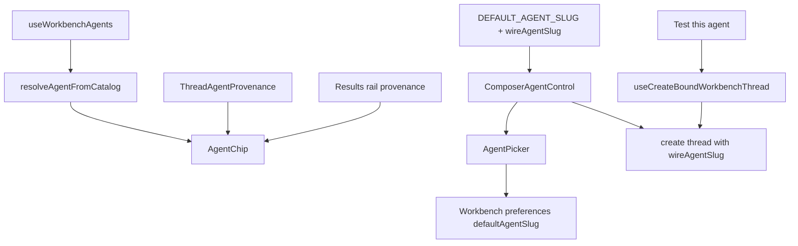

# features/agents — Agent identity, selection, and binding UI

This module owns the client-side agent identity primitive used by chat,
workbench provenance, and the Library. It keeps the capability-freeze rule out
of individual call sites: a picker is a control only when the next send can
change which agent handles that send.

## Contracts

### Synthetic default agent

`DEFAULT_AGENT_SLUG = "general"` is a client-side label for the platform-default
experience. It is not a server row and must not cross the wire.

- UI label: **General**.
- Server representation: no current-agent binding on the thread/create request.
- Choke point: `wireAgentSlug(slug)` returns `undefined` for `general`, `null`,
  and `undefined`; every thread-create write site must use it.
- Upgrade path: if builtin agents are seeded as real package-domain definitions,
  `general` becomes a real catalog row and this filter is removed.

Sending `general` to the server attempts to bind an agent definition that does
not exist. That is a bug in the caller, not a valid fallback.

### Capability-freeze UI rule

Thread capabilities are frozen at the first turn attempt by the runtime's
composed prompt bake. The frontend mirrors that constraint in where it renders
controls:

| Surface | Behavior |
|---|---|
| New/Home composer or deferred workbench new-chat | Interactive picker; selection changes the agent bound on first send. |
| Existing server-backed thread, zero turns | Interactive picker; rebinding is allowed until first send. |
| Existing server-backed thread after first send | Read-only chip; selection would not change the frozen prompt, so it is not a control. |
| Idle existing thread with fork affordance | Picker opens only as **Continue in a new thread with…**; it creates a fresh thread. |
| Thread header / results provenance | Inert span; tooltip uses positive provenance: **Started with X**. |

Do not render a picker just because a chip appears. A control must change the
next send, or it teaches the user that capability controls are unreliable.

### Mark vocabulary

`AgentChip` uses `gradient-mark` for agent initials. The olive
`gradient-avatar` remains human-only (AccountMenu/avatar). This visual split is
provenance vocabulary: green mark = instrument/agent, olive avatar = person.

## Architecture

Key files:

| File | Role |
|---|---|
| `constants.ts` | Synthetic General/default-agent wire filter. |
| `AgentChip.tsx` | Shared mark/name/source-badge primitive; variants: `interactive`, `readonly`, `compact`, `card`. |
| `AgentPicker.tsx` | Popover catalog grouped into installed/user and builtin sources; default-agent action and Library link. |
| `ComposerAgentControl.tsx` | Applies the capability-freeze rule for composer chips and fork framing. |
| `ThreadAgentProvenance.tsx` | Inert compact provenance chip with “Started with …” tooltip. |
| `use-create-bound-thread.ts` | Fresh agent-bound thread creation for fork and Test-this-agent. |

## Patterns

- Set defaults through `WorkbenchPreferences.defaultAgentSlug`; validate on the
  server against selectable catalog rows.
- Create a fresh thread for “Test this agent” and fork flows. Reusing a thread
  silently tests the old bake.
- Route Library navigation through the screen owner (`?screen=library`); docked
  chat paths use `onSelectDockThread` and must not steal screen ownership.
