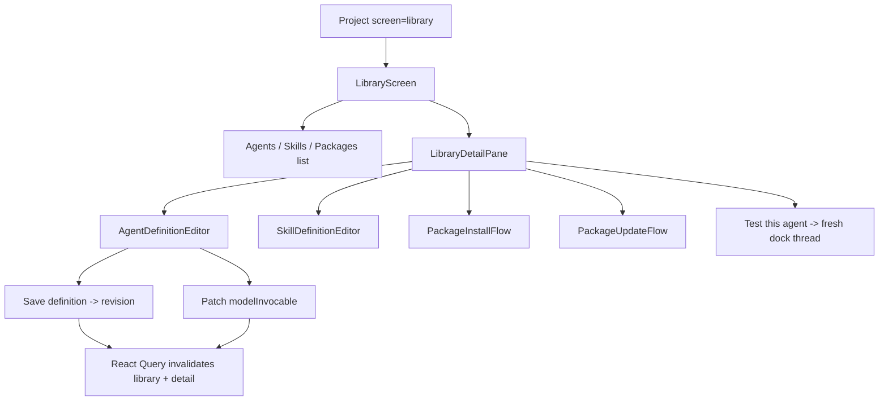

# features/library — Project capability inventory and authoring surface

The Library is the project's first-class capability screen. It lists the
agents, skills, and installed packages a project owns, and provides the
structured editor over Mars definition files. It is not a settings dialog:
capabilities are a workspace resource parallel to Context.

## Contracts

### Library inventory vs picker catalog

The Library uses `GET /api/projects/:projectId/library`. That inventory is
broader than the composer picker catalog:

| Surface | Shows |
|---|---|
| Picker catalog | Enabled primary agents selectable for new threads. |
| Library inventory | All agents, all skills, installed packages, disabled/retired definitions, and unlinked skills. |

The Library is the canonical place to reach skills that are not linked to any
agent. Agent skill rows and package contents are secondary routes into the same
records.

### Definition content vs operational link state

The editor preserves the package-domain split:

- **Versioned definition content:** agent/skill body, metadata, agent config, and
  skill ordering. Saving these fields appends an immutable revision.
- **Operational link override:** `modelInvocable` on an existing agent-skill
  link. The toggle applies immediately and does not mark the definition edited.

The dirty guard follows the same line: body/meta/config and skill order make the
draft dirty; `modelInvocable` does not.

### Revision spine

Every explicit save creates a revision. Restoring from History or Restore
original also creates a new revision; history is never rewritten. The UI mirrors
that with a quiet **History** panel and shared **Restore original** affordance.

### Test loop

**Test this agent** creates a fresh thread with the selected agent and points the
docked chat at it. It must not reuse the current dock thread because thread
capabilities freeze at first send.

### Package install/update/export

The in-pane package flow uses the packages-domain truth directly:

- Preview mirrors apply: collisions are **keep existing** and are skipped on
  apply, not overwritten.
- Retired definitions still count as existing slugs; preview must not promise
  silent resurrection.
- Update reconciliation separates pristine items (`willUpdate`) from edited
  items (`willKeep`) and upstream-pruned history (`willRetire`).
- Export downloads the current as-edited package content as Mars files in a zip;
  publishing is deferred.

## Architecture

Key files:

| File | Role |
|---|---|
| `LibraryScreen.tsx` | Master-detail screen and unsaved-selection guard. |
| `LibraryPaneController.tsx` | Connects the screen to project routing and dock thread selection. |
| `editor/*` | Agent/skill definition editors, history, restore, save bar, dirty state. |
| `install/*` | In-pane preview/apply, update reconciliation, and package export UI. |
| `client/api/project-definitions-api.ts` | Definition CRUD/revision HTTP client. |
| `client/query/useAgentDefinition.ts` / `useSkillDefinition.ts` | Query invalidation and optimistic inventory badge updates. |

## Don't

- Don't expose raw YAML editing in this surface. Unknown frontmatter keys round
  trip through metadata, but the user edits structured fields and markdown body.
- Don't treat `modelInvocable` as definition content or include it in dirty
  detection.
- Don't move Library into settings. Settings owns behavior knobs; Library owns
  capabilities.
- Don't test an edited agent in an existing thread; create a fresh thread so the
  new definition can be baked.
