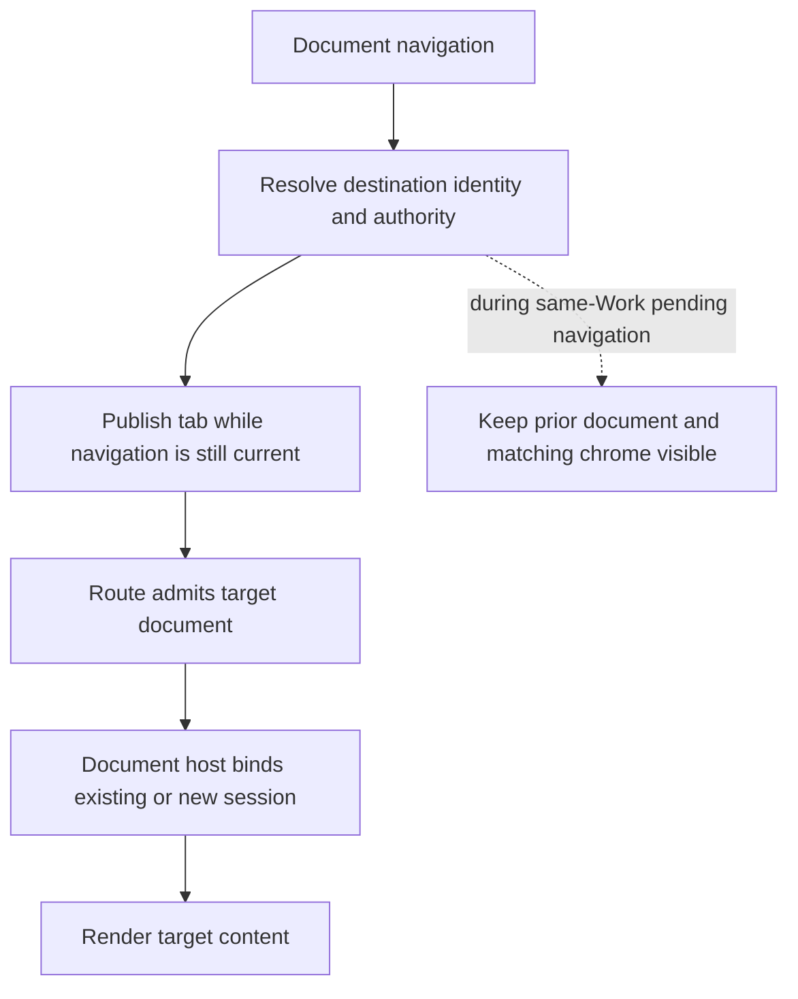

# Editor document lifecycle

Document navigation has separate address, tab-publication, and content owners.
A pending address is not a reason to hide an already usable editor. Retention
is presentation continuity, not authorization for the requested document.

## Entry paths

- **Editor navigation item:** once project desk validation is live, choose the
  selected eligible open tab or a remembered identity that is still open. Use
  its current metadata, not its historical path. Navigate directly to it. Before
  desk validation finishes, navigate to empty Editor without mutating persisted
  selection. No later mount effect restores a document or opens the first file.
- **Bare `/editor`:** explicitly empty on direct entry, reload and Back/Forward.
  Closing every tab and switching screens cannot reopen a closed identity.

- **Readable URL, reload, Back/Forward:** `ReadableProjectRoute` resolves the
  project and document address. `ProjectAddressDocument` uses the authorized
  result's catalog entry to publish tab metadata. It does not invoke a second
  live opener. While a lookup is refetching, cached metadata cannot publish
  an admission or repair the URL.
- **Stable document ID, such as a wikilink or search result:**
  `ProjectDocumentNavigationAdapter` resolves through the live opener, awaits
  tab publication, then navigates to the resolved address. A background open
  publishes the tab without navigating. The URL layer still does not repeat
  live admission; session binding belongs to the host.
- **Existing local Untitled:** remains on its local-document route/session
  path. It is not resolved as a published server document by this lifecycle.
  Creating or applying a document is a separate publication lifecycle.

## Ordered handoff

1. Capture the navigation's ownership ticket or latest-attempt predicate.
2. Resolve the requested document and its scope. A path is a reusable address;
   the returned document ID is identity.
3. Await `openTab`. `DeviceContextDeskLedger` checks the ownership predicate
   inside its serialized operation/lock, immediately before reducing and
   persisting the desk change. A superseded request must not leave a stale tab.
4. Recheck ownership before completing admission or navigation. The tab must
   exist before the route attempts to select it.
5. If the resolved path is canonical already, settle admission. If it is an
   alias, keep admission pending through canonical URL replacement. A rejected
   replacement carries its own ticket; only a still-current failure may show
   an error. A newer click must not inherit the previous click's error.
6. The document host owns content startup and session binding. Finishing
   address admission is not a promise that a cold document's content is ready.

## What stays visible

For a same-project, same-Work Editor transition with prior usable content,
`ProjectRouteBoundary` leaves that content visible and non-inert. After 200 ms
it shows a small, pointer-transparent progress indicator. Fast transitions
therefore show no loading cover or spinner flash. Desktop surfaces remain
mounted; returning to a warm document can reuse its editor and session.

Phone retention keeps the old document's path, identity, and breadcrumb
presentation together. `HydratedReviewScopes` supplies that same identity to
both recovery and the phone document host. Navigation commands remain current,
so clicking the retained Files breadcrumb can supersede the pending open.
Retention does not change the phone viewer's existing read-only behavior.

Retention ends when the new address is admitted or the transition is no longer
eligible. Cold entry has no old editor to show and can still display loading.
Different-project entry, Work recovery, unavailable destinations, and errors do
not expose retained content as if it were the requested destination. A cold
content host may also need its own startup UI after address resolution.

## Session and synchronization boundary

This route lifecycle uses the existing session registry and Yjs/IndexedDB
persistence. It adds neither a second content cache nor a sync-based read-only
gate. Warm navigation can reuse a live session and connection. A new session
has its own local-replay and transport-startup lifecycle; address admission
must not be confused with local persistence readiness or server reconciliation.
See the [editor core contract](../../../core/editor/.context/CONTEXT.md).
Transport remains room-scoped; multiplexing is outside this routing contract.

## Source and checks

- [Address admission](../routing/ProjectAddressDocument.tsx) and its sibling tests.
- [Navigation ownership](../routing/project-navigation.ts) and its sibling tests.
- [Stable-ID navigation](../context/open-project-document.ts).
- [Loading boundary](../routing/ProjectRouteBoundary.tsx) and its sibling tests.
- [Shell and phone retention](../ProjectView.tsx), tested in `ProjectView.retention.test.tsx`.
- [Durable desk publication](../../../client/stores/context-tabs-store/context-desk-storage.ts).
