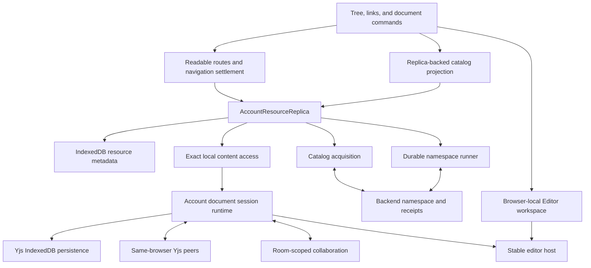

# Project document resource lifecycle

Project documents are local-first resources synchronized with the existing backend. One account-scoped owner coordinates durable metadata, namespace work, exact Yjs content, and server catalog checkpoints. Editor tabs remain browser-tab-local views; neither a tab nor a URL owns document durability.

## Ownership map

Three facts must stay separate:

1. A durable resource exists locally.
2. A browser tab has an Editor view open.
3. The backend has acknowledged namespace metadata and admitted synchronization.

| Owner | Responsibility |
| --- | --- |
| [AccountFeatureLifetime](../context/account-feature-lifetime.ts) | Creates one account document runtime, resource replica, availability coordinator, removal coordinator, and opener. Storage invalidation closes the complete account lifetime. |
| [AccountResourceReplica](../../../core/resources/account-resource-replica.ts) | Owns reservation, exact local opening, catalog acquisition, durable namespace replay, remint, terminal transitions, and projection subscriptions. |
| [Resource replica package](../../../../../../packages/resource-replica/src/index.ts) | Pure resource, catalog, intent, deletion, adoption, and projection policy. It imports no React, browser storage, HTTP, or Yjs session objects. |
| [IndexedDB metadata adapter](../../../core/resources/indexeddb-resource-metadata.ts) | Stores account-global resource descriptors, project-qualified intentions, and project-qualified catalog checkpoints with revision CAS. One account-wide reactive read feeds project projections. |
| [Editor workspace reducer](../../../client/stores/context-tabs-store/editor-workspace-state.ts) | Owns synchronous tab membership, selection, order, stable member identity, and account-scoped `sessionStorage` restoration. |
| [Document session runtime](../../../core/editor/.context/CONTEXT.md) | Owns Y.Doc instances, exact persistence incarnations, local replay, peer exchange, registry adoption, transport, and shutdown fences. |
| [Backend receipts](../../../../../server/server/domains/context/context/context-operation-receipts.ts) | Make move and delete retryable by immutable operation ID and request bytes. |

## New, write, and acknowledge

1. New atomically reserves an account-global resource handle, Document ID, exact content database, provisional Unfiled location, and ineligible create intention.
2. Content initialization completes before the editor receives the handle. The workspace opens the resource synchronously and the stable session boundary binds its Y.Doc.
3. First content marks creation eligible. Explicit filing also marks an empty resource eligible and appends the desired location.
4. The namespace runner persists immutable request bytes before HTTP, records the outcome, then applies it through metadata CAS. Reload, response loss, and another browser context resume the same recorded work.
5. Acknowledgement adopts the same Y.Doc into authorized registry transport. Metadata, tab labels, the sidebar row, and the readable URL reconcile without replacing the editor ancestry.
6. If creation collides with a foreign server Document ID, remint changes the resource's current Document ID while retaining its handle, persistence database, Y.Doc, view member, and obsolete-ID alias.

Closing the view never abandons the resource or cancels synchronization. Explicit Delete is the writer command that changes resource lifecycle.

## Catalogs, addresses, and opening

`ResourceCatalogAcquisition` is the only catalog cursor and installation owner. React Query triggers acquisition and may cache the returned view, but the durable checkpoint and resource overlay remain authoritative. A received catalog commit and its derived resource observations commit atomically; resource revision fences prevent a late response from overwriting newer local intent.

Trees, reference browsing, wikilink resolution, restored tabs, readable addresses, and stable-ID navigation consume the same projection. A readable path is a locator; Document ID and stable resource handle are identity. Current identity wins over an obsolete remint alias when both appear in the catalog.

Known exact content opens locally before remote admission. The returned admission binds another lease to the same local session after route and workspace settlement. Remote ownership reconciliation proceeds separately and waits for an adoption-eligible editor binding; navigation and background probe leases never acknowledge a session that would be released immediately. An unacquired catalog resource uses the server opener, and a successful synchronized session can then establish exact local content for later opens. Missing or uninitialized IndexedDB is never treated as an editable blank cache.

## Rename, move, and delete

File rename, filing, and the identity bar issue one durable resource-location command. The desired projection replaces the old server row immediately; an eventual receipt or catalog refresh converges canonical metadata without remounting content. Folder operations remain on the direct context API because they have no document resource identity.

Delete appends durable intent and hides the exact resource optimistically. A rejected attempt restores it with repair state. A terminal server generation closes matching tabs and session access through the existing availability/removal coordinator. Path reuse resolves the new Document ID rather than resurrecting stale content. Server-backed storage cleanup requires an authorized terminal transition. Explicit deletion of a never-submitted local resource settles locally and records an exact-database cleanup obligation without a server receipt. Catalog disappearance alone is not deletion evidence.

## Tabs, history, and loading

Editor membership is isolated per browser tab/window in `sessionStorage`; content and resource metadata are shared at account scope. Open, selection, close, Back/Forward, and URL changes settle through the accepted navigation operation. Closing the last tab stays empty across screen changes and reload. A late acknowledgement cannot reopen a closed member.

The application shell and pane geometry render immediately. Eligible warm transitions retain the prior usable editor. Cold waits keep a blank pane for about 500 ms and then show a content-shaped skeleton, with no spinner, loading text, or artificial minimum duration. Pending address state never keys or remounts the editor.

## Synchronization and shutdown

Local Yjs persistence and same-browser peers make exact cached content usable independently of backend latency. Backend authorization and room transport remain separate capabilities; local data does not grant permission to upload or overwrite server state. Metadata acknowledgement also does not prove Yjs synchronization.

Account shutdown fences new work, drains namespace/catalog operations, content participants, registry sessions, local peers, and persistence providers, then closes metadata. IndexedDB `versionchange` invalidates the entire account feature lifetime rather than leaving mixed-version session owners alive.

The repository has no production users or legacy data. The old Untitled lineage, reconciler, pending-tree union, and incompatible dormant metadata schema are deleted rather than migrated or kept as compatibility writers.

## Deliberate limits

Cold offline application boot, generalized durable folder commands, Scratch/Uploads Editor viewers, socket multiplexing, and multi-pane Editor layout are outside this lifecycle. Scratch and Uploads remain valid chat/reference/tool resources. See [tracked follow-ups](../context/.context/TODO.md) for separate product work.

Cold boot and folder commands are tracked with the [resource adapter follow-ups](../../../core/resources/.context/FUTURE), multi-pane layout with the [project shell follow-ups](FUTURE), and socket multiplexing with the [transport follow-ups](../../../core/transport/.context/FUTURE).
