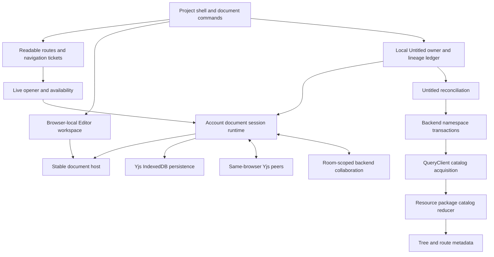

# Current project document architecture

This describes the implemented project document system on this branch, including its remaining split ownership. It covers Editor navigation, browser persistence and backend synchronization, not unrelated billing or inference internals. The resource-replica package currently owns a pure catalog reducer, not a durable resource journal. Do not implement against the target redesign as though it already exists.

## Ownership map

There are three different facts: a resource exists, a view is open, and the server has acknowledged an operation. The current system separates some of these boundaries but still has separate local-Untitled and server-catalog owners.

| Owner | Current responsibility |
| --- | --- |
| [AccountFeatureLifetime](../context/account-feature-lifetime.ts) | Composes availability, removal, the Untitled owner, live opener and account document runtime; participates in retryable shutdown. |
| [Editor workspace reducer](../../../client/stores/context-tabs-store/editor-workspace-state.ts) | Synchronous tab membership, selection and order; account-scoped sessionStorage restoration is independent per browser tab. Layout persistence is not content persistence. |
| [LocalUntitledOwner](../context/local-untitled-owner.ts) and [lineage ledger](../context/local-untitled-lineage-ledger.ts) | Local document identity, creation/adoption lineage and recoverable pending writing. This owner still has exclusive local access constraints. |
| [Live opener](../context/open-project-document.ts) | Resolves server identity/availability and obtains admission through the existing registry/adoption boundary. Cached acknowledged opening still depends on remote admission. |
| [Editor runtime](../../../core/editor/.context/CONTEXT.md) | Owns live Y.Doc sessions, exact persistence incarnations, authority fences, adoption and transport lifecycle. |
| [Local peers](../../../core/editor/local-document-peers.ts) | Exchanges state vectors/updates between matching local content incarnations; persisted catch-up repairs missed local broadcasts. This is not backend acknowledgement. |
| [Catalog query](../../../client/query/useContextCatalog.ts) and [resource reducer](../../../../../../packages/resource-replica/src/catalog.ts) | Query layer acquires/installs server catalog state; package applies catalog projection decisions. No persistent general resource owner yet. |
| [Backend operation receipts](../../../../../server/server/domains/context/context/context-operation-receipts.ts) | Wrap namespace operations with immutable move/delete outcomes. Frontend durable retry ownership is still unfinished. |

## New, write, acknowledge

1. New reserves local Untitled identity through the existing local owner. A local history pointer at `/editor` identifies the local document; this URL alone is not an error.
2. The document host binds local content through the session runtime and existing Yjs persistence.
3. First content starts project-owned Unfiled creation. Reconciliation coordinates acknowledgement, aliases and queued location changes.
4. Same-ID acknowledgement updates metadata and the canonical address without changing the editor's component ancestry. The tested path retains the mounted editor, focus and caret. Undo continuity still needs its explicit end-to-end QA check.
5. Closed pending writing can appear in the Unfiled sidebar independently of open tabs. The pending-local tree integration is still separate from the server catalog and must eventually be replaced by one resource projection.

A successful local edit does not mean a server create or Yjs synchronization completed. The lineage/session contract retains recovery obligations across those stages. See [local writing ownership](../context/.context/CONTEXT.md).

## Open and switch

Readable URLs resolve address/authority before publishing admitted metadata. Stable-ID entry points use the live opener and navigation adapter. The host binds the content session; resolving an address is not proof that local content replay finished.

Eligible same-project/Work transitions retain the previous usable editor and its actual identity. Acknowledgement does not replace the host. Warm navigation can reuse sessions; cold acknowledged-document opening is not fully local-first yet. No second content cache has been introduced.

Editor entry chooses an eligible open document. Explicit empty entry and settled Close-all do not invoke the old first-file/default-open ladder. The exact entry branches are documented in [Editor document lifecycle](editor-document-lifecycle.md).

## Close and restore

Closing a tab changes a browser-local view, not server document existence. Live workspace transitions are synchronous; sessionStorage snapshots restore the browser tab's layout. Failed layout persistence is reported without reverting the live transition or freezing commands. Another browser tab's layout is independent even when document content is shared.

Navigation and workspace settlement are not yet one atomic accepted operation. Closing the final tab and reloading in the same turn can retain an old address and reopen it. The remaining plan must resolve native history ordering, cancellation and supersession rather than adding another restoration fallback.

## Content synchronization and shutdown

Yjs content lives in the session's Y.Doc and its exact IndexedDB persistence incarnation. Same-browser peer transport exchanges updates without server transport and catches up from persisted updates on wake. It does not make all local Untitled resources concurrently admissible: the feature owner still needs replacement.

Server transport remains room-scoped. This work does not multiplex sockets or replace Yjs merge semantics. Metadata namespace transactions and Yjs content synchronization have separate acknowledgements.

Account/authority shutdown fences new work and drains attached and detached local resources through the same runtime. Failed cleanup retains the required holds and is retryable. This prevents premature release; full legacy-to-resource-journal migration is still a separate unverified obligation.

## Backend namespace and receipts

The backend remains authoritative for permissions, canonical names/paths, namespace transactions and terminal document state. Move/delete attempts carry an operation ID and immutable payload. Matching retries recover a stored outcome; the same ID with another payload rejects. Receipt lookup does not depend on a source path that a successful move/delete already removed. Infrastructure failures are not recorded as terminal business outcomes.

These receipts make safe frontend replay possible. They do not provide the missing browser-durable intent queue. A path disappearing from a scoped catalog is also not sufficient evidence to delete local content.

## Current limits and planned work

The foundation preserves editor continuity, independent layout, drain safety, peer exchange and operation outcomes. User testing reports many original symptoms gone; that is useful feedback, not proof of every crash/recovery case.

Still unfinished: a durable general resource owner/journal, proven cached-content readiness, concurrent local admission, one catalog/tree projection, frontend durable namespace replay, accepted workspace/history settlement and migration/deletion of old owners.

Address-loading presentation keeps the shell immediately, retains eligible prior content, and otherwise shows a blank pane followed by a skeleton after approximately 500ms. Only the fallback resets with destination changes; the editor stays mounted. There is no spinner, loading copy or minimum fallback duration. Content-session startup remains a separate wait whose presentation still needs the same policy; see [tracked follow-ups](TODO).
