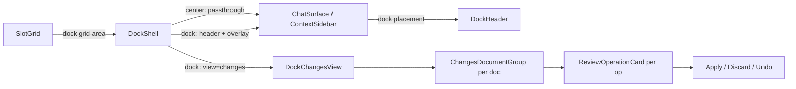

# features/project/dock — Contracts, architecture, rationale

Reference depth for the tabbed dock container and work-scoped Changes view.
Read [`AGENTS.md`](../AGENTS.md) first.

## Contracts

### Surface-parking invariant

`DockShell` guarantees its occupant's native body (`children`) keeps the same
React tree depth in both `center` and `dock` placements. In `center`, the shell
is a bare passthrough — the occupant renders directly inside the grid cell. In
`dock`, the shell wraps with `DockHeader` and the Changes overlay, but
`children` still renders at the same nesting level (inside the same `relative
flex min-h-0 flex-1` div). When the occupant moves between center↔dock in the
grid, React's reconciliation sees the same component at the same position.

The primary body stays **mounted** when the Changes view is active. It is hidden
via `opacity-0 pointer-events-none` + the `inert` attribute. This means:

- Chat state (WebSocket, scroll, composer draft) survives a view switch.
- Document sessions survive a view switch.
- The body does not reflow — Changes overlays it with `absolute inset-0`.

**Violation consequence:** unmounting `children` when Changes is active would
lose chat state, force reconnection on return, and break the surface-parking
contract the project shell relies on.

### `resolveDockView` pure fallback

`resolveDockView(screen: ScreenKey, stored: DockView | undefined): ResolvedDockView`
is a pure function:

- If `stored` is a valid view for the screen's set, it is the active view.
- Otherwise, the screen's `default` is used (the occupant's native view).
- The screen's view set and primary view are always returned alongside.

This is deliberately separated from the React hook (`useDockView`) so the
fallback logic is unit-testable. The hook only adds the Zustand binding.

### Dock view store

`useDockViewStore` is a Zustand store keyed by `ScreenKey`:

- **Session-only, no `persist`.** A fresh reload starts from each screen's
  default. A stale tab choice across reloads is worse than a fresh start.
- **No placement data.** Width, collapse, and grid placement are owned by the
  surface-prefs store (`layout/surface-prefs-store.ts`), not here.
- **Explicit choice only.** The store only records writer-initiated tab switches;
  the default is not written to the store.

### Slot material contract

The dock grid slot (`layout/desktop-layout.ts`) owns all background chrome:
`bg-sidebar` plus the `border-l` seam against the center pane. Dock components (header,
Changes view, occupant body) must not paint a hardcoded background — the slot
paints the material. Transparent/surface-subtle fills are correct, and tonal
steps may recess (`bg-sidebar-accent`) and re-surface the slot's own tone
(`bg-sidebar`): `DockHeader` is a recessed strip band whose active view tab
surfaces `bg-sidebar`, mirroring `ContextTabBar`'s band→canvas step.
`bg-background` or `bg-card` are bugs (the dock is a sidebar).

### Changes view: controller seam

`DockChangesView` reads from `DraftReviewProvider` (mounted at the project shell
level). It does not own a review session — it consumes the shared controller and
drives these actions:

- `controller.focusReviewOperation(operationId)` — click-to-scroll on cards
- `controller.acceptOperation(operationId, model)` — per-card Apply
- `controller.discardOperation(operationId)` — per-card Discard
- `controller.undoAcceptOperation()` — per-card Undo (write-id from message)
- `controller.isDisposing` — global disposition lock

The review session owner is `useDraftReviewController` in the chat feature; the
dock only renders review state and dispatches actions.

### Claim-based inline-review editor registration

The draft review controller (`useDraftReviewController`) holds the active
review editor in a claim-based ref (`inlineRuntimeRef`): the review editor
registers on mount, and release is a **no-op unless the caller still holds
the claim** — on a review document switch the new editor may register before
the old one's effect cleanup runs, and that stale cleanup must not clear the
fresh claim. The dock's `focusReviewOperation` reads the editor from this ref
to highlight and scroll manuscript spans; warm hidden editors never stomp the
reference because only the active review editor claims it.

See [`features/chat/useDraftReviewController.ts`](../../../chat/useDraftReviewController.ts) and
[`core/editor/.context/CONTEXT.md`](../../../../core/editor/.context/CONTEXT.md).

## Architecture



`DockShell` is the single component both dock occupants (`ChatSurface`,
`ContextSidebar`) render through. There is no "ChatDock" or "ContextDock"
wrapper — the same shell handles both, with the screen determining the view set.

## Traps

### tailwind-merge cannot dedupe custom color classes

`cn()` (which uses `tailwind-merge`) merges Tailwind utility classes by
understanding their category — `border-red-500` and `border-blue-500` conflict
as border-color utilities, and the later one wins. But `border-border-subtle` is
a custom CSS variable class (`border-[color:var(--color-border-subtle)]`) that
tailwind-merge does not recognize as a border-color utility; it treats it as an
arbitrary value with no dedup category.

This means stacking `border-border-subtle` with `border-primary` in a `cn()`
call would leave **both** classes in the output, with CSS specificity
determining the winner — unpredictable. The fix: use **one border-color class
per state branch**, not a base + override. In `ReviewOperationCard`, the active
and inactive states each supply exactly one border class:

```tsx
active
  ? "border-primary"
  : "border-border-subtle hover:border-border hover:bg-sidebar-accent/30"
```

Never:

```tsx
// BROKEN: tailwind-merge leaves both, CSS cascade wins unpredictably
"border-border-subtle", active && "border-primary"
```

This trap applies anywhere `border-subtle` (or any custom color token class) is
combined with a standard Tailwind border-color class in a `cn()` call.

### Operation card text is DOM-only

The card body shows the intended change text extracted from preview hunks and
operation excerpts. This text is a **display artifact**, not editable content —
it is plain `<span>` elements, never TipTap nodes. The card's click dispatches
`focusReviewOperation` to scroll the manuscript; the card never manipulates
editor state itself.

Adding click-to-edit or inline editing in the card body would require resolving
the same Yjs anchors the inline-review extension uses, which is not practical
for a non-editor component. Keep card interactions as focus + verbs.

### Per-card Discard needs a real journal

The per-card Discard path reconstructs an inverse Yjs update from the draft
journal. Synthetic or seeded drafts (QA fixtures created via direct DB inserts
without real draft rows) have no journal or incomplete journals — the
reconstruction fails silently or produces a no-op update. QA/probe drafts must
come from real chat flows where the agent wrote to a draft.

This is the same trap that has surfaced 4× across the draft-undo and
dock-tabs arcs. See [KB: Draft Review Lifecycle](https://github.com/haowjy/meridian-flow-docs/blob/main/kb/decisions/draft-review-lifecycle.md).

## Rationale

### Primary body hidden, not unmounted

Unmounting would lose chat state. `display: none` would cause a layout reflow
(tab order, scroll position). The `opacity-0 + inert` approach keeps the DOM
stable and the browser from wasting layout work on hidden content.

### Session-only view store

Persisting the view choice means a writer who opens the app in a fresh session
gets a stale tab. The default (occupant's native view) is the right starting
point every time. The writer's explicit choice is remembered within a session
so switching screens and coming back restores it.

### Combined region unit = card unit

The dock renders whatever operation units the server hands it. Combining
dependent regions into one unit happens upstream (server/model). The card never
merges or splits operations — one server operation = one card = one accept/discard
granularity. This is the same combined-unit model the draft-simplify lane depends
on: see the cross-lane note at
`work/draft-simplify/notes/heads-up-dock-tabs.md`.
