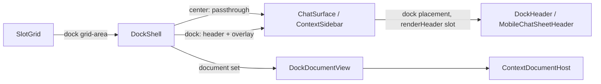

# features/project/dock — Contracts, architecture, rationale

Reference depth for the dock view container. Read [`AGENTS.md`](../AGENTS.md) first.

## Contracts

### Surface-parking invariant

`DockShell` guarantees its occupant's native body (`children`) keeps the same
React tree depth in both `center` and `dock` placements. In `center`, the shell
is a bare passthrough — the occupant renders directly inside the grid cell. In
`dock`, the shell wraps with the caller's header (via the `renderHeader` slot)
and, on Work or Chat, the document overlay, but `children` still renders at the
same nesting level (inside the same `relative flex min-h-0 flex-1` div). When the
occupant moves between center↔dock in the grid, React's reconciliation sees the
same component at the same position.

The primary body stays **mounted** while the file view shows. It is hidden via
`opacity-0 pointer-events-none` + the `inert` attribute. This means:

- Chat state (WebSocket, scroll, composer draft) survives a view switch.
- Document sessions survive a view switch.
- The body does not reflow — the file view overlays it with `absolute inset-0`.

**Violation consequence:** unmounting `children` while the file shows would
lose chat state, force reconnection on return, and break the surface-parking
contract the project shell relies on.

### `resolveDockView` pure function

`resolveDockView(screen: ScreenKey, stored: DockView | undefined)` is a pure function:

- If `stored` is a valid view for the screen's set, it is the active view.
- Otherwise, the screen's `default` is used (the occupant's native view).
- The screen's view set and primary view are always returned alongside.

This is deliberately separated from the React hook (`useDockView`) so it is
unit-testable. The hook only adds the Zustand binding.

### Dock document slot

`occupant` in the same browser-tab-local store is the one document the dock shows on Work or
Chat: `{ projectId, screen, tab }`. `useDockView(screen, projectId)` returns
it only for its own screen and project.
While it is set, `DockShell` covers the occupant (mounted, inert) with
`DockDocumentView` and `DockHeader` swaps the view switch for a Close document button then the
title chip on the left, and Open in Editor (an expand button) then the collapse toggle on the right. Opening a second one
replaces the first. `setDockView` on its screen clears it, so revealing
the chat returns to the chat. Closing returns to the panel's own view underneath: Recent on Chat.
`ProjectView` calls `syncOccupantScope(projectId, screen, workId)`: an occupant is dropped
when the project changes, and a Work-screen document when leaving that Work or its screen; a
Chat-screen occupant survives screen and chat changes, but is only shown on Chat (the sync also records the Work on the Work
screen, which the title menu browses); a sync to the same place is not an intent. Every intent bumps `revision`: an async attempt calls
`claim()` when it starts and `commit(claim, document)` shows the document only if no newer intent
came since, otherwise the commit is `cancelled`. That one incrementing claim is the only race
handling opens have. `dock-persistence.ts` stores `{ accountId, byScreen, occupant }` under
`meridian:dock:v1` in sessionStorage, reusing the Editor tab codec. Reads, parsing
and writes degrade silently if storage is unavailable. The dock-owned restoration
hook binds the authenticated account before admitting a snapshot; missing or
foreign account stamps drop the entire layout. Account switches also clear live
state and invalidate prior claims. Version 1 remains unchanged because this shape
has no released data. `dock-views.ts` owns the shared view policy used by rendering
and snapshot validation. A fresh store puts the saved document in `restoring`,
never directly in the visible slot. The pure `dockDocumentFitsScope` predicate
fences both scope sync and restored installation, including a Work owner changed
during validation. `ProjectView` supplies `_workspaceHydrated` (the Editor signal)
to the dock-owned `useDockDocumentRestoration` hook; `restoreDockDocument` then
waits for the replica projection. It projects resource identity, rejects terminal/removed resources and missing local Untitleds, and
resolves server-backed documents by stable ID with the Editor availability
validator. Acquiring the resolved catalog before a final projection keeps a
rename/move and optimistic namespace intents coherent. Validation failure leaves
only a hidden candidate, never an error-flashing document. `restore(expected, tab)`
only installs the still-current candidate and never changes the claim revision;
a writer intent clears it immediately. Persisting an intermediate scope sync
retains the hidden candidate until validation or cancellation finishes.

Desktop rail switches belong to `DesktopProjectController`, beside `DesktopProject`.
It resolves the retained Editor presentation once through the Editor identity resolver
and resource projection, and resolves the screen-scoped dock occupant once. The pane,
dock body/header and transfer all consume these derived values. Collapse affects what
can be carried, not the mounted document's lifetime. Error/unavailable/recovery boundaries
and the Editor chooser carry nothing. The route exposes destination commands and owns
addresses; no displayed Editor props travel back to it. Phone never enters this controller.

The Editor's visible tab replaces the Chat slot and reveals it. A visible Chat or Work
Files document opens or focuses through `openDocumentInEditor`, also used by the header.
Work receives no document. At the click, the transfer claims the existing dock revision.
The pure `handOffVisibleDocument` policy binds one claim-gated `afterCommit` effect:
after successful Editor tab installation it closes the dock, or after Chat acceptance
it calls the shared `commitDockDocument` plus reveal boundary. Cancel/supersede and failed
tab installation leave the dock alone; a newer dock intent suppresses only the transfer,
not a valid destination navigation. Native history flush still precedes workspace commit.

Navigation returns a typed settlement with a ticket and failure stage. The document-command
boundary normalizes preparation failures; presentation never reconstructs acceptance via
callbacks or exceptions. One opt-in failure owner keeps records by source control. Rail and
header project pre-acceptance failures inline; their records expire with the source entry
or dock revision. The route boundary projects accepted workspace failures on the destination
and keeps Retry. Both shells use `useRailScreenSwitch` for the same-screen guard and ticket-checked
rail settlement policy. `WorkspaceNavBody` projects inline rail failures directly
from this shell-neutral failure owner. Desktop composes its captured document transfer
into that command; phone only invokes destination commands and never claims the dock.
Only rail and header actions opt in; ordinary document opens keep their
own failure policy. Browser history never calls the desktop switch controller.
Peeking and closing the dock never write Editor tabs. There is no third active-document
store or continuous synchronization. An Untitled Editor tab can also be carried: the dock
binds its existing resource session and marks it create-eligible on first input. Its title
menu still browses from the root, without unavailable rename actions. Uploads navigate to
the resource route without a prepared Editor tab. Other context opens retain caller-owned
failure handling. Chat switches, with or without a hand-off, use `showChatScreen` to choose
the current chat (or its index) and pass the named post-commit effect through its destination command.

`dockDocumentOnScreen` is the single project/screen predicate for the dock slot.
`useDockDocument` supplies it to view rendering and file/Scratch highlights. LeftSidebar
resolves its highlighted path through `useDockDocumentTab`, using the same resource-tab
projection as the desktop presentation owner. Parked Chat documents must not highlight rows on Work or Editor.

Where a document opens is decided once, in `use-dock-placement.ts`, which also owns the one commit
into the dock (`commitDockDocument`, used by `useDockPlacement().commit`, with `revealDock("document")`). Two rules differ on
purpose: a chat or Scratch pick goes *beside the chat* (`opensBesideChat`: the Chat screen, wide), and
Work Files plus the dock's own title menu may also replace the dock document on the Work screen
(`dockHoldsDocument`). The Editor screen and the phone never hold a dock document, so those picks open
an Editor tab or route (`useOpenDocumentInDock`, `useOpenScratchNote`). `DockReveal` is
`"chat" | "document"`: a document reveal only opens the dock, the slot already holds the document.

An id-keyed door (a Recent row, a chat door) resolves through the navigation adapter's `open`, the
one resolution operation (replica first, then the server); images, PDFs and binaries open as viewer
tabs through the viewer host, and an unresolvable id announces an error. A known catalog file (a title
menu pick, a left-tree click, a Scratch row) enters at the commit boundary directly. The phone has no
context rail, so a phone never opens a Recent row here.

With no document open, the Chat screen's rail header shows the same chip, "Open document", through `DockTitleMenu` (one component for both states): it opens at the root list without a heading or actions, and a pick opens in the dock like any other. On that screen the left project tree's
file clicks are chat doors too (`LeftSidebar` commits the known file to the dock, images, PDFs and
binaries included since the dock's viewer host shows them) and the tree's highlighted row follows the
dock document; on the Editor and Work screens and the phone a tree click is unchanged.

Chat doors (link chips, receipt rows, passage and tool-result doors, `@` references) open
through `useOpenChatDocument` (`../context/open-chat-document.ts`), the one wrapper they share
over `useOpenProjectDocument`. It claims the dock at the start of the intent and offers the resolved
tab to `BesideChatContext`, which `ChatDocumentsBesideProvider` fills only when the chat is in the
middle (`opensBesideChat`: Chat screen, not phone): the tab then opens in the dock slot and the
address stays on the chat.
The adapter's `beside` request hook does this before any route change, so the same open
result (and its session admission for passage and change-trail landing) is returned. On the
Editor and Work screens (the chat is the dock) and on the phone nothing is registered and doors
open Editor tabs and routes as before; a new-tab gesture keeps its background tab. The route-request
door (`ProjectChatContextNavigationProvider`) resolves its document in the catalog first, spelling a
bare `scratch://x` with the chat's owner handle, claims the dock before that lookup, hands the
resolved file straight to passage handling (no second lookup) and falls back to the route only when
the document is actually absent. The title menu's root Scratch is the one on screen
(`use-dock-browse-scratch.ts`: the displayed chat's, resolved by `useDisplayedThread` so a subagent
keeps its Scratch, or the Work-screen route's Work), separate from the open document's own area.

`useOpenScratchNote()` is the way in for a note picked from the rail's Scratch section
(`../chat/ChatScratch.tsx`): the dock document on the Chat screen only, where
the chat is in the middle; an Editor tab from the Work and Editor screens, where the
chat is the dock and a dock document would cover it; the full-screen document on a
phone. The note's owner (a Work or a lineage) travels with its tab, so the dock
document's catalog, rename and Open in Editor follow it. A Chat-screen note stays
open when the writer switches chats; its title menu keeps listing its own owner's
Scratch.

`DockDocumentView` follows the resource projection (`useDockDocumentTab`): a rename
elsewhere updates the name and path the header and identity bar show, and a removed
or terminal document closes the slot. It reads `DraftReviewProvider` from wherever
`DockShell` is mounted (the chat scope), so review claims follow the editor that is
in front: the Editor tab's editor and the dock's are never both `active`.

The menu browses the tab's real scheme: a note moved out of Scratch to Manuscript or
KB still gets its own area's tree and Rename. "Earlier notes" belongs to the chat's
Scratch source alone.

The title chip opens a `DrillInMenu` (`components/app/DrillInMenu`) at the document's own folder.
Back rows climb through the folders to the area's top and one more to a root listing of the project's
areas: Manuscript, Knowledge Base, User, Unfiled and the Scratch in view (the on-screen chat's on the
Chat screen, the Work's on the Work screen), with no root heading; Rename follows at every
level (Open in Editor is the header button). The tree comes from `useProjectMenuSource`
(`../context/use-catalog-menu-source.ts`), built by the pure `../context/menu-tree.ts` from the
same catalogs the left tree reads; a document in an area the root does not offer (Uploads, or a
Scratch left behind) opens in an unlisted area. `useCatalogMenuSource` is the single-area form the
rail's Scratch section draws; the menu takes a tree source and an action list.
The phone has no dock document, so no menu there.

### Two views of one document

The Editor's warm tabs and the dock's document can be bound to one session at once.
The registry reference-counts bindings per owner, so closing either view leaves the
other bound. The caret has one publisher per session and each view keeps its own
undo stack; the contract is in
[`core/editor/.context/CONTEXT.md`](../../../../core/editor/.context/CONTEXT.md)
("Two editors can share one session"). The dock's part is to pass its visibility as
the host's `active`, which is what makes it the front or back view.

`useAiDraftLauncher` takes `screen` from the route-owned
`ProjectNavigationContext`, supplied by `ReadableProjectRoute`. It must not
recreate the removed project query grammar to choose a dock view.

### Dock view store

`useDockViewStore` is a Zustand store holding the account-bound document slot:

- **Browser-tab-local persistence.** `dock-persistence.ts` is the only
  sessionStorage boundary. Reload retains explicit choices and the document;
  a separate browser tab starts with its own layout, like Editor tabs.
- **No placement data.** Width, collapse, and grid placement are owned by the
  surface-prefs store (`layout/surface-prefs-store.ts`), not here.
- **Explicit choice only.** The store only records writer-initiated view switches;
  the default is not written to the store.

### Slot material contract

The dock grid slot (`layout/desktop-layout.ts`) owns all background chrome:
`bg-sidebar` plus the `border-l` seam against the center pane. Dock components (header,
file view, occupant body) must not paint a hardcoded background — the slot
paints the material. Transparent/surface-subtle fills are correct, and tonal
steps may recess (`bg-sidebar-accent`) and re-surface the slot's own tone
(`bg-sidebar`). One bounded exception: `DockViewSwitch` (shared by `DockHeader`
and the phone chat sheet's `MobileChatSheetHeader`) is a contained segmented
track (a recessed ink-mix well) whose active segment surfaces paper
(`bg-background`) — the paper stays inside the track's boundary, so the dock
still reads as one chrome surface. The document's editor shell takes the slot's
material too (`editorClassName="bg-transparent"`). Any other `bg-background` or
`bg-card` in the dock is a bug (the dock is a sidebar).

### Claim-based inline-review editor registration

The draft review controller (`useDraftReviewController`) holds the active
review editor in a claim-based ref (`inlineRuntimeRef`): the review editor
registers on mount, and release is a **no-op unless the caller still holds
the claim** — on a review document switch the new editor may register before
the old one's effect cleanup runs, and that stale cleanup must not clear the
fresh claim. `focusReviewChange` reads the editor from this ref
to highlight and scroll manuscript spans; warm hidden editors never stomp the
reference because only the active review editor claims it.

See [`features/draft-review/useDraftReviewController.ts`](../../../draft-review/useDraftReviewController.ts) and
[`core/editor/.context/CONTEXT.md`](../../../../core/editor/.context/CONTEXT.md).

## Architecture


```mermaid
flowchart LR
    Grid[SlotGrid] -->|dock grid-area| DockShell
    DockShell -->|center: passthrough| Occupant[ChatSurface / ContextSidebar]
    DockShell -->|dock: header + overlay| Occupant
DockShell -->|document set| Doc[DockDocumentView]
    Doc --> DocHost[ContextDocumentHost]
    Occupant -->|dock placement, renderHeader slot| Header[DockHeader / MobileChatSheetHeader]
```

`DockShell` is the single component both dock occupants (`ChatSurface`,
`ContextSidebar`) render through. There is no "ChatDock" or "ContextDock"
wrapper — the same shell handles both, with the screen determining the views.

## Traps

### tailwind-merge cannot dedupe custom color classes

`cn()` (which uses `tailwind-merge`) merges Tailwind utility classes by
understanding their category — `border-red-500` and `border-blue-500` conflict
as border-color utilities, and the later one wins. But `border-border-subtle` is
a custom CSS variable class (`border-[color:var(--color-border-subtle)]`) that
tailwind-merge does not recognize as a border-color utility; it treats it as an
arbitrary value with no dedup category.

This means stacking `border-border-subtle` with `border-primary` in a `cn()`
call would leave **both** classes in the output, with CSS specificity
determining the winner — unpredictable. The fix: use **one border-color class
per state branch**, not a base + override. Where a row or card has an active and
an inactive state, each supplies exactly one border class:

```tsx
active
  ? "border-primary"
  : "border-border-subtle hover:border-border hover:bg-sidebar-accent/30"
```

Never:

```tsx
// BROKEN: tailwind-merge leaves both, CSS cascade wins unpredictably
"border-border-subtle", active && "border-primary"
```

This trap applies anywhere `border-subtle` (or any custom color token class) is
combined with a standard Tailwind border-color class in a `cn()` call.

### Selective Discard needs a real branch journal

Selective Discard reconstructs a peer from the individually addressable,
reviewable Work-draft journal rows and reverses the server-vended class.
Synthetic QA branches created from snapshots or direct database inserts do not
provide that evidence. QA/probe branches must come from real chat flows where
the agent wrote to a Work draft.

This has repeatedly surfaced in draft-review probes. See
[KB: Runtime Probes](https://github.com/haowjy/meridian-flow-docs/blob/main/kb/wiki/conventions/verification/runtime-probes.md)
on labeling synthetic fixtures.

## Rationale

### Primary body hidden, not unmounted

Unmounting would lose chat state. `display: none` would cause a layout reflow
(tab order, scroll position). The `opacity-0 + inert` approach keeps the DOM
stable and the browser from wasting layout work on hidden content.

### Reload retains the writer's layout

The writer should return to what was open, not rebuild the side panel after
reload. SessionStorage follows the Editor workspace's browser-tab boundary:
reload retains the layout without sharing another tab's choices. Dock peeks
remain outside the URL and history. Validation, not a fresh-start default,
prevents missing or terminal documents from flashing on screen.

### Review ownership

The dock has no Changes view or controller scope. Review lists live in the
composer, document identity row, phone sheet and Work page. Its document mounts
`DraftReviewBoundary` with the existing Editor scope, then the common
`ContextDocumentHost` and `DocumentPaneChrome`. The host uses
`useActiveReviewBinding`; no second projection or presence-suspension path exists.
Review composition remains in `EditorView` over `SessionEditor`.
