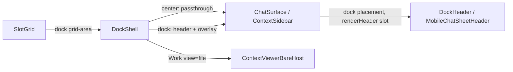

# features/project/dock — Contracts, architecture, rationale

Reference depth for the dock view container. Read [`AGENTS.md`](../AGENTS.md) first.

## Contracts

### Surface-parking invariant

`DockShell` guarantees its occupant's native body (`children`) keeps the same
React tree depth in both `center` and `dock` placements. In `center`, the shell
is a bare passthrough — the occupant renders directly inside the grid cell. In
`dock`, the shell wraps with the caller's header (via the `renderHeader` slot)
and, on Work, the transient file overlay, but `children` still renders at the
same nesting level (inside the same `relative flex min-h-0 flex-1` div). When the
occupant moves between center↔dock in the grid, React's reconciliation sees the
same component at the same position.

The primary body stays **mounted** while the file view shows. It is hidden via
`opacity-0 pointer-events-none` + the `inert` attribute. This means:

- Chat state (WebSocket, scroll, composer draft) survives a view switch.
- Document sessions survive a view switch.
- The body does not reflow — the file view overlays it with `absolute inset-0`.

**Violation consequence:** unmounting `children` while the file shows would
lose chat state, force reconnection on return, and break the surface-parking
contract the project shell relies on.

### `resolveDockView` pure function

`resolveDockView(screen: ScreenKey, hasFile: boolean)` is a pure function:

- The view is the occupant's: `chat` on Work and Editor, `context` on Chat.
- `views` is the switch's segments: the occupant, plus `file` only on Work while
  a transient Work file is available. Only that case has a switch.

This is deliberately separated from the React hook (`useDockView`) so it is
unit-testable. The hook only adds the Zustand binding.

On Work, `workFile` is a transient `{ workId, tab, active }` slot in the
session-only store. While populated, `file` joins the chat as a segment. Opening
a file activates its view; selecting Chat parks the file view, and selecting File
again reactivates it. Closing the slot returns to Chat. Chat remains mounted and
inert underneath the viewer. `ProjectView` owns route reconciliation and calls
`enterWork` or `leaveWork` to clear a stale slot on Work change, the Work
collection, or any other destination. Pending creation routes use their client
Work identity too. No file view is persisted across reloads.

### Dock view store

`useDockViewStore` is a Zustand store holding the transient `workFile` slot:

- **Session-only, no `persist`.** A fresh reload starts from the occupant.
- **No placement data.** Width, collapse, and grid placement are owned by the
  surface-prefs store (`layout/surface-prefs-store.ts`), not here.
- **No draft review data.** Changes lists live in the surfaces of the scope they
  list (the chat strip, the identity row and phone sheet, the Work page).

### Slot material contract

The dock grid slot (`layout/desktop-layout.ts`) owns all background chrome:
`bg-sidebar` plus the `border-l` seam against the center pane. Dock components (header,
file view, occupant body) must not paint a hardcoded background — the slot
paints the material. Transparent/surface-subtle fills are correct, and tonal
steps may recess (`bg-sidebar-accent`) and re-surface the slot's own tone
(`bg-sidebar`). One bounded exception: `DockViewSwitch` (shared by `DockHeader`
and the phone chat sheet's `MobileChatSheetHeader`) is a contained segmented
track (a recessed ink-mix well) whose active segment surfaces paper
(`bg-background`) — the paper stays inside the track's boundary, so the dock
still reads as one chrome surface. Any other `bg-background` or `bg-card` in
the dock is a bug (the dock is a sidebar).

### Claim-based inline-review editor registration

The draft review controller (`useDraftReviewController`) holds the active
review editor in a claim-based ref (`inlineRuntimeRef`): the review editor
registers on mount, and release is a **no-op unless the caller still holds
the claim** — on a review document switch the new editor may register before
the old one's effect cleanup runs, and that stale cleanup must not clear the
fresh claim. `focusReviewChange` reads the editor from this ref
to highlight and scroll manuscript spans; warm hidden editors never stomp the
reference because only the active review editor claims it.

See [`features/draft-review/useDraftReviewController.ts`](../../../draft-review/useDraftReviewController.ts) and
[`core/editor/.context/CONTEXT.md`](../../../../core/editor/.context/CONTEXT.md).

## Architecture


```mermaid
flowchart LR
    Grid[SlotGrid] -->|dock grid-area| DockShell
    DockShell -->|center: passthrough| Occupant[ChatSurface / ContextSidebar]
    DockShell -->|dock: header + overlay| Occupant
    DockShell -->|Work view=file| File[ContextViewerBareHost]
    Occupant -->|dock placement, renderHeader slot| Header[DockHeader / MobileChatSheetHeader]
```

`DockShell` is the single component both dock occupants (`ChatSurface`,
`ContextSidebar`) render through. There is no "ChatDock" or "ContextDock"
wrapper — the same shell handles both, with the screen determining the views.

## Traps

### tailwind-merge cannot dedupe custom color classes

`cn()` (which uses `tailwind-merge`) merges Tailwind utility classes by
understanding their category — `border-red-500` and `border-blue-500` conflict
as border-color utilities, and the later one wins. But `border-border-subtle` is
a custom CSS variable class (`border-[color:var(--color-border-subtle)]`) that
tailwind-merge does not recognize as a border-color utility; it treats it as an
arbitrary value with no dedup category.

This means stacking `border-border-subtle` with `border-primary` in a `cn()`
call would leave **both** classes in the output, with CSS specificity
determining the winner — unpredictable. The fix: use **one border-color class
per state branch**, not a base + override. Where a row or card has an active and
an inactive state, each supplies exactly one border class:

```tsx
active
  ? "border-primary"
  : "border-border-subtle hover:border-border hover:bg-sidebar-accent/30"
```

Never:

```tsx
// BROKEN: tailwind-merge leaves both, CSS cascade wins unpredictably
"border-border-subtle", active && "border-primary"
```

This trap applies anywhere `border-subtle` (or any custom color token class) is
combined with a standard Tailwind border-color class in a `cn()` call.

### Selective Discard needs a real branch journal

Selective Discard reconstructs a peer from the individually addressable,
reviewable Work-draft journal rows and reverses the server-vended class.
Synthetic QA branches created from snapshots or direct database inserts do not
provide that evidence. QA/probe branches must come from real chat flows where
the agent wrote to a Work draft.

This has repeatedly surfaced in draft-review probes. See
[KB: Runtime Probes](https://github.com/haowjy/meridian-flow-docs/blob/main/kb/wiki/conventions/verification/runtime-probes.md)
on labeling synthetic fixtures.

## Rationale

### Primary body hidden, not unmounted

Unmounting would lose chat state. `display: none` would cause a layout reflow
(tab order, scroll position). The `opacity-0 + inert` approach keeps the DOM
stable and the browser from wasting layout work on hidden content.

### Session-only view store

Persisting the transient file slot would reopen a stale file in a fresh session;
the occupant is the right starting point.
