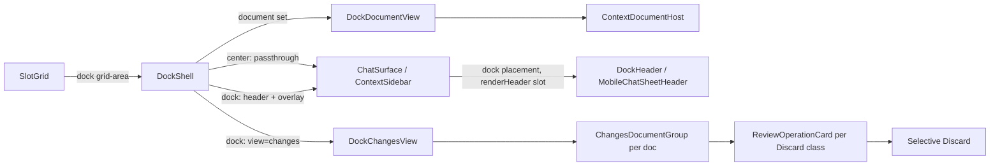

# features/project/dock — Contracts, architecture, rationale

Reference depth for the dock view container and work-scoped Changes view.
Read [`AGENTS.md`](../AGENTS.md) first.

## Contracts

### Surface-parking invariant

`DockShell` guarantees its occupant's native body (`children`) keeps the same
React tree depth in both `center` and `dock` placements. In `center`, the shell
is a bare passthrough — the occupant renders directly inside the grid cell. In
`dock`, the shell wraps with the caller's header (via the `renderHeader` slot)
and the Changes overlay, but `children` still renders at the same nesting level
(inside the same `relative flex min-h-0 flex-1` div). When the occupant moves
between center↔dock in the grid, React's reconciliation sees the same
component at the same position.

The primary body stays **mounted** when the Changes view is active. It is hidden
via `opacity-0 pointer-events-none` + the `inert` attribute. This means:

- Chat state (WebSocket, scroll, composer draft) survives a view switch.
- Document sessions survive a view switch.
- The body does not reflow — Changes overlays it with `absolute inset-0`.

**Violation consequence:** unmounting `children` when Changes is active would
lose chat state, force reconnection on return, and break the surface-parking
contract the project shell relies on.

### `resolveDockView` pure fallback

`resolveDockView(screen: ScreenKey, stored: DockView | undefined)` is a pure function:

- If `stored` is a valid view for the screen's set, it is the active view.
- Otherwise, the screen's `default` is used (the occupant's native view).
- The screen's view set and primary view are always returned alongside.

This is deliberately separated from the React hook (`useDockView`) so the
fallback logic is unit-testable. The hook only adds the Zustand binding.

### Dock document slot

`document` in the same session-only store is `{ screen, tab }`: the one document the
dock shows on Work or Chat. `useDockView(screen)` returns it only for its own screen.
While it is set, `DockShell` covers the occupant (mounted, inert) with
`DockDocumentView` and `DockHeader` swaps the view switch for the document's title
chip, a Close document button, and the collapse toggle. Opening a second document
replaces the first. `setDockView` on the document's screen clears it, so revealing
the chat returns to the chat. Closing returns to the writer's last explicit view.
`ProjectView` calls `syncDocumentScope(screen, workId)`: a Work's note is dropped when
the Work or the screen changes; a Chat-screen note stays on the Chat screen. No
document is persisted across reloads.

`useOpenDocumentInDock()` is the way in for a Work Files note. It opens the dock
document and `revealDock("document")`; on the Editor screen and on the phone it opens
an Editor route instead, so those never hold a dock document. `DockReveal` is
`"chat" | "document"`: a document reveal only opens the dock, the slot already holds
the document.

`useOpenScratchNote()` is the way in for a note picked from a chat's Scratch menu
(`../chat/ChatScratch.tsx`): the dock document on the Chat screen only, where
the chat is in the middle; an Editor tab from the Work and Editor screens, where the
chat is the dock and a dock document would cover it; the full-screen document on a
phone. The note's owner (a Work or a lineage) travels with its tab, so the dock
document's catalog, rename and Open in Editor follow it. A Chat-screen note stays
open when the writer switches chats; its title menu keeps listing its own owner's
Scratch.

`DockDocumentView` follows the resource projection (`useDockDocumentTab`): a rename
elsewhere updates the name and path the header and identity bar show, and a removed
or terminal document closes the slot. It reads `DraftReviewProvider` from wherever
`DockShell` is mounted (the chat scope), so review claims follow the editor that is
in front: the Editor tab's editor and the dock's are never both `active`.

The menu browses the tab's real scheme: a note moved out of Scratch to Manuscript or
KB still gets its own area's tree and Rename. "Earlier notes" belongs to the chat's
Scratch source alone.

The title chip opens a `DrillInMenu` (`components/app/DrillInMenu`) over the
document's own catalog tree (a Work's Scratch or Uploads, or a chat's Scratch) at the
document's folder, then Open in Editor and Rename. The tree comes from
`useCatalogMenuSource` (`../context/use-catalog-menu-source.ts`), the same source the
rail's Scratch control lists; the menu takes a tree source and an action list.
On a phone the same source is a `DrillInSheet` bottom sheet with no actions.

### Two views of one document

The Editor's warm tabs and the dock's document can be bound to one session at once.
The registry reference-counts bindings per owner, so closing either view leaves the
other bound. The caret has one publisher per session and each view keeps its own
undo stack; the contract is in
[`core/editor/.context/CONTEXT.md`](../../../../core/editor/.context/CONTEXT.md)
("Two editors can share one session"). The dock's part is to pass its visibility as
the host's `active`, which is what makes it the front or back view.

`useAiDraftLauncher` takes `screen` from the route-owned
`ProjectNavigationContext`, supplied by `ReadableProjectRoute`. It must not
recreate the removed project query grammar to choose a dock view.

### Dock view store

`useDockViewStore` is a Zustand store keyed by `ScreenKey`:

- **Session-only, no `persist`.** A fresh reload starts from each screen's
  default. A stale view choice across reloads is worse than a fresh start.
- **No placement data.** Width, collapse, and grid placement are owned by the
  surface-prefs store (`layout/surface-prefs-store.ts`), not here.
- **Explicit choice only.** The store only records writer-initiated view switches;
  the default is not written to the store.

### Changes availability

`dockRows(groups)` in `features/chat/docked-drafts.ts` is the shared active-row
projection. `DockShell` uses its `hasDockChanges` wrapper for segment
visibility, while `DockChangesView` renders those rows and owns its empty
branch. When the final row disappears, `DockShell` immediately renders the
native view and updates the session choice.

### Slot material contract

The dock grid slot (`layout/desktop-layout.ts`) owns all background chrome:
`bg-sidebar` plus the `border-l` seam against the center pane. Dock components (header,
Changes view, occupant body) must not paint a hardcoded background — the slot
paints the material. Transparent/surface-subtle fills are correct, and tonal
steps may recess (`bg-sidebar-accent`) and re-surface the slot's own tone
(`bg-sidebar`). One bounded exception: `DockViewSwitch` (shared by `DockHeader`
and the phone chat sheet's `MobileChatSheetHeader`) is a contained segmented
track (a recessed ink-mix well) whose active segment surfaces paper
(`bg-background`) — the paper stays inside the track's boundary, so the dock
still reads as one chrome surface. The document's editor shell takes the slot's
material too (`editorClassName="bg-transparent"`). Any other `bg-background` or
`bg-card` in the dock is a bug (the dock is a sidebar).

### Changes view: controller seam

`DockChangesView` reads from `DraftReviewProvider` (mounted at the project shell
level). It does not own a review session — it consumes the shared controller and
drives these actions:

- `controller.focusReviewOperation(operationId)` — click-to-scroll on cards
- `controller.discardOperation(operationId)` — per-card Discard
- `controller.isDisposing` — global disposition lock

The review session owner is `useDraftReviewController` in the chat feature; the
dock only renders review state and dispatches actions.

### Claim-based inline-review editor registration

The draft review controller (`useDraftReviewController`) holds the active
review editor in a claim-based ref (`inlineRuntimeRef`): the review editor
registers on mount, and release is a **no-op unless the caller still holds
the claim** — on a review document switch the new editor may register before
the old one's effect cleanup runs, and that stale cleanup must not clear the
fresh claim. The dock's `focusReviewOperation` reads the editor from this ref
to highlight and scroll manuscript spans; warm hidden editors never stomp the
reference because only the active review editor claims it.

See [`features/chat/useDraftReviewController.ts`](../../../chat/useDraftReviewController.ts) and
[`core/editor/.context/CONTEXT.md`](../../../../core/editor/.context/CONTEXT.md).

## Architecture


```mermaid
flowchart LR
    Grid[SlotGrid] -->|dock grid-area| DockShell
    DockShell -->|center: passthrough| Occupant[ChatSurface / ContextSidebar]
    DockShell -->|dock: header + overlay| Occupant
DockShell -->|dock: view=changes| Changes[DockChangesView]
DockShell -->|document set| Doc[DockDocumentView]
    Doc --> DocHost[ContextDocumentHost]
    Occupant -->|dock placement, renderHeader slot| Header[DockHeader / MobileChatSheetHeader]
    Changes --> DocGroup[ChangesDocumentGroup per doc]
    DocGroup --> Card[ReviewOperationCard per Discard class]
    Card --> Verbs[Selective Discard]
```

`DockShell` is the single component both dock occupants (`ChatSurface`,
`ContextSidebar`) render through. There is no "ChatDock" or "ContextDock"
wrapper — the same shell handles both, with the screen determining the view set.

## Traps

### tailwind-merge cannot dedupe custom color classes

`cn()` (which uses `tailwind-merge`) merges Tailwind utility classes by
understanding their category — `border-red-500` and `border-blue-500` conflict
as border-color utilities, and the later one wins. But `border-border-subtle` is
a custom CSS variable class (`border-[color:var(--color-border-subtle)]`) that
tailwind-merge does not recognize as a border-color utility; it treats it as an
arbitrary value with no dedup category.

This means stacking `border-border-subtle` with `border-primary` in a `cn()`
call would leave **both** classes in the output, with CSS specificity
determining the winner — unpredictable. The fix: use **one border-color class
per state branch**, not a base + override. In `ReviewOperationCard`, the active
and inactive states each supply exactly one border class:

```tsx
active
  ? "border-primary"
  : "border-border-subtle hover:border-border hover:bg-sidebar-accent/30"
```

Never:

```tsx
// BROKEN: tailwind-merge leaves both, CSS cascade wins unpredictably
"border-border-subtle", active && "border-primary"
```

This trap applies anywhere `border-subtle` (or any custom color token class) is
combined with a standard Tailwind border-color class in a `cn()` call.

### Operation card text is DOM-only

The card body shows the intended change text extracted from preview hunks and
operation excerpts. This text is a **display artifact**, not editable content —
it is plain `<span>` elements, never TipTap nodes. The card's click dispatches
`focusReviewOperation` to scroll the manuscript; the card never manipulates
editor state itself.

Adding click-to-edit or inline editing in the card body would require resolving
the same Yjs anchors the inline-review extension uses, which is not practical
for a non-editor component. Keep card interactions as focus + verbs.

### Selective Discard needs a real branch journal

Selective Discard reconstructs a peer from the individually addressable,
reviewable Work-draft journal rows and reverses the server-vended class.
Synthetic QA branches created from snapshots or direct database inserts do not
provide that evidence. QA/probe branches must come from real chat flows where
the agent wrote to a Work draft.

This has repeatedly surfaced in draft-review probes. See
[KB: Runtime Probes](https://github.com/haowjy/meridian-flow-docs/blob/main/kb/wiki/conventions/verification/runtime-probes.md)
on labeling synthetic fixtures.

## Rationale

### Primary body hidden, not unmounted

Unmounting would lose chat state. `display: none` would cause a layout reflow
(tab order, scroll position). The `opacity-0 + inert` approach keeps the DOM
stable and the browser from wasting layout work on hidden content.

### Session-only view store

Persisting the view choice means a writer who opens the app in a fresh session
gets a stale view. The default (occupant's native view) is the right starting
point every time. The writer's explicit choice is remembered within a session
so switching screens and coming back restores it.

### Combined region unit = card unit

The dock renders the Discard classes the server hands it. Combining dependent
regions into one unit happens upstream. The card groups directly by the
required `closureClassId` and never repairs or reconstructs class membership.
One server Discard class = one card = one selective-Discard granularity. Apply
is document-level and is not a card action.
