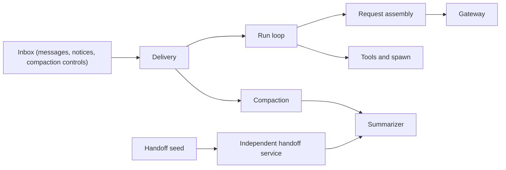

# domains/runtime

The agentic execution engine. It takes a user's message (or a subagent
report, a Work change, a queued control), streams the thread through an LLM
with tool use, persists every side effect through the threads repositories,
and emits `OrchestratorEvent`s that the threads domain fans out to clients.

## Where each concept lives

| File | Concept |
|---|---|
| [run-loop.md](run-loop.md) | One run: the orchestrator, run session and claim, persistence ordering, finalization, and loop invariants. |
| [delivery.md](delivery.md) | Writer admission, the prepare/commit protocol, inbox materialization, notices and Work refreshes, references, images, locks, and wakes. |
| [request-assembly.md](request-assembly.md) | The bound Agent, composed system prompt, frozen prefix and prompt epochs, history rendering, and cache state. |
| [tools.md](tools.md) | Tool registry and executor, per-turn permissions, and cost. |
| [spawn.md](spawn.md) | Child runs, `thread_message`, invocation cards, activity, and reports. |
| [history-tools.md](history-tools.md) | `thread_ls`, `thread_history`, `thread_report`, lineage scope, `spawn.from`, and bake-gated history guidance. |
| [document-text.md](document-text.md) | Document revision evidence, shown-link evidence, and how compaction and `thread_history` replace stale document copies. |
| [compaction.md](compaction.md) | The compaction protocol: transitions, decisions and refusals, the one projection authority, trigger and estimate, failure, cancellation, overflow, images. |
| [controls.md](controls.md) | Queued writer controls, run-start queue order, Stop behavior, withdrawal, and one-command-per-run consumption. |
| [handoff.md](handoff.md) | Handoff brief ownership of the destination run claim, Stop/Retry, and release wake. |
| [summarizer.md](summarizer.md) | The shared summarizer port (owner and source), branch/rolling paths, and paid-row settlement. |
| [recovery.md](recovery.md) | Run-owned placeholder repair and independent process recovery lanes. |
| [gateway context](../gateway/.context/CONTEXT.md) | The provider-neutral gateway: routing, retry, deadlines, usage, instrumentation, registry, cache descriptors. |

Deferred work: [TODO](TODO) and [FUTURE](FUTURE).

## Cross-domain dependencies

- **Depends on `domains/threads`**: repositories, the event journal, the hub,
  the read model, the effective-transcript loader, and the subagent-thread
  creation seam.
- **Depends on `domains/packages`**: immutable Agent revisions and retained
  package-local named-target resolution.
- **Depends on `domains/billing` and `@meridian/contracts/spawn`**: the credit
  ledger and tree budgets.
- **Depends on `domains/collab` at composition**: active-document resolution
  and response-scoped write settlement are supplied through runtime ports.
- **Consumed by `lib/` routes**: HTTP writer sends call `UserTurnAdmission`;
  cancellation calls `turnRunner.cancel`; controls go through
  `thread-controls.ts`.
  Composition wires each owner.
- **No concrete dependency on `domains/context`**: context-using tools receive
  handlers through DI, and compaction imports only the `DocumentRevisions`
  port type, which the composition root fills.
