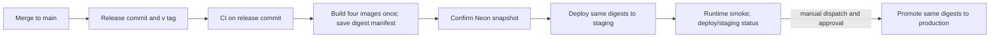

# Deploy contract

Every merged pull request to `main` is assigned a release version, built once
as four immutable GHCR image digests, deployed to staging, and smoke-checked.
Production is a manual, reviewer-gated promotion of those same digests after
staging has recorded success. No environment branch or production rebuild is
part of the contract. Start with the [first-deploy runbook](./runbook.md);
[operations](./operations.md) covers rollback, restore, and migration safety.

## Topology and route ownership

All Railway services run in Virginia (`us-east4-eqdc4a`). Caddy ingress owns the
public app origin and routes to private Railway services. The app and API share
a browser origin; browser calls use relative `/api` and `/ws` routes.

| Public path | Owner | Upstream |
|---|---|---|
| `/healthz`, `/readyz` | API server | `server.railway.internal:3000` |
| `/api/auth/callback`, `/api/auth/dev-login` | App | `app.railway.internal:3000` |
| Other `/api/*`, `/ws/*` (including `/ws/yjs`) | API server | `server.railway.internal:3000` |
| `/`, `/login`, other app routes | App | `app.railway.internal:3000` |
| Marketing site | WWW service | Its own Railway public domain; not routed through the app ingress |
| Database | Neon | Direct TLS connection from server, WWW if configured, and release command |

The API's `DATABASE_URL` must be Neon **direct**, not `-pooler`, with
`sslmode=require` and no `channel_binding=require`. The deployed postgres.js
client does not implement SCRAM-SHA-256-PLUS; including `channel_binding` is
not an effective enforcement mechanism and is rejected by the supported-URL
guard. The server opens a persistent `LISTEN` connection, so it needs the direct
endpoint. The accepted [Postgres host decision][Postgres host decision] records the database trade-offs and beta-scale cost assumptions. One API replica is required: collaboration state is in-memory
([#590](https://github.com/haowjy/meridian-flow/issues/590)). The migration
release command uses that same direct `DATABASE_URL`.

## Environment contract

Set runtime variables in each Railway environment (`staging` and `production`)
using Railway's service variables. `configure.sh` writes non-secret values and
references; the human sets secrets. GitHub environment secrets and variables
are separate from Railway runtime variables. Never put Neon API credentials
in Railway.

### Server service

| Variable | Required / value | Set by | Purpose |
|---|---|---|---|
| `NODE_ENV` | `production` | `configure.sh` | Enables production boot guards. |
| `APP_ENV` | `staging` or `production` | `configure.sh` | Environment identity; must not be empty in production Node mode. |
| `HOST` | `::` | `configure.sh` | Listen on all interfaces. |
| `PORT` | `3000` | `configure.sh` | Container port. |
| `DATABASE_URL` | Required Neon direct URL; `sslmode=require`; no `-pooler` or `channel_binding` | Human Railway secret | Runtime persistence and release migrations. |
| `API_REPLICA_COUNT` | `1` | `configure.sh` | Enforces single API instance. |
| `MERIDIAN_BACKENDS` | `live` | `configure.sh` | Selects live service defaults. |
| `OBJECT_STORE_PROVIDER` | `s3` | `configure.sh` | Live object storage provider. |
| `S3_BUCKET` | `uploads` bucket | `configure.sh` reference `${{uploads.BUCKET}}` (verify preset key on first setup) or human Railway variable | Object storage bucket. |
| `S3_ENDPOINT` | Bucket endpoint | `configure.sh` reference `${{uploads.ENDPOINT}}` (verify) or human Railway variable | S3-compatible API endpoint. |
| `S3_PUBLIC_ENDPOINT` | Public bucket endpoint | `configure.sh` reference `${{uploads.PUBLIC_ENDPOINT}}` (verify) or human Railway variable | Public URL base used for signed/public object URLs. |
| `S3_REGION` | Bucket region | `configure.sh` reference `${{uploads.REGION}}` (verify) or human Railway variable | S3 signing region. |
| `S3_ACCESS_KEY` | Bucket access key | `configure.sh` reference `${{uploads.ACCESS_KEY_ID}}` (verify) or human Railway secret | S3 credentials. |
| `S3_SECRET_KEY` | Bucket secret key | `configure.sh` reference `${{uploads.SECRET_ACCESS_KEY}}` (verify) or human Railway secret | S3 credentials. |
| `S3_FORCE_PATH_STYLE` | Optional; defaults to `true` | Human Railway variable if needed | Selects path-style S3 requests. |
| `S3_CREATE_BUCKET_IF_MISSING` | Optional; defaults off | Human Railway variable if needed | Local/testing convenience; normally leave off because provisioned bucket is explicit. |
| `OBJECT_STORE_SIGNED_URL_TTL_SECONDS` | Optional; defaults to `900` | Human Railway variable if needed | Signed object URL lifetime. |
| `WORKOS_API_KEY` | Real WorkOS key; staging may use `sk_test_`, production may not | Human Railway secret | Server-side WorkOS integration. |
| `WORKOS_CLIENT_ID` | Real client id | Human Railway secret | AuthKit client identity. |
| `WORKOS_COOKIE_PASSWORD` | At least 32 characters; unique per environment | Human Railway secret | Sealed session cookie encryption. |
| `WORKOS_REDIRECT_URI` | Public origin + `/api/auth/callback` | Human Railway variable/secret | Registered AuthKit callback URI. |
| `ANTHROPIC_API_KEY` | At least one live provider key is required | Human Railway secret | Anthropic model provider. |
| `OPENAI_API_KEY` | At least one live provider key is required | Human Railway secret | OpenAI model provider. |
| `DEEPSEEK_API_KEY` | At least one live provider key is required | Human Railway secret | DeepSeek-compatible provider. |
| `OPENROUTER_API_KEY` | At least one live provider key is required | Human Railway secret | OpenRouter provider. |
| `MODEL_PROVIDER` | Optional; never `mock` in staging/production | Human Railway variable if explicitly selecting provider | Provider override. |
| `EVENT_PROVIDER` | Optional; leave unset for live default (`local`) | Human Railway variable if explicitly selecting provider | Event sink override; live currently resolves to local sink. |
| `DURABLE_EVENT_BACKEND` | Optional; currently defaults to `none` | Human Railway variable if explicitly used | Multi-instance event/log coordination; do not use to imply API scale-out is supported. |
| `LOG_LEVEL` | Optional | Human Railway variable if needed | Runtime log level. |
| Railway `deploy.drainingSeconds` | `30` seconds | `configure.sh` | Gives shutdown time for request drain, AI turn completion, Yjs checkpoint, and socket close. |

Development-only values are not deployed: `WORKOS_DEV_AUTOLOGIN`,
`WORKOS_DEV_LOGIN_EMAIL`, and `WORKOS_DEV_LOGIN_PASSWORD` are forbidden in
staging and production. `LOCAL_OBJECT_STORE_DIR`,
`LOCAL_OBJECT_STORE_SIGNED_URL_BASE_PATH`, and `OBJECT_STORE_SIGNING_SECRET`
apply only when `OBJECT_STORE_PROVIDER=local`.

### App service

| Variable | Required / value | Set by | Purpose |
|---|---|---|---|
| `NODE_ENV` | `production` | `configure.sh` | Production app runtime. |
| `APP_ENV` | `staging` or `production` | `configure.sh` | App environment identity. |
| `HOST` | `::` | `configure.sh` | Listen on all interfaces. |
| `PORT` | `3000` | `configure.sh` | Container port. |
| `MERIDIAN_API_ORIGIN` | `http://server.railway.internal:3000` | `configure.sh` | App SSR API origin on the private Railway network. |
| `WORKOS_API_KEY` | Real key, unique to WorkOS environment as appropriate | Human Railway secret | WorkOS AuthKit session integration. |
| `WORKOS_CLIENT_ID` | Real client id | Human Railway secret | AuthKit identity. |
| `WORKOS_COOKIE_PASSWORD` | At least 32 characters; unique per environment | Human Railway secret | Sealed session cookie encryption. |
| `WORKOS_REDIRECT_URI` | `https://<public-host>/api/auth/callback` | Human Railway variable | Registered WorkOS callback; app startup validates it. |
| `WORKOS_DEV_AUTOLOGIN` | Must not be set to `1` | Do not set in production | Development-only login shortcut. |
| `WORKOS_DEV_LOGIN_EMAIL`, `WORKOS_DEV_LOGIN_PASSWORD` | Must not be set | Do not set in production | Development-only login credentials. |
| `LOG_LEVEL` | Optional | Human Railway variable if needed | Runtime log level. |

### WWW service

| Variable | Required / value | Set by | Purpose |
|---|---|---|---|
| `NODE_ENV` | `production` | `configure.sh` | Production runtime. |
| `APP_ENV` | `staging` or `production` | `configure.sh` | Deployment identity. |
| `HOST` | `::` | `configure.sh` | Listen on all interfaces. |
| `PORT` | `3000` | `configure.sh` | Container port. |
| `WEB_DATABASE_URL` | Required direct Postgres URL; if unset code falls back to `DATABASE_URL` | Human Railway secret | WWW's database adapter. Set explicitly if WWW uses a different DB identity. |
| `DATABASE_URL` | Alternative source only when `WEB_DATABASE_URL` is absent | Human Railway secret | Fallback consumed by WWW env parsing. |

### Ingress service

| Variable | Required / value | Set by | Purpose |
|---|---|---|---|
| `HOST` | `::` | `configure.sh` | Listen on all interfaces. |
| `PORT` | `8080` | `configure.sh` | Public Caddy listener. |
| `APP_UPSTREAM` | `app.railway.internal:3000` | `configure.sh` | App private hostname; Caddy refreshes DNS periodically. |
| `SERVER_UPSTREAM` | `server.railway.internal:3000` | `configure.sh` | API private hostname. |

### Image-build arguments

The build workflow passes `MERIDIAN_VERSION` and `MERIDIAN_RELEASE_SHA` to
each of the four Docker builds (server, app, www, ingress). These become image
environment variables and OCI labels; operators do not set them in Railway.
They identify the release visible to `/healthz` and app response headers.

### Deploy seam and GitHub Actions

| Name | Scope | Set by | Purpose |
|---|---|---|---|
| `source.image` | Each Railway service/environment | `tools/deploy/deploy.ts` | Digest-pinned image reference from the release manifest. Never hand-edit during normal deploys. |
| `MERIDIAN_BACKUP_REF` | Railway server runtime, one environment | Deploy seam | Confirmed Neon snapshot ID plus the matching release SHA; written with `source.image` before the server pre-deploy migration. |
| `RAILWAY_TOKEN` | GitHub `staging` and `production` environment secrets; locally for setup/deploy scripts | Human | Project/environment-scoped Railway token. |
| `NEON_API_KEY` | GitHub `staging` and `production` environment secrets | Human | Project-scoped Neon Editor API key for snapshot operations; never a Railway secret. |
| `NEON_PROJECT_ID` | GitHub `staging` and `production` environment variable | Human | Target Neon project. |
| `NEON_BRANCH_ID` | GitHub `staging` and `production` environment variable | Human | Exact branch to snapshot before deploy. |
| `PUBLIC_URL` | GitHub `staging` and `production` environment variable | Human | Public ingress base URL used by workflow smoke and environment URL. |
| `RELEASE_TOKEN` | GitHub repository secret | Human | Fine-grained admin PAT or bypass GitHub App token that can push release commit/tag through the `main` ruleset. |
| `NEON_SNAPSHOT_TTL_DAYS` | Deploy workflow runner, optional | Operator override; defaults to `14` | Snapshot expiry. Must be a positive integer. |
| `NEON_OPERATION_TIMEOUT_MS`, `NEON_POLL_MS`, `NEON_API_BASE_URL` | Deploy workflow runner, optional | Operator override | Neon operation timeout, poll interval, and API origin. |
| `DEPLOY_TIMEOUT_MS`, `DEPLOY_POLL_MS`, `DEPLOY_DETECT_MS` | Deploy workflow runner, optional | Operator override | Railway terminal wait, poll interval, and new-deployment detection window. |

Optional billing integrations use `STRIPE_SECRET_KEY` and
`STRIPE_WEBHOOK_SECRET`; add `STRIPE_PRICE_PLAN_FREE`,
`STRIPE_PRICE_PLAN_STANDARD`, and `STRIPE_PRICE_PLAN_PREMIUM` when configuring
Stripe price IDs. None is required to boot. Optional model tuning includes
`MODEL_CALL_TIMEOUT_MS`, `OPENROUTER_BASE_URL`, `OPENROUTER_HTTP_REFERER`,
and `OPENROUTER_APP_NAME`. Local observability controls are `LOG_DIR`,
`LOG_RETENTION_DAYS`, and `LOG_MAX_BYTES`; do not point these at ephemeral
production storage unless log persistence is intentional.

The [runbook](./runbook.md) shows exact GitHub and Railway provisioning,
including secret entry without shell-history exposure. The local production-
shaped Compose stack is documented in [`tools/deploy/local/README.md`](../../tools/deploy/local/README.md).

## Source contracts

This page reflects runtime validation in `apps/server/server/lib/env.ts`,
`apps/server/server/lib/startup-guards.ts`,
`apps/server/server/lib/object-store-factory.ts`,
`apps/server/server/lib/backend-policy.ts`, `apps/app/src/server/`,
`apps/www/src/server/env.ts`, and `packages/database/src/release-cli.ts`;
Railway-owned values are in `tools/deploy/railway/configure.sh` and
`tools/deploy/ingress/`; build and GitHub inputs are in
`.github/workflows/` and `tools/deploy/deploy.ts`.

[Postgres host decision]: https://github.com/haowjy/meridian-flow-docs/blob/main/kb/decisions/platform/hosting/postgres-host.md
