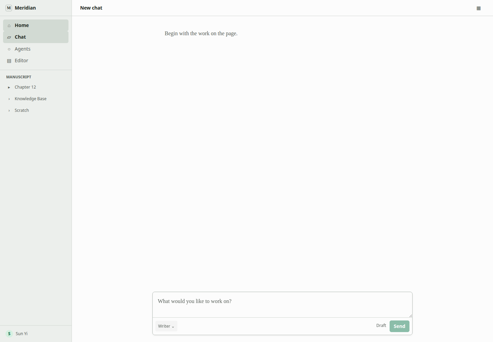
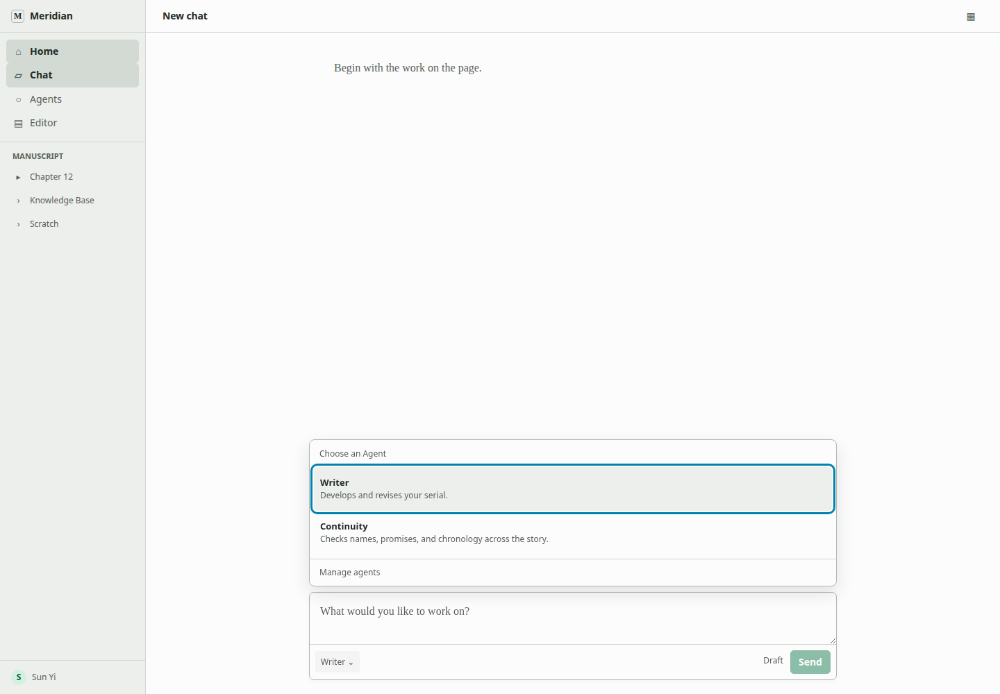
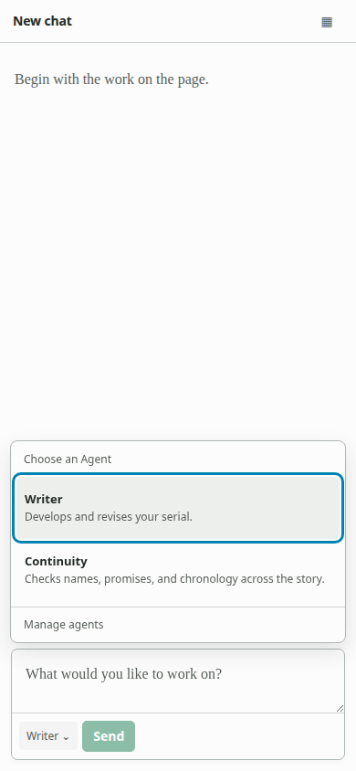
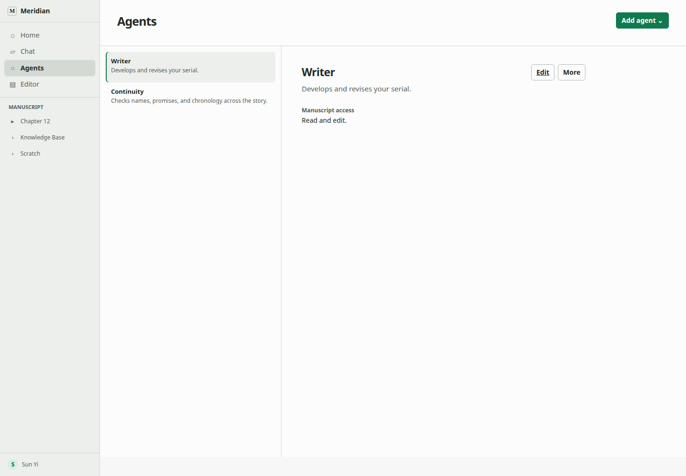
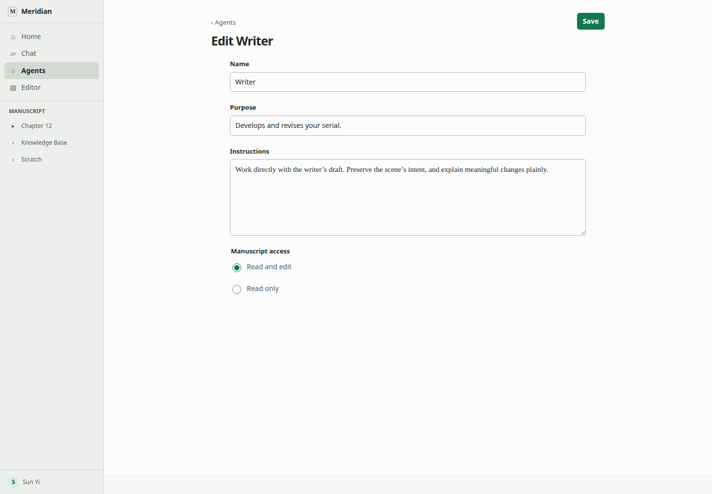
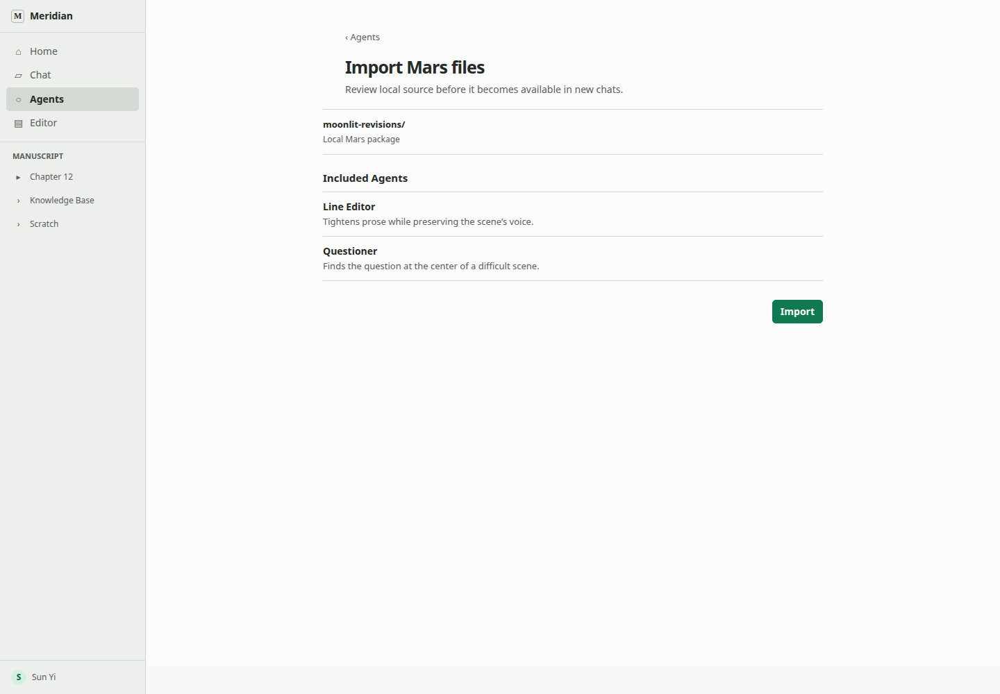
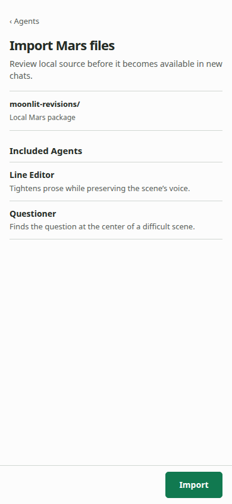
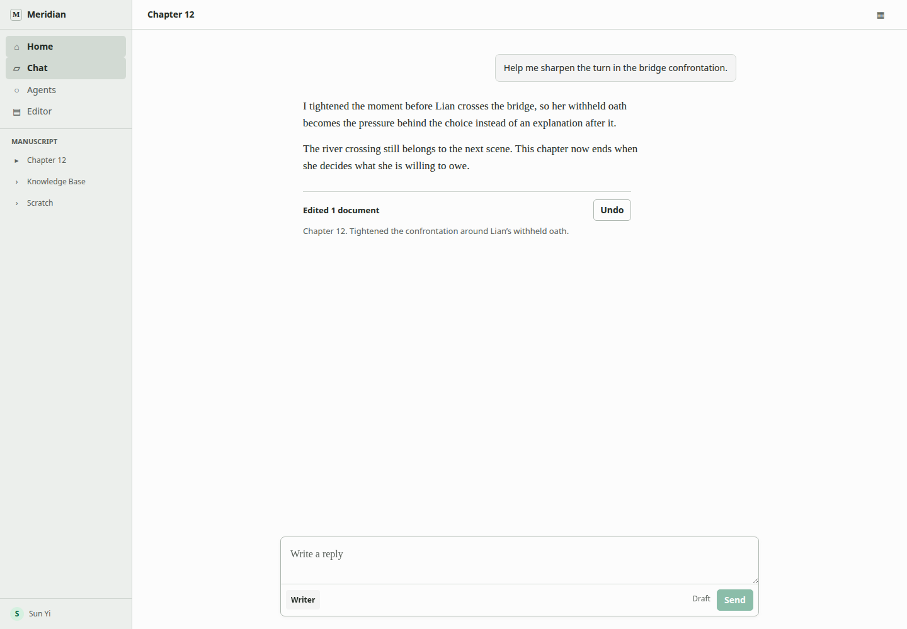
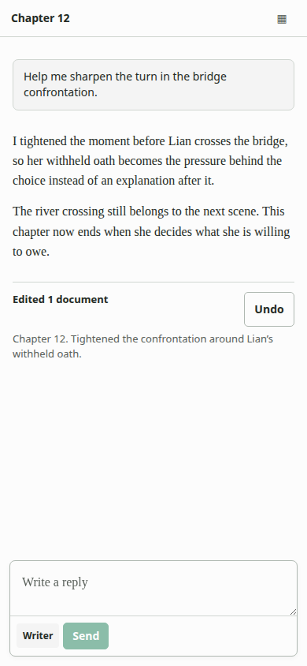

# Agent v1 implementation target

## Decision

Build a portable collaborator, not another workflow product. A writer manages or imports a Mars-defined Agent, chooses it only in New Chat, and then works in the ordinary transcript. First Send atomically binds the chat to one immutable Agent definition revision and its fixed Work.

Normal output remains assistant prose. When manuscript text changes, the existing edit receipt and Undo follow. The earlier generic `Sources and effects`, `Helpers consulted`, and `Run details` rows were invented proposals, not current Flow; they are deleted from the target.

## Browse the design

Open the self-contained [Agent design guide](guide/index.html) for the requirements, architecture, mockups, data model, plan, cuts, and evidence labels.

Authoritative documents:

1. [Requirements](agent-system-requirements.md)
2. [System design](agent-system-design.md)
3. [Data model](agent-system-data-model.md)
4. [Agent experience](agent-ux-spec.md)
5. [Implementation plan](agent-system-implementation-plan.md)

## Product shape

| Surface | Owns | Does not own |
|---|---|---|
| **New Chat** | Draft Agent choice, conditional Work choice, atomic first Send. | Editing, package management, run details. |
| **Agents** | Flat inventory, concise detail, four-field editor, local Mars import/export. | Start chat, Run, Test, active work. |
| **Existing chat** | One inert Agent fact, ordinary transcript, current activity, outcomes. | Agent or Work switching, duplicate identity, definition editing. |
| **Settled turn** | Assistant prose; existing edit receipt and Undo only if edits occurred. | Generic execution receipt or evidence stack. |

### New Chat stays writing-first

| Desktop | 390 px |
|---|---|
|  |  |

### Agent selection stays inside the composer

| Desktop | 390 px |
|---|---|
|  |  |

### Agents manages without launching

| Desktop | 390 px |
|---|---|
|  |  |

### The editor has four fields

| Desktop | 390 px |
|---|---|
|  |  |

### Mars exchange starts local

| Desktop | 390 px |
|---|---|
|  |  |

### Existing chats stay quiet

| Desktop | 390 px |
|---|---|
|  |  |

## Core system

Root Agent v1 adds only:

1. a strict versioned Mars compiler boundary;
2. immutable package and definition revisions;
3. one account/system catalog entry selecting the revision offered to future chats;
4. one immutable thread binding;
5. an atomic `StartAgentChat` application service;
6. one `prepareAgentTurn` and `EffectiveToolPolicy` path.

It reuses the current thread, turn journal, model gateway, `@meridian/agent-edit`, Yjs, activity, receipt, and Undo. It adds no runtime dependency, workflow engine, state-machine framework, run journal, generic action request system, or approval for native writing.

Mars v1 gains semantic `actions` for `document.read` and `document.edit`. Flow binds those requests to its own concrete tool operations and Project authority. Mars source never grants Project access, chooses Work, or carries credentials/run state.

Child Agents are post-v1. They add exact revision-resolved child edges, inherited Project/Work context, attenuated policy, and foreground spawn-and-report only after root v1 ships. Remote registry/distribution and external effects remain later designs.

## Provenance

| Label | In this target |
|---|---|
| **Existing pattern** | Composer selection, compact activity, assistant prose, edit receipt, Undo. |
| **Required addition** | Management/editor/import, strict Mars contract, catalog pointer, immutable binding, atomic first Send, unified policy. |
| **Later extension** | Child Agents, remote distribution, external effects, rich revision management. |
| **Deleted behavior** | Launch cards, existing-chat switching, one-Work picker, routine statuses, editor preview/rail, generic receipt rows, background/task-center UI, parallel run systems. |

## Verification

- Requirements-first design review covered all 19 functional requirements and approved the target after the catalog, compiler, digest, cutover, and authoring blockers were corrected.
- `meridian kg check` found no broken links in the work design.
- `meridian mermaid check` validated all seven diagrams.
- The product artifact rendered all six states at 1440 × 1000 and 390 × 844 with no page overflow or browser errors.
- The structured guide rendered overview and experience at both viewports; all 28 local references resolved.
- The implementation must still pass `pnpm check`, `pnpm test:db`, the 30-run p95 comparison, and a full Portless DB/stream/Yjs/Undo probe.
