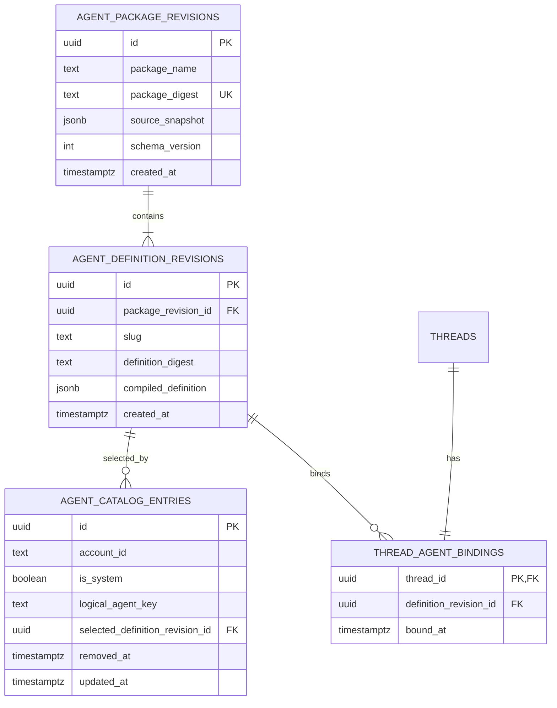

# Meridian Agent System Data Model

## Decision

The first release adds four durable concepts: an immutable package revision, immutable Agent definition revisions within it, a small account/system catalog entry selecting what future chats may use, and one immutable Agent binding per thread. Runs remain turns. Availability remains a query result. Source edits create revisions and then move only the future-chat catalog pointer.



## `agent_package_revisions`

One row is one validated import, first-party seed, or save from the structured editor.

| Column | Rule |
|---|---|
| `id` | Stable internal UUID. |
| `package_name` | Canonical Mars package coordinate for this local source. Not sufficient as execution identity. |
| `package_digest` | SHA-256 over `meridian.agent-package.v1\0` plus the canonical supported source tree. Identical installs are idempotent. |
| `source_snapshot` | Complete local Mars source needed for export and future editing. It is immutable. |
| `schema_version` | Compiled contract version, initially `1`. |
| `created_at` | Audit ordering only; never part of digest. |

The table does not need source registries, publisher trust, current activation, update state, compatibility caches, or revocation controls in the first release.

## `agent_definition_revisions`

One row is one compiled Agent from one package revision.

| Column | Rule |
|---|---|
| `id` | Exact identity used by chat bindings. |
| `package_revision_id` | Parent immutable source snapshot. `ON DELETE RESTRICT` once referenced. |
| `slug` | Unique only within the package revision; presentation and export coordinate, not binding identity. |
| `definition_digest` | SHA-256 over `meridian.agent-definition.v1\0` plus canonical JSON of `NormalizedAgentDefinitionV1`; the digest is not inside its own preimage. |
| `compiled_definition` | Strict closed JSON value validated at repository ingress and egress. |
| `created_at` | Audit ordering only. |

Required uniqueness:

```text
UNIQUE(package_revision_id, slug)
UNIQUE(package_revision_id, definition_digest)
```

The definition repository exports insert and get-by-ID. It does not export `updateDefinition`. Editing compiles and inserts another package/definition revision.

## `agent_catalog_entries`

One row represents one logical Agent offered to future chats. It is the minimum ownership and selection state that immutable artifacts cannot provide by themselves.

| Column | Rule |
|---|---|
| `id` | Stable internal UUID. |
| `account_id` | WorkOS/account owner for a personal Agent; null only for a system entry. |
| `is_system` | True only for bundled first-party entries. A check constraint makes this mutually consistent with `account_id`. |
| `logical_agent_key` | Stable identity within the owner scope across edits. It is not used by existing chats. |
| `selected_definition_revision_id` | The immutable revision offered to future chats. Saving a personal edit changes only this pointer. |
| `removed_at` | Null while selectable. Delete sets this for future catalog reads; bound revisions remain. |
| `updated_at` | Future-chat catalog ordering and cache invalidation only. |

Partial unique indexes enforce one system logical key and one logical key per account. Personal Agents are reusable across the writer's Projects. The New Chat catalog first authorizes the Project, then combines system entries with entries owned by the authenticated account and computes current host availability. It does not treat Project membership as Agent ownership.

Import is atomic: install the package/definition revisions and create or select the requested account catalog entries in one transaction. Name or logical-key collision fails with a clear rename-and-reimport instruction in v1; there is no implicit overwrite or merge. Save inserts a new source/package/definition revision and updates the same owned catalog entry in one transaction.

## `thread_agent_bindings`

One row pins a thread to the definition used at its atomic first Send.

| Column | Rule |
|---|---|
| `thread_id` | Primary key and foreign key to `threads`. Exactly one binding per Agent chat. |
| `definition_revision_id` | Foreign key to the immutable definition revision with `ON DELETE RESTRICT`. |
| `bound_at` | Audit timestamp. |

There is no setter. Handoff or deliberate Agent change creates a new thread with the same chosen/inherited Work and a new binding.

## Existing records remain authoritative

| Concern | Existing owner |
|---|---|
| Project membership and authorization | Existing Project/auth domain. |
| Fixed Work context | Existing `works` and primary `thread_works` relationship. |
| Writer and assistant turns | Existing thread/turn records. |
| Sequenced execution evidence | Existing turn journal/events. |
| Model edit evidence and Undo | Existing collaboration trail and `TurnEditsReceipt` path. |

Do not copy these facts into Agent tables. In particular, package, definition, and catalog rows never contain Project/Work IDs, credentials, current run state, or change receipts.

## In-memory values are not tables

### Catalog row

```ts
type AgentCatalogRow = {
  catalogEntryId: string;
  definitionRevisionId: string;
  name: string;
  description: string;
  documentAccess: "read" | "edit";
  availability:
    | { status: "available" }
    | { status: "unavailable"; reasons: AvailabilityReason[] };
  origin: { kind: "personal" | "bundled"; canEdit: boolean; canDelete: boolean };
};
```

The UI omits available status copy. `availability` exists so exceptional blockers can be rendered and selection can be enforced. It is computed server-side from the definition and host support, not persisted as a cache.

### Effective tool policy

```ts
type EffectiveToolPolicy = {
  advertisedOperations: readonly ToolOperationDescriptor[];
  canDispatch: (operation: ToolOperationId) => boolean;
  digest: string;
};
```

This value is resolved per turn from the bound definition and current authenticated host policy. It is not an `agent_permissions` table. Project authorization remains dynamic and external connections do not exist in the first release.

### Source draft

The browser may hold unsaved name, purpose, instructions, and document access as local form state. It is not a database draft and never becomes launchable. Saving validates and installs a full immutable revision atomically.

## First-Send transaction

The application transaction writes, in order within one Drizzle transaction:

1. thread;
2. primary `thread_works` row;
3. `thread_agent_bindings` row;
4. first writer turn/message;
5. existing initial journal evidence.

Eligibility and Project/Work authorization are checked inside the transaction or under equivalent locking immediately before writes. Any failure rolls back the aggregate. Model execution starts only after commit.

## Child-Agent extension

A post-v1 extension may add two records only when delegation is implemented:

```text
agent_definition_child_edges
  parent_definition_revision_id
  child_definition_revision_id
  required

agent_run_tree_budgets
  root_thread_id
  max_depth
  max_concurrency
  credit_limit
  deadline
```

Edges resolve slugs to exact child revision IDs during installation. They never retarget silently. A child thread uses the existing thread/turn lifecycle and its own `thread_agent_bindings` row; parent/child lineage should reuse the current child-run relation if it remains adequate after the root cutover.

Do not add `agent_runs` or `agent_run_events` merely for children. Add durable suspension/action-request records only if background or external-effect requirements later prove they cannot fit the established turn lifecycle.

## Deleted data structures

The target removes rather than migrates these current or previously proposed concepts:

- mutable current definition rows and editable overlays;
- duplicated skill and subagent relationship sources;
- slug-based thread binding;
- synthetic `General` fallback identity;
- active-package pointers used as existing-chat behavior;
- prompt snapshots treated as the Agent identity;
- host projections and compatibility caches for the initial closed subset;
- `agent_runs`, `agent_run_events`, `agent_run_receipts`, and generic action requests;
- approval grants for native writing;
- registry sources, publisher keys, artifact controls, and update activation records.

Because v3 has no real users or data, replacement is a schema cutover with fresh first-party seed data, not a compatibility migration.

## Invariants

1. Every Agent chat has exactly one definition binding and one primary Work link.
2. Bound definition content never changes.
3. Definition identity is a revision UUID and digest, never a display name or slug.
4. A compiled definition cannot exist without its source package revision.
5. A personal catalog entry has exactly one account owner; a system entry has none.
6. A catalog pointer may change for future chats, but a thread binding never follows it.
7. An invalid or unsupported definition never reaches persistence.
8. A model event never begins before the first-Send transaction commits.
9. Tool policy is derived, not mutable stored authority.
10. Deleting a personal Agent means setting `removed_at`; referenced revisions remain.

## Source basis

- [System design](agent-system-design.md)
- [Requirements](agent-system-requirements.md)

The work item preserves the minimal-architecture and First-Send atomicity
reviews used to refine this model. This PR package keeps only the target.
