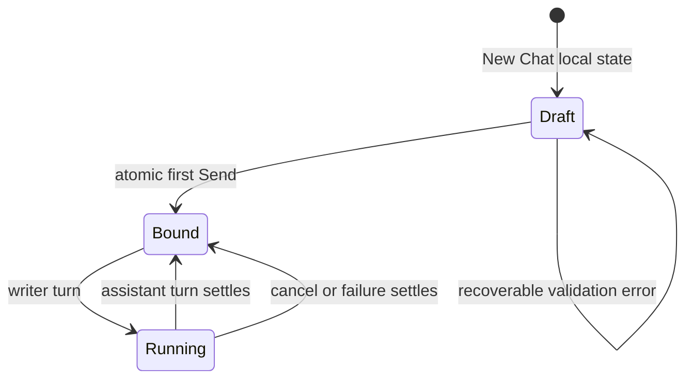

# Meridian Agent System Design

## Decision

Meridian has one Agent concept across Mars, Meridian CLI, and Meridian Flow: a portable named definition that a host compiles, binds to host context, and executes under host authority. Mars owns the portable source semantics. Flow owns chat binding, Project authorization, fixed Work context, effective tool policy, model execution, and manuscript mutation.

The first Flow implementation needs five new structural ideas only:

1. a strict Mars definition compiler boundary;
2. immutable definition revisions;
3. a small account-scoped catalog entry selecting the revision offered to future chats;
4. an atomic first-Send application service;
5. one turn-preparation and effective-tool-policy path.

Everything else reuses the current thread, journal, gateway, Yjs, activity, receipt, and Undo mechanisms.

```mermaid
flowchart LR
    Source["Mars source"] --> Compiler["MarsDefinitionCompilerPort"]
    Compiler --> Catalog["Immutable definition catalog"]
    Catalog --> Start["StartAgentChat"]
    Start --> Thread["Thread + Work + binding + first turn"]
    Thread --> Prepare["prepareAgentTurn"]
    Catalog --> Prepare
    Prepare --> Policy["EffectiveToolPolicy"]
    Policy --> Gateway["Existing model gateway"]
    Gateway --> Edit["Existing agent-edit + Yjs"]
    Edit --> ExistingUI["Existing activity + receipt + Undo"]
```



## Definition contract

The initial compiled contract is deliberately closed:

```ts
type NormalizedAgentDefinitionV1 = {
  schemaVersion: 1;
  slug: string;
  display: {
    name: string;
    description: string;
  };
  instructions: string;
  invocation: {
    userInvocable: boolean;
  };
  model: {
    token?: string;
    effort?: "low" | "medium" | "high" | "max";
  };
  documentAccess: "read" | "edit";
};

type CompiledDefinitionEnvelopeV1 = {
  definition: NormalizedAgentDefinitionV1;
  definitionDigest: string;
};

type CompiledAgentPackageV1 = {
  schemaVersion: 1;
  packageName: string;
  packageDigest: string;
  definitions: CompiledDefinitionEnvelopeV1[];
  canonicalSource: MarsPackageSource;
  diagnostics: SourceDiagnostic[];
};
```

`edit` implies read. The digest is outside the value it hashes: `definitionDigest` is SHA-256 over the domain prefix `meridian.agent-definition.v1\0` plus canonical JSON of `NormalizedAgentDefinitionV1`; `packageDigest` uses `meridian.agent-package.v1\0` plus the canonical supported source tree. There is no optional ability lattice, host-negotiation protocol, external connection, approval mode, run budget, child roster, model-invocable axis, or packaged skill semantics in v1. Recognized unsupported policy-bearing fields and skill references fail compilation; unknown documentation-only extension fields may be preserved in source but do not enter the compiled contract.

### Mars source mapping

Mars v1 adds a semantic requested-action field rather than asking Flow to interpret harness tool slugs:

```yaml
actions:
  - document.read
  - document.edit
```

`document.read` alone compiles to `documentAccess: "read"`. Adding `document.edit` compiles to `"edit"`; edit implies read. The four-field editor emits this canonical form. Flow v1 rejects other action identifiers, `tools`, `disallowed-tools`, and `skills` rather than silently dropping or broadening them. Other Mars hosts may bind the semantic actions to their own tool mechanisms or report them unsupported.

A full Mars package compiles to one `CompiledAgentPackageV1` containing every Agent. A standalone Agent Markdown import is deterministically wrapped as package `local-<slug>` with one `agents/<slug>.md` entry before compilation. Export accepts a source snapshot or normalized package value, never a Flow database ID.

### Why a strict subset rather than a launch bundle

Mars already expresses more coding-harness policy than Flow needs. Reusing its YAML vocabulary is realistic; importing its whole CLI launch bundle is not. Flow does not launch a filesystem harness and must not pretend that `sandbox` or `approval` describe Project/Work access.

The first boundary is therefore a versioned normalized contract and shared golden fixtures. Flow may initially implement that subset with existing `yaml` and Zod. A future Mars library or WASM compiler can replace the adapter behind `MarsDefinitionCompilerPort` when it covers every consumed semantic and measurably removes more complexity than it adds. A privileged subprocess is not part of the design.

## Boundaries and ownership

| Boundary | Owns | Must not own |
|---|---|---|
| **Mars source/compiler** | Profile schema, defaults, field-presence rules, normalized instructions and requested policy, source diagnostics, canonical digest fixtures. | Project IDs, Work IDs, users, credentials, run state, or receipts. |
| **Definition catalog** | Immutable compiled revisions, source provenance, eligibility queries. | Thread creation, model calls, or mutable current-agent state. |
| **Threads** | Thread, fixed primary Work link, exact definition binding, turns. | Mars parsing or tool-policy interpretation. |
| **StartAgentChat** | One cross-domain transaction for the initial aggregate. | HTTP types, rendering, or model execution. |
| **Runtime preparation** | Resolve bound definition, fixed context, model request, effective actions, and writer-facing exceptional availability. | Persisting a second run lifecycle or mutating definitions. |
| **Tool registry** | Map semantic document access to concrete read/edit operations and enforce dispatch. | Deciding Project ownership or changing Work. |
| **Model gateway** | Provider translation and streaming. | Rebuilding Agent policy or prompt composition. |
| **Collaboration domain** | Apply edits through Yjs and record reversible change evidence. | Agent selection or approval gates. |
| **App UI** | Present server truth and collect draft selection/input. | Infer capability, compatibility, or authority. |

## Core interfaces

### Compilation and catalog

```ts
interface MarsDefinitionCompilerPort {
  compile(source: MarsPackageSource | StandaloneAgentSource): CompileResult<CompiledAgentPackageV1>;
  export(compiled: CompiledAgentPackageV1): MarsPackageSource;
}

interface AgentDefinitionRepository {
  install(compiled: CompiledAgentPackageV1): Promise<InstalledPackageRevision>;
  getRevision(id: string): Promise<DefinitionRevision | null>;
}

interface AgentCatalogRepository {
  selectForAccount(entry: AccountAgentCatalogEntry): Promise<void>;
  listForAccount(
    accountId: string,
    page: { limit: number; cursor?: { normalizedName: string; entryId: string } },
  ): Promise<{ items: AgentCatalogRow[]; nextCursor?: { normalizedName: string; entryId: string } }>;
  removeFromAccount(accountId: string, logicalAgentKey: string): Promise<void>;
}
```

Identical compiled bytes are idempotent by digest. `install` never updates referenced content in place. The catalog entry is the only mutable future-chat pointer; personal entries are account-owned and built-ins are system-owned. Project authorization is still checked at launch, but a Project does not own the writer's reusable Agent library. Catalog pages are bounded and ordered by normalized display name then entry ID; pagination exists at the server boundary even while the small-inventory UI has no search or paging chrome.

### Atomic creation

```ts
type StartAgentChatCommand = {
  projectId: string;
  threadId: string; // client-minted UUID for optimistic navigation
  workId: string;
  definitionRevisionId: string;
  instruction: string;
};

interface StartAgentChat {
  execute(command: StartAgentChatCommand): Promise<{
    thread: Thread;
    userTurn: Turn;
    snapshotFloorNextSeq: string;
  }>;
}
```

The command authorizes the Project, validates that Work belongs to it, checks definition eligibility, then writes the full aggregate in one Drizzle transaction. There is no earlier empty-thread creation call.

### Turn preparation and enforcement

```ts
type EffectiveToolPolicy = {
  advertisedOperations: ToolOperationDescriptor[];
  canDispatch(operation: ToolOperationId): boolean;
  digest: string;
};

type PreparedAgentTurn = {
  definitionRevisionId: string;
  generateRequest: GenerateRequest;
  toolPolicy: EffectiveToolPolicy;
};

function prepareAgentTurn(threadId: string): Promise<PreparedAgentTurn>;
```

The same policy instance supplies model-visible operations and guards dispatch. `documentAccess: "read"` projects read operations only. `"edit"` projects read and edit operations. Even a fabricated disallowed tool call is rejected before its handler or Yjs.

## Authority model

```text
effective actions =
  compiled definition request
  ∩ host-supported operations
  ∩ authenticated Project authority
  ∩ runtime policy
```

Work is not one of those permission grants. It is immutable chat context and the default meaning of Work-scoped references. An Agent cannot choose or rebind it.

The source may request actions; it cannot grant itself access. The host may narrow a request and must never silently broaden an explicit restriction. This rule is why definition compilation, availability projection, advertisement, and dispatch cannot become separate policy implementations.

Native manuscript edits remain trusted model writes. They require no approval and flow through the existing Yjs peer path. A future external effect can add operation-specific confirmation without changing this rule.

## Lifecycle



There is no mutable `current Agent` transition. Changing Agent means starting a new chat. Editing or importing creates a new definition revision available to future chats only.

## Child Agents are post-v1, not hidden infrastructure

Delegation matters to the eventual product, but its semantics and schema are added only after root Agent v1 has shipped. The extension adds:

- exact child edges resolved to definition revisions when the parent revision is installed;
- model-invocable eligibility enforced at both advertisement and launch;
- inherited Project and fixed Work context;
- an effective policy attenuated from the parent, never broadened by the child;
- a small tree budget for depth, concurrency, time, and credits;
- foreground spawn-and-report through the existing transcript.

It does not initially add a task center, background tray, helper cards, child transcript chrome, workflow graph, or separate writer-facing receipt. A meaningful child result is incorporated into the parent's assistant response. Dedicated durable orchestration is earned only by real background/resume requirements.

## Architectural patterns

| Pattern | Application |
|---|---|
| **Compile then execute** | Parse and validate portable source once; runtime consumes a closed immutable value. |
| **Ports and adapters at volatile seams** | Compiler, repositories, gateway, and operation bindings have ports. Routes and simple domain functions do not get ceremonial interfaces. |
| **Functional core, imperative shell** | Normalization, digesting, policy intersection, and availability projection are pure. Persistence, gateway calls, and Yjs mutation are effects. |
| **Immutable revision reference** | Threads bind revision IDs, not slugs or activation pointers. |
| **Application service transaction** | `StartAgentChat` coordinates the one aggregate crossing catalog, thread, Work, and journal ownership. |
| **Single composition seam** | `prepareAgentTurn` is the only route from bound identity to executable request. |
| **Policy/mechanism separation** | `EffectiveToolPolicy` decides; tool handlers execute. |
| **Truthful progressive disclosure** | Healthy state is omitted; exceptional blockers appear at the action source; internal evidence stays internal. |
| **Deletion over compatibility** | Remove mutable definitions, synthetic fallback Agents, slug binding, and prompt baking. Do not adapt them indefinitely. |

## Rejected alternatives

| Alternative | Why rejected |
|---|---|
| Flow-specific Agent schema | Creates invisible drift while using Mars-looking files. |
| Full Mars CLI launch bundle | Imports filesystem-harness concepts and operational overhead Flow does not need. |
| Direct Mars subprocess now | The normalized producer is incomplete; subprocess lifecycle and containment cost are unearned. |
| Mutable active definitions | Existing chats change behavior without consent or reproducibility. |
| Separate Agent run/event system | Duplicates the established turn journal and UI lifecycle. |
| General capability framework | Two document-access states prove the seam without an ontology project. |
| Background orchestration first | Adds suspension, leases, recovery, and UI before a foreground child proves need. |

## Risks and cheapest probes

| Risk | Probe before commitment |
|---|---|
| Mars and TypeScript semantics drift | Run shared positive/negative fixtures in both repositories and compare canonical output/digests. |
| Compound write tool leaks edit operations | Generate advertised schemas for read/edit definitions and inject a fabricated edit dispatch for read-only. |
| First-Send transaction does not cover journal writes | Inject a DB failure after every repository call against real Postgres. |
| Existing gateway assumes prompt baking or slug lookup | Trace one current turn, replace it with `prepareAgentTurn`, and compare emitted request/event order. |
| Local import/export is not semantically round-trippable | Export a created Agent, delete it, re-import, and compare compiled digest. |
| Agent identity copy becomes duplicate chrome | Browser probe all six target surfaces at desktop and 390 px before implementation approval. |

## Source basis

- [Requirements](agent-system-requirements.md)

The work item preserves the underlying Mars fit, boundary, Meridian CLI, and
minimal-architecture research used to make these decisions. This PR package
keeps only the implementation target.
