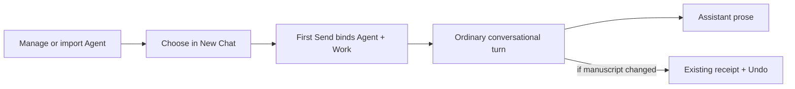

# Agent System Requirements

## The first useful system is a portable collaborator, not a workflow product

A fiction writer must be able to define or import a named collaborator, understand its purpose and manuscript access, choose it in New Chat, and receive an ordinary conversational result. If it edits, the existing change receipt and Undo explain and recover the change. Everything else must earn its way into a later release.

## Vocabulary

| Term | Canonical meaning |
|---|---|
| **Agent** | A named, reusable collaborator whose definition supplies purpose, instructions, model preference, invocation eligibility, and requested action policy. An Agent is not a thread, run, persona card, or autonomous background process. |
| **Agent source** | Author-owned Mars package files: `mars.toml` and Agent Markdown with YAML frontmatter. This is the portable v1 exchange form. |
| **Agent definition revision** | An immutable, validated runtime representation compiled from one Agent source revision. A chat binds this identity, not a mutable slug. |
| **Chat binding** | The immutable relationship from a chat to one Agent definition revision. |
| **Run** | One execution of the bound Agent for one turn. It uses the existing turn lifecycle rather than a new writer-facing run object. |
| **Work** | The fixed task-scoped editing context already defined by Flow. It is selected at chat creation and is not an Agent permission. |
| **Requested actions** | What the portable definition asks the host to expose. |
| **Effective tool policy** | The host-enforceable intersection used both to advertise and dispatch actions. It is runtime policy, not source authority. |
| **Child Agent** | A later Agent run launched by another Agent from an exact declared child definition. It is the same Agent concept at a different invocation depth. |

## Functional requirements

### Definition and exchange

| ID | Requirement | Acceptance evidence |
|---|---|---|
| F1 | Mars YAML/Markdown is the source and local exchange format. Flow must not invent a second Agent dialect. | An exported Agent can be imported again without changing its supported semantics. |
| F2 | Flow supports a strict, versioned Mars subset and rejects unsupported runtime-bearing fields, including v1 skill references. | Shared golden fixtures compile identically in Mars and Flow; invalid fixtures fail before persistence. |
| F3 | A personal Agent can be created and edited through a narrow form: name, purpose, instructions, and manuscript access. | Saving produces valid Mars source and a new immutable definition revision. |
| F4 | A writer can import and export a local Mars package or Agent YAML/Markdown source. | Import review identifies contained Agents and errors; export produces portable files. No registry is required. |
| F5 | The first-party package includes at least one read/edit Agent and one read-only Agent. | Runtime tests prove the visible difference is enforced, not descriptive copy. |

### Selection and binding

| ID | Requirement | Acceptance evidence |
|---|---|---|
| F6 | Agent selection occurs only in New Chat. | No Agent detail, package page, Home card, or existing chat can launch or switch an Agent. |
| F7 | Work selection appears only when the project has more than one eligible Work. | A one-Work project has no redundant Work control. |
| F8 | First Send atomically creates the thread, primary Work link, exact Agent binding, first writer turn, and journal evidence. | Fault injection after each persistence step leaves no empty or partially bound thread. |
| F9 | Later turns always use the exact bound definition revision. | Renaming, editing, importing, or updating an Agent does not change an existing chat. |
| F10 | A missing or unavailable selection blocks at the source without losing the draft. | The writer's text and selections remain after recovery. |

### Execution and change communication

| ID | Requirement | Acceptance evidence |
|---|---|---|
| F11 | One server-owned preparation path resolves instructions, model routing, context, and effective tools. | Every root turn uses `prepareAgentTurn`; routes and adapters do not rebuild policy. |
| F12 | Tool advertisement and dispatch use the same `EffectiveToolPolicy`. | A read-only Agent cannot see or call an edit operation, including a fabricated call. |
| F13 | Native manuscript edits use the existing `@meridian/agent-edit` and Yjs path without approval. | The edit appears live and remains undoable through the existing receipt. |
| F14 | Normal output is assistant prose. The existing activity treatment may state current work while running. | A no-edit answer looks like an ordinary assistant turn, not a process report. |
| F15 | The existing `TurnEditsReceipt` appears only when documents changed and owns Undo. | No duplicate edit count or second generic evidence section appears. |
| F16 | Cancel appears only while cancellation can still affect an active turn. | Terminal and non-cancellable states have no dead control. |

### Management

| ID | Requirement | Acceptance evidence |
|---|---|---|
| F17 | Agents is a management surface: flat inventory, concise detail, create/edit, import/export, and delete where ownership permits. | It contains no launch, run, test, chat composer, or New Chat preview. |
| F18 | The inventory reports exceptional blockers where they occur and otherwise stays quiet. | Healthy Agents have no `Ready` or `Compatible` badges. |
| F19 | Packaged and personal Agents share the same list semantics; origin is secondary metadata only when it changes available actions. | The list is not split into competing card systems. |

## Non-functional requirements

| Quality | Required strategy and gate |
|---|---|
| **One semantic authority** | Mars owns portable profile semantics, including a new semantic `actions` list for `document.read` and `document.edit`. Flow implements a pinned strict subset from Mars-owned versioned fixtures until an embeddable normalized compiler is justified. No permissive partial parser. |
| **Determinism** | Canonical compiled JSON and content digests are byte-stable across key order, line endings, and repeated compilation. |
| **Immutable identity** | Definition content and chat bindings are append-only. Referenced revisions use restrictive foreign keys. Slugs and names are never runtime identity. |
| **Atomicity** | First Send is one application transaction. Postgres integration tests inject failures at every write boundary. |
| **Least authority** | A definition requests actions but cannot grant Project access, choose Work, bind credentials, or broaden host policy. Unknown policy fails closed. |
| **Policy parity** | One result controls availability projection, model advertisement, and dispatch denial. The client never computes readiness or authority. |
| **Trust the LLM** | Ordinary Yjs writing has no approval, confirmation, or review gate. Writer recovery is Undo. |
| **Failure containment** | Invalid source, unsupported model policy, unavailable connections, or missing definitions fail before model execution and preserve writer input. |
| **Accessibility** | Keyboard-complete selection and authoring, named controls and statuses, focus return, reduced motion, 390 px without horizontal overflow, no hover-only meaning. |
| **Performance** | First Send to first mock-provider event adds no more than 10% p95 over the existing path in a same-machine 30-run comparison. Catalog queries remain bounded and paginatable even before search is exposed. |
| **Observability** | Reuse the internal turn journal and `EventSink`. Do not convert diagnostics into permanent writer-facing telemetry. |
| **Dependency restraint** | Add no runtime library. Use existing React, TanStack Query/Router, Radix wrappers, design tokens, Zod, `yaml`, Drizzle/Postgres, Yjs, Vitest, and Playwright. |
| **Structural restraint** | No new workflow engine, state-machine framework, event-sourcing layer, run journal, or generic capability framework. Add ports only at Mars compilation, persistence, model gateway, and tool-operation seams that are genuinely volatile. |
| **Cutover** | Replace mutable definition and slug/prompt-bake paths atomically. There are no compatibility shims or dual authorities. |

## What good UX means

1. **Launch happens where intent begins.** New Chat owns selection; Agents owns management.
2. **A fact appears once.** Existing chats show the bound Agent in one quiet composer-adjacent location, not in both header and composer.
3. **Normal state is silent.** Do not label healthy Agents `Ready`, routine packages `Compatible`, or settled runs `Completed` when the surrounding interface already says so.
4. **Exceptions appear at their source.** A missing connection belongs on the affected Agent or picker row; an invalid import belongs in import review; a failed turn belongs in the turn.
5. **Progress stays proportional.** Use the existing compact activity phrase for current work. Do not add a run rail, task center, background tray, or permanent execution receipt.
6. **The writer sees outcomes, not infrastructure.** Lead with useful prose. Show the existing change receipt only when there were edits.
7. **Advanced representation stays secondary.** Mars source, revisions, digests, and package provenance remain reachable without dominating routine selection or editing.
8. **Mobile preserves the same model.** Routes may replace desktop panes, but concepts and action ownership do not change.

## Explicitly deleted from the target

The following must not be implemented:

- `Sources and effects`, `Helpers consulted`, or `Run details` disclosures on every turn;
- a persistent `Agent and Work are fixed after first send` explanation;
- duplicate bound identity in both chat header and composer;
- a Work picker when only one eligible Work exists;
- routine `Ready`, `Compatible`, `Preparing`, or `Completed` badges;
- search and filter controls before inventory scale justifies them;
- New Chat wording previews inside Agent detail or editor;
- Agent launch, test, or chat controls inside Agents;
- package launch cards, package-shaped projects, gallery badges, or popularity UI;
- generic `Needs attention`, `Continue in background`, global run status, task center, or helper cards;
- generic package acknowledgements and compatibility paragraphs;
- a second run journal, workflow engine, or durable action-request system for ordinary writing;
- remote registry, signing, ratings, automatic update, external effects, credentials, or approvals in the first release.

## Later extensions with preserved seams

| Extension | Earliest additional contract |
|---|---|
| **Child Agents** | Exact revision-resolved child edges, inherited Project/Work context, attenuated effective policy, tree budget, and foreground spawn/report. |
| **Remote distribution** | Registry identity, publisher verification, dependency resolution, update diff, revocation, and activation policy. |
| **External effects** | Connection binding, operation-specific confirmation policy, durable suspension/resumption, and effect receipt. |
| **Rich revision management** | Activation pointer, diff, rollback for future chats, and source history. Existing chats remain pinned. |
| **Inventory search** | Evidence that the flat list no longer supports recognition or navigation. |
| **Packaged skills** | A versioned normalized skill contract and deterministic compilation into the Agent prompt or tool policy. v1 rejects skill references rather than ignoring them. |

These are not hidden first-release scaffolding. The initial boundaries keep them addable without building their systems early.
