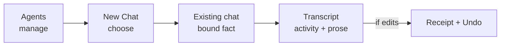

# Meridian Flow Agent Experience

## Decision

Agent UX has two jobs and two owners:

- **New Chat chooses and launches.**
- **Agents manages and edits.**

Once a chat exists, the Agent becomes a quiet fact. Execution stays inside the normal transcript. There is no separate Agent mode, run dashboard, helper rail, or permanent evidence stack.

## Surface ownership

| Surface | Owns | Never owns |
|---|---|---|
| **New Chat** | Draft Agent choice, conditional Work choice, first Send. | Editing definitions, package management, runtime details. |
| **Agents** | Inventory, detail, create/edit, import/export, exceptional setup. | Starting chats, testing Agents, active runs. |
| **Existing chat** | One bound Agent fact, writer input, current turn, outcomes. | Switching Agent or Work, definition editing, package state. |
| **Import review** | Local source validation, included Agents, actual errors, one Import action. | Registry browsing, launch, generic compatibility ceremony. |

## 1. New Chat stays a composer

**Existing pattern:** preserve the current blank chat, composer, Agent control, mode control, and Send action. Do not replace it with a wizard or Agent gallery.

### Default state

- Show the selected Agent's name as one compact composer control.
- If the Project has one eligible Work, do not show a Work control.
- If it has multiple Works, show a sibling Work control with the current selection.
- Do not explain that Agent and Work become fixed. The control disappearing after first Send communicates the state change.
- Do not show `Ready`, version, source, permissions, or package metadata in the closed control.

### Agent picker

Each row contains:

1. name;
2. one-sentence purpose;
3. a blocker only when the Agent cannot be selected.

No status means available. A small inventory has no search field or group headings. A final quiet `Manage agents` link may navigate to Agents; it is not a creation shortcut or launch action.

Unavailable rows remain visible when the blocker teaches a recoverable next step. Selecting one opens the relevant Agent detail or inline recovery action without discarding the New Chat draft. Unsupported or invalid definitions that cannot be recovered in Flow do not enter the picker.

### First Send

Send performs the atomic binding and navigates to the created chat. If validation fails:

- keep the draft instruction, Agent, and Work;
- put the error beside the failed control or composer action;
- focus the error summary when needed;
- never leave an empty chat in navigation.

## 2. Agents is a workshop, not a launch surface

### Inventory

The default desktop layout is a flat list with a selected detail pane. Mobile uses a routed list and detail.

The list row contains name and purpose. It adds plain secondary exception text only for an unavailable Agent. Origin appears only when it explains why editing or deletion is unavailable.

The page has one primary `Add agent` action. Its small menu offers:

- `Create agent`
- `Import Mars files`

Do not show separate `New agent`, `Install package`, `Browse`, or `Launch` actions across the page. Do not add search until inventory scale demonstrates a recognition problem.

### Detail

Detail answers four questions in order:

1. What is this collaborator for?
2. Can it read or edit the manuscript?
3. Is anything blocking its use?
4. Can I edit it?

The primary content is name, purpose, a concise manuscript-access statement, conditional blocker, and `Edit` for owned sources. A quiet overflow contains Export and ownership-permitted Delete.

Do not show a `Readiness` section for healthy Agents, a generic `What it cannot do` inventory, helper descriptions, behavior duplication, raw digest, New Chat preview, Test button, or Start chat action.

### Editor

Use one readable column. The first release has four fields:

- **Name**
- **Purpose**
- **Instructions**
- **Manuscript access:** `Read and edit` or `Read only`

`Save` validates and creates a new revision. Existing chats do not change, but that fact appears once in the success message only when editing an already-used Agent. It is not persistent page copy.

Export produces the supported Mars files. Raw Mars source is not a second editable representation in v1; writers who prefer source editing can export, edit externally, and import.

There is no section navigation rail, live New Chat preview, helper card builder, capability checklist, denied-ability prose field, credit budget, or model-routing form in the first release.

### Import review

Import accepts local Mars package files and shows:

- package name if present;
- included Agent names and purposes;
- validation errors or unsupported semantics;
- name or logical-key collisions with a clear rename-and-reimport instruction;
- one `Import` action when valid.

Healthy compatibility is silent. Do not require an acknowledgement checkbox. No remote registry, publisher trust, ratings, update comparison, or connection setup belongs in the first release.

## 3. Existing chats stay quiet

### Bound identity

Show the Agent name once as inert composer-adjacent text where the draft control used to be. It has no chevron and cannot be clicked to switch.

Show Work beside it only when the writer could otherwise confuse multiple Works. Do not repeat either fact in the header, under the mobile title, in every turn, or in a `Run details` disclosure.

### Active turn

**Existing pattern:** reuse `ProcessDisclosure` and `ActivityRow` grammar.

- Display one current phrase such as `Reading Chapter 12` or `Revising the confrontation`.
- Collapsed detail may show actual current operations already available from the event stream.
- Show Cancel only while it can change the outcome.
- An Agent asking a question is just an assistant message, not a `Needs attention` state.
- Do not add `Continue in background`, progress percentages, helper cards, a task center, or a run rail.

### Settled turn

The order is:

1. assistant prose;
2. existing `TurnEditsReceipt` with Undo, only if documents changed.

That is the complete normal state. There are no generic `Sources and effects`, `Helpers consulted`, or `Run details` rows. A concrete exceptional fact may appear inline only when the writer must act on it, such as an unavailable source that prevented the requested result.

If there were no edits, do not show a no-op receipt. If a child Agent is added later, its useful finding belongs in the parent's prose; do not expose orchestration merely because it occurred.

## Visual system

### Preserve from current Flow

- existing project shelf and chat/context proportions;
- existing composer placement and control density;
- established text hierarchy and muted neutral palette;
- existing buttons, popovers, inputs, focus rings, activity disclosure, receipt, and Undo;
- existing design tokens and icon set;
- one-column transcript rhythm.

### Do not introduce

- Agent mascots, portraits, gradients, or colorful status systems;
- nested cards for simple facts;
- decorative pills for normal state;
- architecture language such as capabilities, host policy, launch bundle, revision digest, or tool slugs in primary writer copy;
- repeated instructional paragraphs explaining the interface;
- raw colors outside design tokens.

## Responsive behavior

| Surface | Desktop | Mobile at 390 px |
|---|---|---|
| New Chat picker | Anchored popover above composer, bounded to viewport. | Viewport-bounded popover or bottom sheet above keyboard; same row content. |
| Agents | List and detail panes. | Routed list then full-width detail; Back preserves list position. |
| Editor | Centered single column with page-level Save. | Full-width route with safe-area sticky Save. |
| Import review | Focused dialog or route. | Full-width route with sticky Import action. |
| Existing chat | Inert Agent fact in composer footer. | Same single location; no duplicate subtitle. |
| Receipt | Existing inline component. | Same order and disclosure behavior, 44 px Undo target. |

## State matrix

| State | Writer sees | Writer can do |
|---|---|---|
| Available Agent | Name and purpose only. | Select it. |
| Unavailable Agent | Name, purpose, one concrete blocker. | Follow recovery when one exists. |
| Invalid import | File/Agent and exact validation problem. | Fix source or remove file. |
| First Send failed | Local error without lost draft. | Correct selection or retry. |
| Active turn | One current activity phrase, optional Cancel. | Continue reading or cancel. |
| Turn failed | Plain failure and context-specific retry. | Retry without re-entering the instruction when safe. |
| No-edit answer | Assistant prose. | Continue conversation. |
| Edited answer | Assistant prose, receipt, Undo. | Inspect or undo. |

## Acceptance criteria

- A writer can create or import an Agent, find it in New Chat, send, receive an answer, and edit it later without encountering a second launch surface.
- A one-Work project never shows a Work picker.
- Existing chat identity appears once.
- Healthy Agent rows contain no status badge.
- An ordinary no-edit answer contains no receipt or execution disclosure.
- An edited answer contains exactly one edit summary, owned by `TurnEditsReceipt`.
- No view contains `Sources and effects`, `Helpers consulted`, `Run details`, `Continue in background`, or a generic acknowledgement checkbox.
- Keyboard and screen-reader flows cover picker, Add menu, editor, import review, and Undo.
- Desktop and 390 px screenshots show no clipped picker, duplicate identity, horizontal overflow, or hover-only control.

## Provenance

| Decision | Source |
|---|---|
| Composer-based New Chat selection | **Existing pattern**, confirmed by current Flow probe. |
| Activity and edit receipt grammar | **Existing pattern**, confirmed by current Flow probe. |
| Agents management/editor and local import/export | **Required addition** from the product goal. |
| Immutable definition binding | **Required addition** from runtime correctness; communicated mostly by control state rather than copy. |
| Generic evidence disclosures from the earlier mockup | **Deleted behavior**; they were speculative, not existing Flow. |
| Child/background/package marketplace UI | **Later extension** only after its system requirements exist. |

See the [requirements](agent-system-requirements.md). The work item preserves
the source/UI minimalism audit that produced the deletion inventory.
