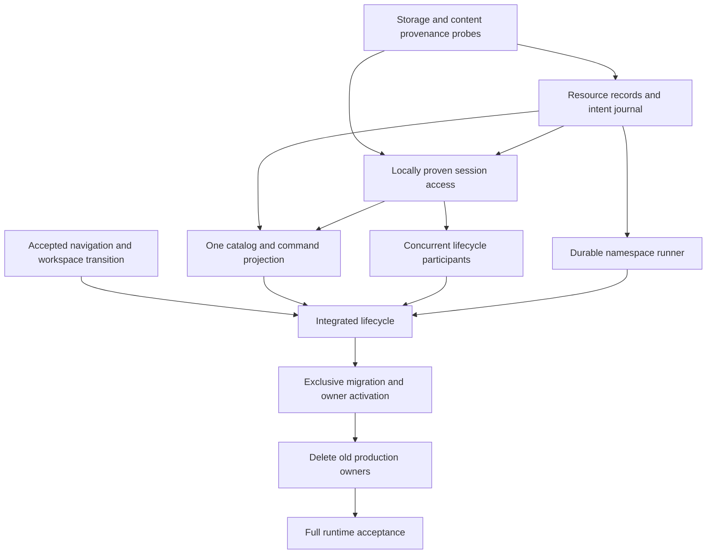

# Local-first document cutover: remaining issues and fixes

Investigation checkpoint at `3ca943a6e`, September 13, 2026. This is the known-issue and implementation-risk dossier for [PR #531][pr], not a claim that every possible failure has been found. The [current architecture][architecture] describes implemented behavior; the changes below are not implemented unless explicitly marked complete.

The main work is a **frontend ownership cutover**, not a rewrite of Yjs or the backend. Three changes are substantial: a durable resource owner, local content admission with initialization proof, and coordinated workspace/navigation settlement. Migration joins them into one system. The completed session, peer, catalog-reducer and backend-receipt foundations remain useful.

## Investigation coverage

| ID | Issue or unfinished contract | Evidence level | Main dependency |
| --- | --- | --- | --- |
| N1 | Close/reload and rapid close/reopen races | Reproduced in the actual app; source ordering traced | Accepted navigation/workspace transition |
| C1 | Missing content can look like initialized empty content | Reproduced in real Chromium using installed Yjs persistence | Exact-incarnation initialization evidence |
| C2 | Cached acknowledged opening waits for remote admission | Source traced; settled offline editing passes, offline reacquisition does not have acceptance proof | C1 and local access capability |
| R1 | Local creation, catalog and pending work have separate owners | Source traced; original incidents not all reproduced on latest HEAD | Durable resource records and intent journal |
| R2 | Backend receipts lack a browser-durable operation queue | Backend receipts verified; frontend source gap identified | R1 |
| X1 | Concurrent local editing admission remains exclusive | Source traced; local peer transport separately verified | C1/C2 and shared lifecycle participation |
| M1 | Migration can lose records or leave old writers active | Source hazards identified; full migration not implemented/probed | R1/C1/X1 and exclusive handoff |
| D1 | Close/absence/deletion can be conflated | Source traced; deletion matrix not fully verified | R1/R2/N1 and existing terminal fences |
| U1 | Session/pre-route waits remain visually incomplete | Actual app observation; address-boundary slice verified fixed | C2/N1 and one pending-state presentation |
| V1 | Full cross-system acceptance and PR evidence | Explicit missing coverage | Integrated cutover |

Evidence level matters: an upstream storage failure proves a seam is unsafe, not that a particular writer lost content. Likewise, no error in the console does not prove URL and workspace agreement.

## N1. Navigation changes membership before acceptance

**Observed:** closing the final tab and reloading in the same JavaScript turn reopens it. Closing and immediately clicking its sidebar entry can instead leave Editor empty. Ordinary settled open/close is not the failing case.

**Cause and code:** `features/project/context/context-removal-coordinator.ts` (`writerClose`, `executeRepresented`, `executePlanning`) changes selection, membership and snapshots before requesting route repair. `features/project/routing/ReadableProjectRoute.tsx` launches `openContext`/`go` without an acceptance receipt. Native history writes can also be queued. Reload sees the old URL; a delayed close fallback can override a newer click. Work-blocker cancellation cannot undo already-published membership coherently.

**Fix:** prepare the existing removal plan without mutating it. Capture existing `tabInstanceId`, request permission through the single Work decision owner, check operation/account/member currency, dispatch matching history, flush its native write, and synchronously commit the prepared workspace transition from the accepted-history callback. Return applied/cancelled/superseded/failed explicitly. The promise settling is not the commit point. Preserve a synchronous allowed path: the installed router awaits registered blockers even when they return false. Inspect and integrate `work/WorkDetailScreen.tsx`'s current blocker rather than adding another one.

Inactive Close commits without navigation after member validation. Active draft Close rechecks its separate `tabInstanceToken` and Apply-reservation fence before commit. Authoritative revocation/removal remains immediate; it cannot wait behind a voluntary Work confirmation. Native Back/Forward must use the same decision policy, but does not behave like an application push that has not yet changed history.

**Delete/retain:** remove membership-first voluntary Close and fire-and-forget fallback navigation. Reuse the existing workspace reducer, removal planner and tab-instance IDs. Do not invent another tab store, token, default opener or rollback-effect ladder. Update `ProjectContextRemovalController`'s latest-ref route adapter with the new interface. Replace `ContextRemovalRoutePort.updateSearch` for voluntary navigation and audit `project-navigation.ts`'s `replaceIfCurrent()`: a resolved promise is not proof that replacement was accepted.

**Verification:** both reproduced same-turn cases; clean synchronous Close; blocked/cancelled Close unchanged; newer open supersedes pending Close; close/reopen gets a new member and rejects stale Close; native Back/Forward cancellation; draft Apply/Discard and unavailable-document safety. A flush-only change cannot satisfy this matrix.

## C1. Replayed does not mean initialized or committed

**Observed:** installed y-indexeddb can open a missing database, write an empty constructor update, and resolve `whenSynced`. The initial transaction can still abort afterward. A legitimate initialized empty document and a silently recreated empty cache otherwise look alike.

**Cause and code:** `core/editor/document-session.ts` (`watchLocalPersistence`) derives replay state and starts peers from that promise. `context/local-untitled-owner.ts` returns restored sessions without waiting for proven local readiness. A descriptor, nonempty text, or update count cannot establish content provenance.

**Fix:** define initialized-content evidence qualified by exact persistence incarnation/schema, committed with initialization content in the same native IndexedDB transaction (`updates` and `custom`). Await transaction completion, not a request or nested promise. Genuine New may initialize empty content. An acknowledged resource with missing/invalid evidence requires authorized content acquisition or explicit recovery, never exposure as an empty replacement. Validate readiness before exposing the editor or starting local peers. Do not retrofit a marker merely because opening the database succeeded.

Metadata and Yjs live in different databases: reserve the exact content identity first, initialize/recover content second, then permit eligible creation dispatch. Record recoverable phases rather than claiming an atomic transaction across both databases. Native commit is a browser transaction guarantee, not immunity to storage eviction or physical-device loss.

**Verification:** genuinely empty initialized content; missing DB with surviving descriptor; schema rollover; abort after successful marker request; crash between reservation and initialization; delayed replay; legacy data without proof; no editor or peer publication from an unproven blank cache. The native marker transaction seam passed a disposable Chromium probe; application integration remains unfinished.

## C2. Local access is still coupled to remote admission

**Cause and code:** `context/open-project-document.ts` resolves availability before registry admission. Private registry construction can omit transport, but still takes a server-admitted lease. A locally cached acknowledged document therefore cannot simply be reopened before remote authority acquisition. Already-open content remaining editable offline is a different, verified behavior.

**Fix:** add a locally fenced access capability to the existing session subsystem. Resolve exact local identity and C1 proof, acquire lifecycle participation, replay, and return the usable handle. Obtain remote availability and transport authorization independently. Preserve the same Y.Doc and editor through admission/acknowledgement; never fabricate a generation or server lease. Unknown offline URLs remain unavailable, not blank New documents.

**Interaction:** ResourceReplica owns the durable descriptor; sessions own content and authorization fences; navigation owns display selection. A failed remote request must not erase proven local writing, while explicit revocation must stop unauthorized transport.

**Verification:** reopen previously initialized acknowledged content with networking blocked before the click; restore pending writing; unknown offline path; late admission after navigating elsewhere; account/schema/terminal changes; correct document identity and content throughout. Local-projection and authority capability design are required before enabling this path.

## R1. Resource existence and pending work lack one durable owner

**Cause and code:** `local-untitled-owner.ts`/lineage ledger own local resources, `untitled-reconciler.ts` mirrors work and revisions in memory, and `client/query/context-catalog-acquisition.ts` installs the server projection. `UnfiledPendingDocuments.tsx` and the tree combine these paths separately. The browser reconciler adapter discards a stale write outcome. This is not a second confirmed reproduction of every original ghost-document incident; it is the remaining split ownership visible in source.

**Fix:** one account-scoped ResourceReplica owns durable resource descriptors, immutable submitted attempts, desired metadata and catalog checkpoints. Transactions install descriptor+intent and catalog+cursor coherently. Its runner reloads/replans on revision conflicts; memory schedules work rather than independently authoring it. Every tree, tab, path lookup, reference and AI/server-created catalog entry consumes that projection. Paths are reusable locators, not resource IDs. Completed acknowledgement retains the resource descriptor instead of deleting its final local record.

**Delete/retain:** replace the Untitled ledger/writer, reconciler work mirror, tab-candidate eligibility and pending-tree union. Keep useful naming policy and the existing package catalog reducer. QueryClient may expose a subscription, not retain another cursor owner. Preserve whole-commit replay/reset semantics; scope disappearance is not a global tombstone.

**Verification:** rapid New A/B/C, first-content/explicit-filing creation triggers, close-before-ack, sidebar/tab/local-path agreement, stale writes, scope resets with pending intentions, AI-created ingestion and path reuse. No tab snapshot may be required to rediscover unsynchronized writing.

## R2. Durable backend outcomes need durable frontend attempts

**Cause:** backend move/delete receipts exist, but `context-identity-mutation.ts` owns a memory queue/attempt IDs and `ContextEntryActions.tsx` owns delete IDs in React state. Restart can lose the command identity needed to recover a lost response.

**Fix:** persist eligible/submitted state and immutable operation ID/payload before dispatch. Recover uncertain outcomes through existing receipts, commit acknowledgement/canonical metadata, then reconcile newer intentions. Do not mutate an already-submitted payload or erase a newer desired location when an older acknowledgement arrives. Serialize dispatch briefly per resource; a lock is not proof of server completion. Ambiguous create must settle before deletion.

**Delete/retain:** replace file mutation queues and component-owned retry identity with journal commands. Preserve folder rename through a thin existing transport path: generalized folder commands are excluded. Keep backend namespace transactions, receipt lookup and Yjs content synchronization distinct.

**Verification:** response loss and restart, duplicate dispatch, same ID/different payload, offline rename/file ordering, old outcome after newer intention, deletion/path reuse and historical receipts after source moves. Existing backend tests alone do not verify the browser journal.

## X1. Peer exchange is not concurrent lifecycle ownership

**Cause:** local Yjs peers exchange updates, but `local-untitled-locks.ts` and the feature owner still grant an exclusive local editing lifetime. Broadcast content does not coordinate remint, adoption or destruction.

**Fix:** reuse shared participant holds from `DocumentSessionLocks`, short-lived operation locks for reconciliation, and exclusive destructive/migration barriers. Every participant uses C1/C2 local access; each obtains its own valid remote attachment after adoption. Remint aliases preserve exact content and mounted view identity across participants. Keep the existing peer channel and wake replay.

**Verification:** two browser contexts edit the same pending document offline; one closes and the other recovers missed persisted edits; remint/adoption occurs during editing; terminal/account/schema changes drain all participants before destructive transitions. No browser's tab membership changes the other's layout.

## M1. Migration must preserve evidence and transfer sole ownership

**Source hazards:** legacy ledger `parse` turns malformed/unsupported data into null and `list` drops it; adopted envelopes omit their original persistence reference; `finishAdopted` can remove completed lineage records. Opening a separate metadata DB does not fence old writers. Detached-runtime drain is implemented but does not prove the entire old-build handoff.

**Fix:** enumerate raw account-qualified keys and preserve unreadable bytes as recovery evidence. Recover adopted persistence only from matching authority/adoption records (`DocumentSessionAuthorityStore.readRoom`); never guess a canonical DB name. Use a distinct writable protocol, durable import checkpoints and existing authority version-change/drain ordering. Blocked upgrade or failed drain cannot activate the new writer. Preserve existing independent sessionStorage layouts, including explicit empty state; do not import the old shared desk again.

Build/test the replacement without activating a second writer. Once resource records, content access, consumers and required runner are ready: fence admissions, drain old participants, acquire handoff, import, then install the replacement account composition. Partial failure retains old evidence and resumes safely. Remove displaced production construction in the activation change, not after an indefinite coexistence period.

**Deletion inventory:** `AccountFeatureLifetime.localOwner`; reconciler startup in `routes/_authenticated.tsx`; old exposure in `account-feature-context.tsx`; global/shared fallback and wrappers in `untitled-reconciler-browser.ts`; `useUntitledTabBridge`; legacy writers/work mirror; pending Unfiled union; QueryClient catalog installer. Keep only a bounded read-only legacy decoder needed for migration, never a live compatibility writer.

**Verification:** old and new builds together; blocked upgrade with detached writing; delayed old create/purge; old-build re-entry; corrupt records; partial import restart; storage denial/quota; exact bytes and identities retained; no two active lifecycle writers. These are outstanding application probes, not already-proven claims.

## D1. View closure and catalog absence cannot authorize deletion

**Cause and code:** `ContextPaneController.tsx` schedules timer-based empty abandonment after Close without an accepted-navigation result. Reconciliation can abandon empty/no-candidate records. Neither missing mounted candidates nor a missing scoped catalog entry is sufficient lifecycle evidence. The colocated TODO also calls out open tabs remaining after backing-entry deletion; exact deletion behavior across all entry paths remains to be verified.

**Fix:** remove automatic tab-driven abandonment. Only explicit, never-submitted empty-resource discard with proven no-writing/no-participant conditions may abandon locally. Submitted/uncertain create must settle. Exact deletion or access-loss evidence invokes existing immediate network/session fencing, preserves unsent writing for explicit recovery, updates resource projection and membership, and separately settles routing. Never silently recreate deleted remote identity or purge unsynchronized writing. Preserve draft disposition fences.

**Verification:** close pending writing; empty close while another participant can type; late acknowledgement after close; AI/server deletion of open content; scope removal without global deletion; revoked access; offline unsent edits at deletion; same path reused by another document; explicit recovery versus resurrection. N1 must not delay authoritative safety behind a writer's navigation confirmation.

## U1. Address feedback is fixed; acquisition feedback is not complete

**Implemented:** short cold address waits show a shell, longer ones show a delayed skeleton, warm A/B/A retains the actual old content, and fallback changes do not remount the editor. Runtime and controlled timing checks passed at `3ca943a6e`.

**Remaining:** a tree click can wait in the live opener before navigation, and an admitted document can wait for session readiness afterward. One route timer cannot describe these other phases. C2 should eliminate remote waiting for proven local content; then place one pending presentation at the remaining content boundary rather than stacking timers.

**Behavior:** shell immediately; eligible prior content retained with its actual identity; otherwise blank approximately 500ms then skeleton until ready. No spinner, loading copy or minimum duration. Pending selection must not flash real empty-state actions. Explicit empty Editor remains empty. Errors/recovery stay distinct.

**Verification:** missing versus slow local content; pre-route wait; startup after admission; fast/slow/offline cases; A/B/A; correct chrome/content identity; no stale timer; no editing an incorrectly labeled retained document. Recent-document empty-state design remains separate work.

## How the fixes fit together

Navigation can be developed against existing resource preparation seams before the journal activates. Content and metadata changes meet at a stable resource handle, not through tab ownership. Server metadata acknowledgement changes canonical location; content synchronization updates the existing Y.Doc. Closing a view only releases its view claim. Terminal evidence has its own safety path.

**Major modifications required:** resource ownership/catalog acquisition, session local-access capability/provenance, and navigation/workspace settlement. These require coordinated caller changes and migration, not isolated guards. **No current evidence requires:** a new backend service, new CRDT, socket multiplexing, replacement of existing authority/session runtime, or a second editor store. Escalate evidence requiring a preserved backend contract to change; do not silently grow this PR into that rewrite.

## Test migration with the ownership changes

Delete `untitled-reconciler-browser.test.ts` with its one-line delegation wrapper. Replace legacy ledger single-write assertions with transaction rollback and atomic-visibility cases, and completed-lineage-removal expectations with retained acknowledged resources. Preserve real Yjs identity/persistence tests at the new content boundary. Adapt voluntary-close route doubles to controlled accept/cancel/supersede. Keep pure planner and forced-availability suites intact. Add native browser-history acceptance/flush verification; a synchronous memory-history double cannot prove it.

## V1. Completion gates and evidence locations

The work directory is `/home/jimyao/.meridian/git/haowjy-meridian-flow-docs/work/editor-tab-lifecycle-study`. These are local artifacts, not publicly uploaded files:

- `probes/runtime-shell-20260913/REPORT.md`: actual navigation races, caret continuity, shell feedback, independent layouts and already-loaded offline editing.
- `probes/content-readiness/README.md` and `results.json`: missing-cache/commit-order/marker transaction probe, with intentional injected errors distinguished from ordinary failures.
- `probes/metadata-storage/README.md` and `results.json`: Dexie commit/abort, concurrency, observation, writer departure and upgrade probe; not full adapter conformance.
- `probes/phase-0-results.md`: earlier foundation checks and applicability limits.
- `design/remaining-work.md`: execution detail/deletion order. `references/remaining-work-source-study.md`: pinned upstream source and blog evidence, not application verification.

Dexie remains a metadata-only candidate. Storage denial/quota, cross-account isolation, full legacy handoff, end-to-end initialization recovery and suspended-query lifecycle coverage must pass before activation. Test the final integrated app across two authenticated accounts and two browser contexts, restart/crash points, native history, draft review and terminal recovery. Recheck caret **and TipTap undo**; retained textarea identity alone does not verify undo. Run the repository gate and attach representative visual evidence before marking the draft ready.

Excluded work remains excluded: cold offline application boot, generalized folder commands, Scratch/Uploads viewer UI, multiplexing, multi-pane Editor and recent-document empty-state redesign. No product approval gate is added to AI writes.

[pr]: https://github.com/haowjy/meridian-flow/pull/531
[architecture]: ../../apps/app/src/features/project/.context/resource-lifecycle-architecture.md
